## Overview

Today I investigated a phishing alert involving a malicious email attachment in the Let'sDefend SOC environment.

The email contained an attachment that was identified as malicious through threat intelligence analysis. Further endpoint investigation showed that the user opened the file and the system communicated with suspected command-and-control (C2) infrastructure.

I investigated the alert using Email Security, VirusTotal, endpoint telemetry, network activity, and the Case Management Playbook.

## Alert Details

- **Alert:** SOC114 — Malicious Attachment Detected — Phishing Alert
- **Event ID:** 45
- **Event Time:** Jan 31, 2021, 03:48 PM
- **Level:** Security Analyst
- **SMTP Address:** 49.234.43.39
- **Source Address:** accounting@cmail.carleton.ca
- **Destination Address:** richard@letsdefend.io
- **Email Subject:** Invoice
- **Device Action:** Allowed
- **Verdict:** True Positive

## Investigation Process

### 1. Email Security Investigation

I navigated to the **Email Security** tab and searched for the recipient:

`richard@letsdefend.io`

The investigation identified an email sent from:

`accounting@cmail.carleton.ca`

to:

`richard@letsdefend.io`

with the subject:

`Invoice`

The device action was **Allowed**, indicating that the email was permitted by the security control.

**Figure 1 — Email Security Tab**

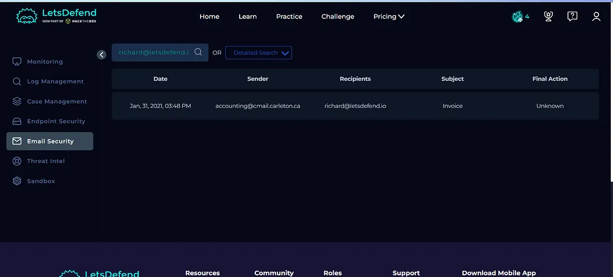

The email contained a suspicious attachment that required further analysis.

**Figure 2 — Email Content**

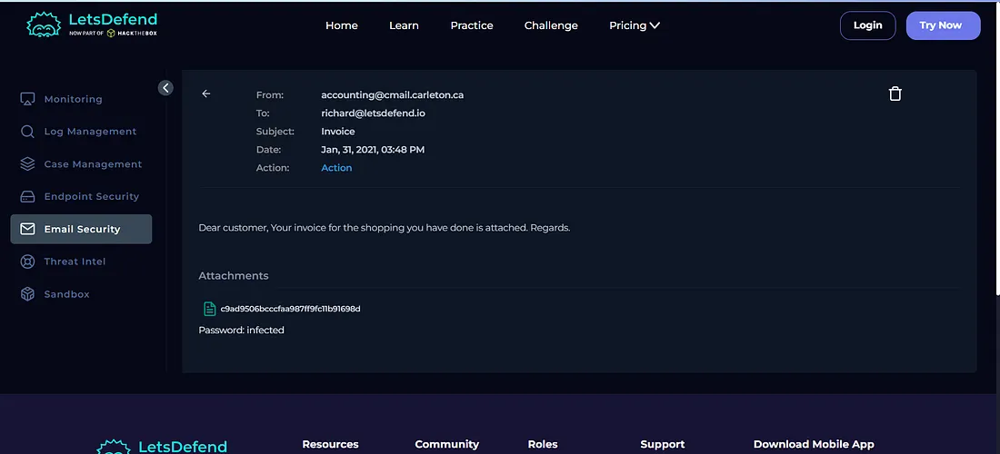

### 2. Attachment Analysis

I submitted the suspicious attachment to **VirusTotal** for analysis.

**Figure 3 — VirusTotal Scan Result**

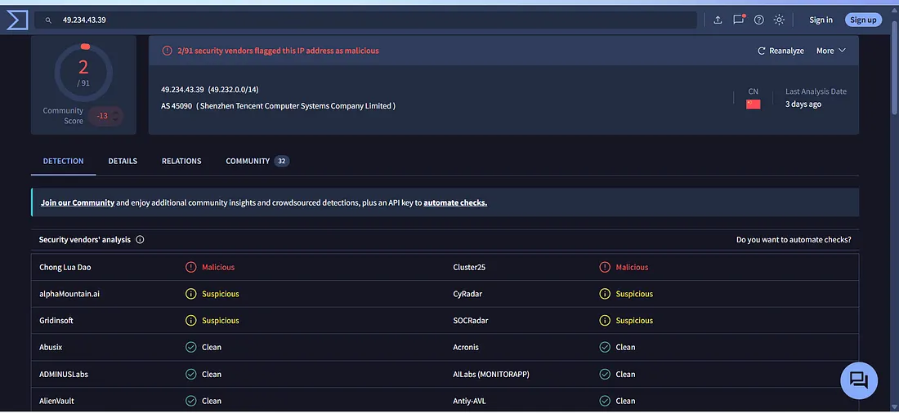

VirusTotal identified malicious indicators associated with the submitted file.

I also analyzed the file using its MD5 hash:

`c9ad9506bcccfaa987ff9fc11b91698d`

The hash was also identified as malicious.

**Figure 4 — VirusTotal Hash Analysis**

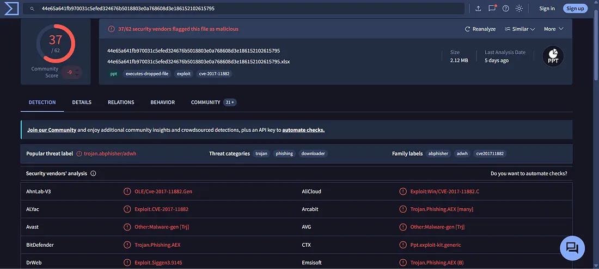

The VirusTotal results provided additional evidence that the attachment was malicious.

### 3. File Relationship and Network Indicators

I reviewed the **Relations** section in VirusTotal to identify infrastructure associated with the malicious file.

The analysis revealed contacted domains and IP addresses associated with the file.

**Figure 5 — VirusTotal Relations**

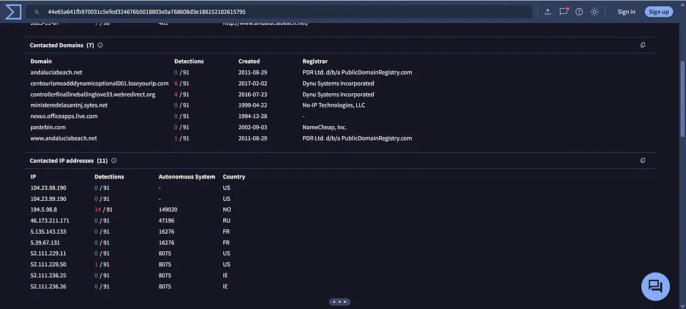

These indicators were useful for the subsequent endpoint and network investigation.

### 4. Endpoint Security Investigation

I then investigated the affected user's endpoint using the **Endpoint Security** tab.

I searched for the user:

`richard`

to determine whether the suspicious attachment had been opened or executed.

**Figure 6 — Endpoint Security**

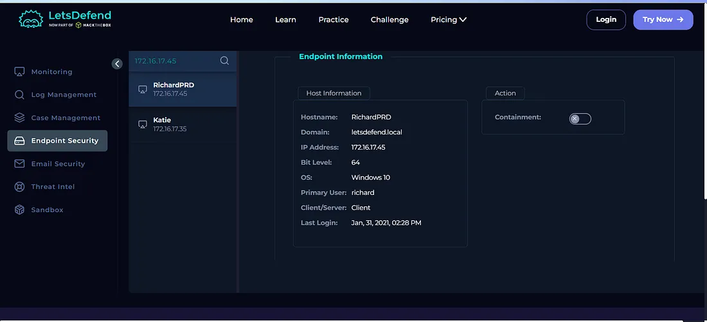

The browser history showed a request to:

`http://andaluciabeach.net/image/network.exe`

This indicated that the system had communicated with a suspicious external resource.

**Figure 7 — Browser History**

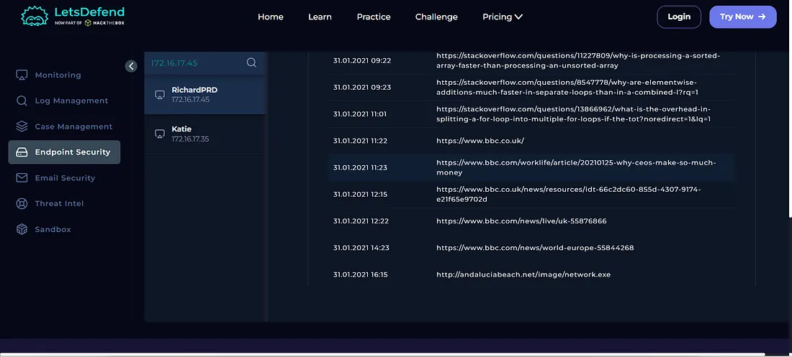

I then reviewed the **Network Action** information and identified communication with:

`5.135.143.133`

This provided additional evidence of communication between the affected system and suspected C2 infrastructure.

**Figure 8 — Network Action**

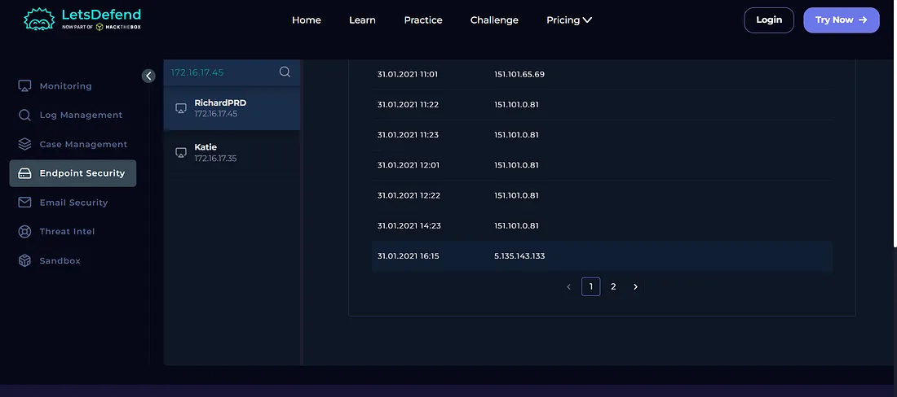

### 5. Host Containment

Since the investigation identified communication with suspected C2 infrastructure, I contained the affected host.

Host containment was performed to prevent further communication with the suspected C2 server and limit potential impact while continuing the investigation.

**Figure 9 — Host Containment**

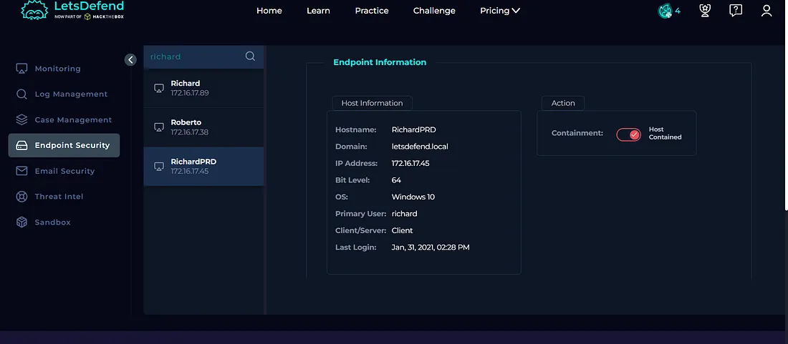

### 6. Case Management — Playbook Answers

I completed the Case Management Playbook based on the evidence collected during the investigation.

#### Does the Email Contain a Malicious Attachment?

**Yes**

The email contained an attachment that was identified as malicious through threat intelligence analysis.

**Figure 10 — Playbook Answer**

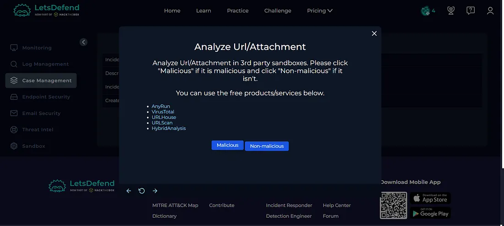

#### Is the Attachment Malicious?

**Yes**

The file was identified as malicious based on VirusTotal analysis and the associated MD5 hash.

**Figure 11 — Playbook Answer**

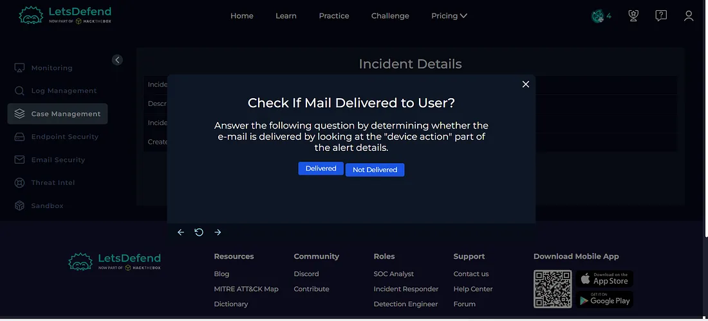

#### Was the Email Delivered to the User?

**Yes**

The device action was **Allowed**, indicating that the email was permitted by the security control.

**Figure 12 — Playbook Answer**

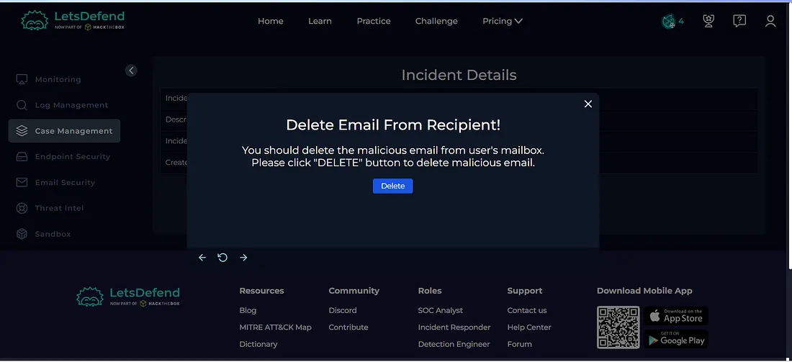

#### Should the Email Be Deleted?

**Yes**

Since the email contained a confirmed malicious attachment, it should be removed from the recipient's mailbox.

#### Did the User Open the File?

**Yes**

Endpoint evidence showed activity associated with the malicious attachment, including communication with suspicious external infrastructure.

#### Was the Host Contained?

**Yes**

The affected host was contained to prevent further communication with the suspected C2 infrastructure.

## Artifacts

The following indicators were documented during the investigation:

| Type | Indicator |
|---|---|
| Source IP | `49.234.43.39` |
| Source Email | `accounting@cmail.carleton.ca` |
| Destination Email | `richard@letsdefend.io` |
| MD5 | `c9ad9506bcccfaa987ff9fc11b91698d` |
| Suspicious URL | `http://andaluciabeach.net/image/network.exe` |
| Suspected C2 IP | `5.135.143.133` |
| Host User | `richard` |

**Figure 13 — Artifacts**

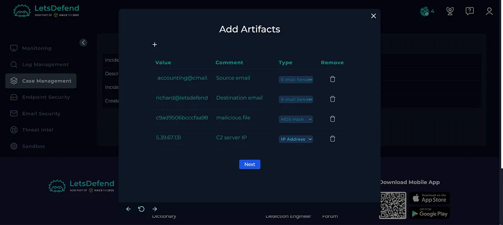

## Investigation Verdict

**True Positive — Malicious Attachment with Suspected C2 Communication**

The alert was confirmed as a genuine malicious phishing incident.

The email contained a malicious attachment, the email was delivered to the user, and endpoint investigation showed activity associated with the malicious file and communication with suspected C2 infrastructure.

## Response

The affected host was **contained** to prevent further communication with the suspected C2 infrastructure.

The malicious email should be removed from the recipient's mailbox, and the identified indicators were documented as artifacts.

The alert was then closed as a **True Positive**.

**Figure 14 — Closed Alert**

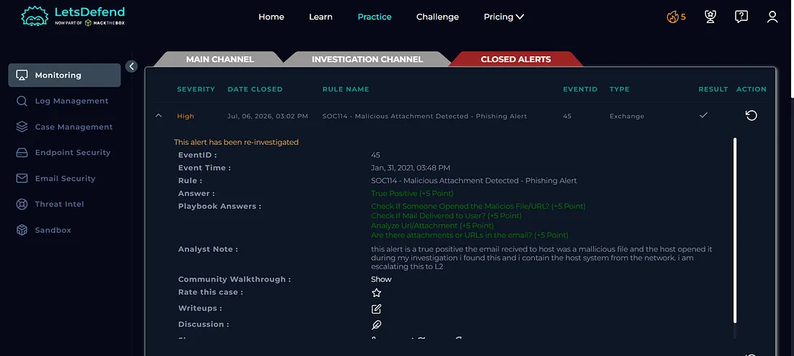

## What I Learned

From this investigation, I learned how to:

- Investigate phishing emails containing malicious attachments
- Analyze suspicious files using VirusTotal
- Use file hashes for threat intelligence investigation
- Review file relationships and network indicators
- Investigate endpoint activity
- Identify suspicious external communication
- Understand potential C2 communication
- Perform host containment
- Document investigation artifacts
- Determine True Positive vs False Positive
- Follow a SOC investigation playbook

## Tools Used

- Let'sDefend
- VirusTotal
- Email Security
- Endpoint Security
- Network Action
- Threat Intelligence
- Case Management Playbook

## Key Takeaway

A malicious attachment becomes more significant when endpoint evidence shows that the file was opened and the affected system subsequently communicated with suspicious external infrastructure.

A SOC analyst should correlate:

**Email → Attachment → Hash Analysis → Endpoint Activity → Network Communication → Containment → Playbook → Verdict**

This investigation helped me understand how a SOC analyst can move from detecting a malicious email attachment to identifying potential C2 communication and containing the affected host.
