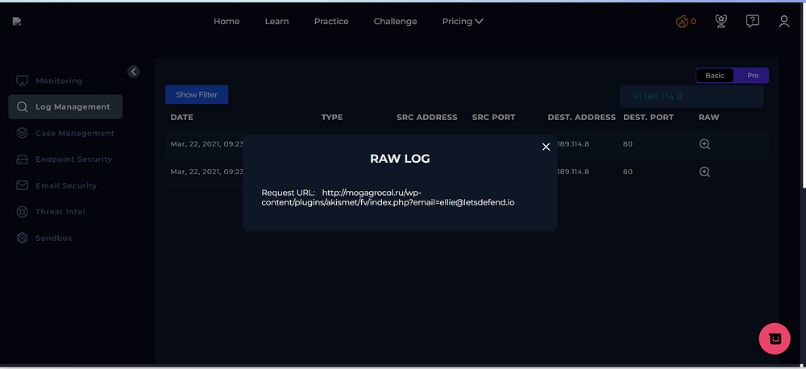
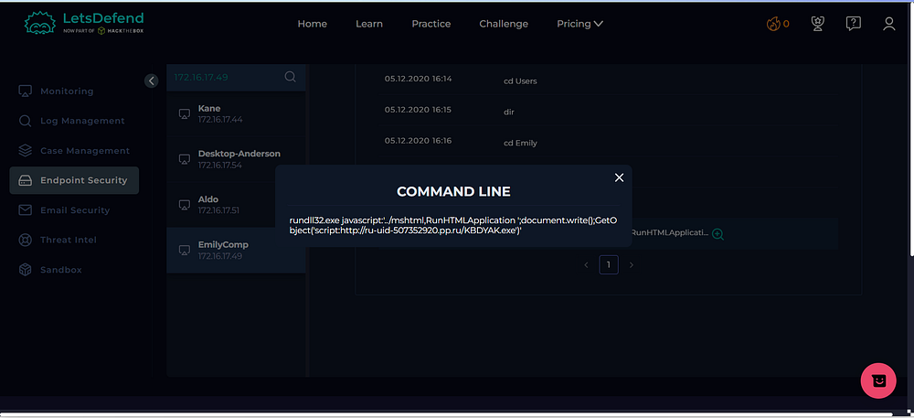
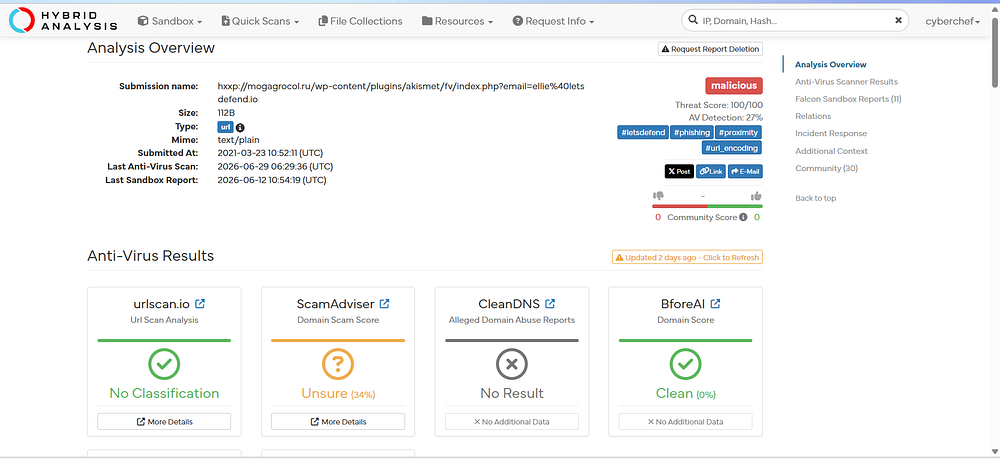
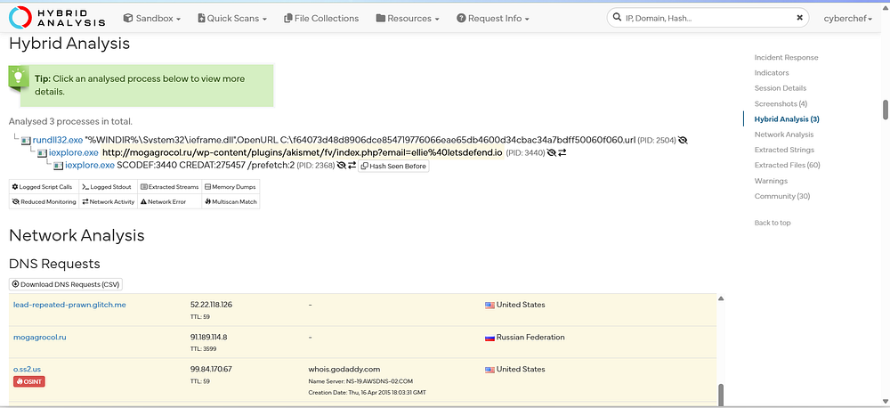
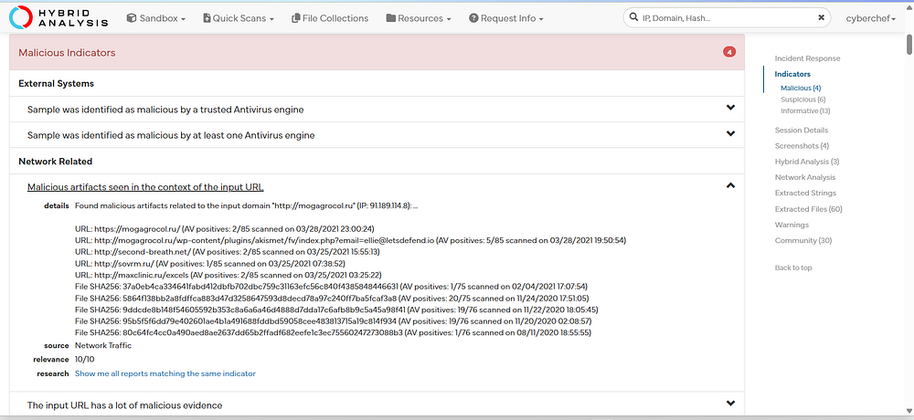
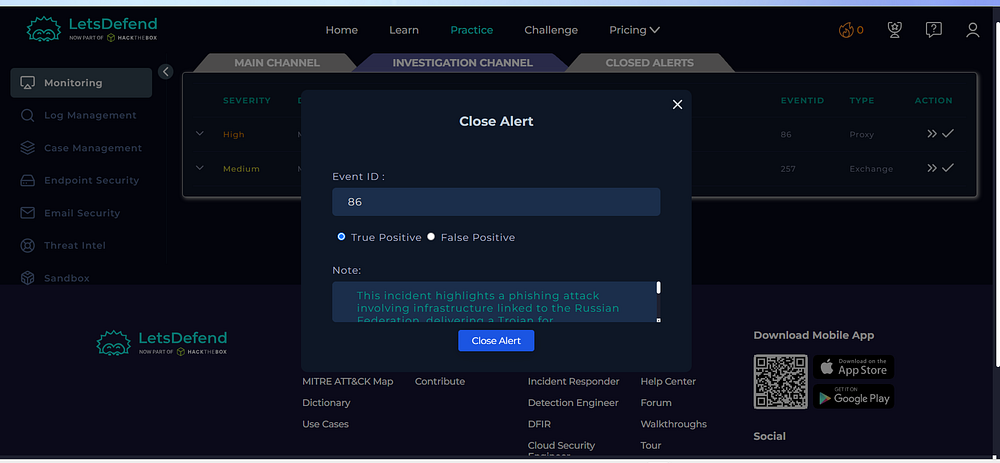
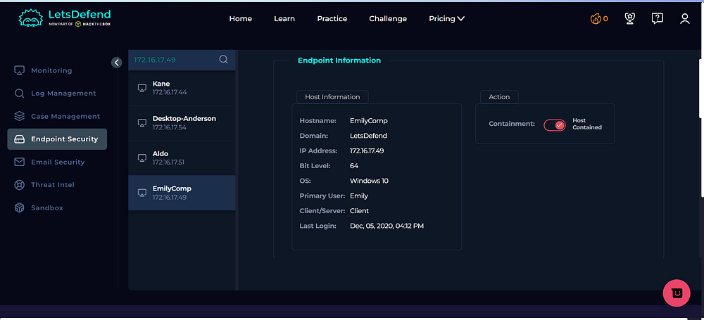
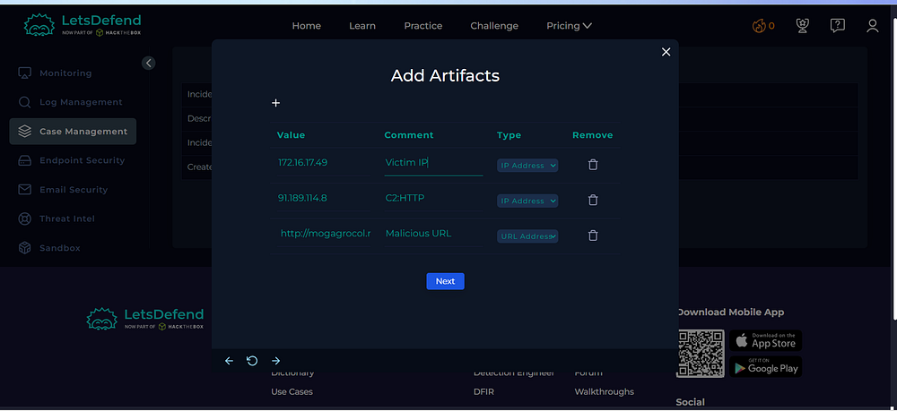

# Day 01 — SOC141: Phishing URL Detected

## Overview

Today I investigated a phishing-related alert in the Let'sDefend SOC environment.

The alert involved a suspicious URL that was detected through proxy activity. I investigated the alert using endpoint information, raw logs, threat intelligence, and sandbox analysis.

## Alert Evidence

## Alert Details

- **Alert:** SOC141 — Phishing URL Detected
- **Event ID:** 86
- **Alert Type:** Proxy
- **Severity:** High
- **Verdict:** True Positive
  
---

## Investigation Process

### 1. Raw Log Analysis

The proxy log showed a request to a suspicious URL:

`http://mogagrocol.ru/wp-content/plugins/akismet/fv/index.php?email=...`

The URL was suspicious because it used a questionable domain and a PHP path commonly associated with malicious web activity.

### 2. Endpoint Investigation

I checked the affected endpoint and identified the following information:

- **Hostname:** EmilyComp
- **Operating System:** Windows 10
- **IP Address:** 172.16.17.49
- **Primary User:** Emily
- **Containment:** Host contained

### 3. Threat Intelligence Analysis

I investigated the suspicious URL using Hybrid Analysis.

The analysis showed multiple malicious indicators associated with the URL.

The sandbox reports also identified the sample as malicious/phishing-related.

### 4. Network Indicators

The investigation revealed network communication associated with the suspicious activity.

Important indicators included:

- Suspicious domain
- Destination IP
- Malicious URL
- HTTP communication

These indicators helped confirm that the alert was not a false positive.

### 5. Malware / Sandbox Analysis

Hybrid Analysis identified malicious behavior associated with the submitted URL.

Multiple sandbox reports classified the activity as:

**Malicious / Phishing**

This provided additional evidence supporting the alert verdict.

## Investigation Verdict

**True Positive**

The alert was confirmed as a genuine phishing-related incident.

The evidence included:

- Suspicious URL
- Malicious domain reputation
- Malicious sandbox results
- Network indicators
- Related endpoint activity

## Response

The affected host was contained to prevent further communication with the malicious infrastructure.

The relevant indicators were documented as artifacts during the investigation.

## IOCs

| Type | Indicator |
|---|---|
| URL | `http://mogagrocol[.]ru/...` |
| Domain | `mogagrocol.ru` |
| Destination IP | `91.189.114.8` |
| Host IP | `172.16.17.49` |

> Note: The indicators above are documented for security-learning purposes only.

## What I Learned

From this investigation, I learned how to:

- Investigate phishing alerts
- Analyze proxy logs
- Identify suspicious URLs
- Use threat intelligence during an investigation
- Validate indicators using sandbox analysis
- Determine True Positive vs False Positive
- Document IOCs
- Understand endpoint containment
- Follow a SOC investigation workflow

## Tools Used
 
- Let'sDefend
- Hybrid Analysis
- Threat Intelligence
- Proxy Logs
- Sandbox Analysis

## Key Takeaway

A suspicious URL alone should not immediately be considered malicious.

A SOC analyst should correlate multiple pieces of evidence such as:

**Proxy Logs → URL Analysis → Threat Intelligence → Sandbox Analysis → Endpoint Investigation → Verdict**

This investigation helped me understand how a SOC analyst validates a phishing alert using multiple sources of evidence.
