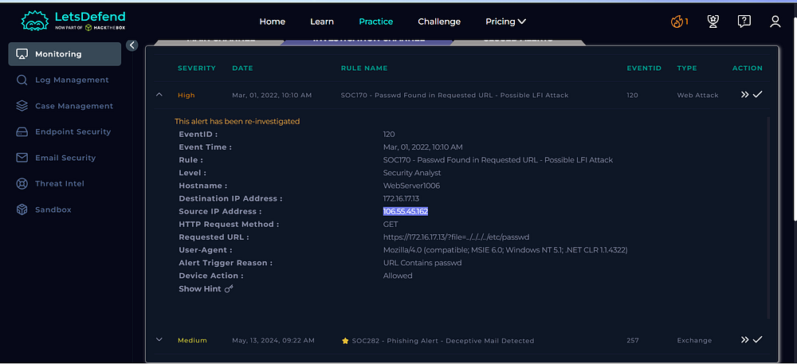
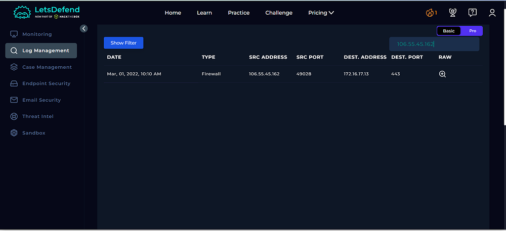
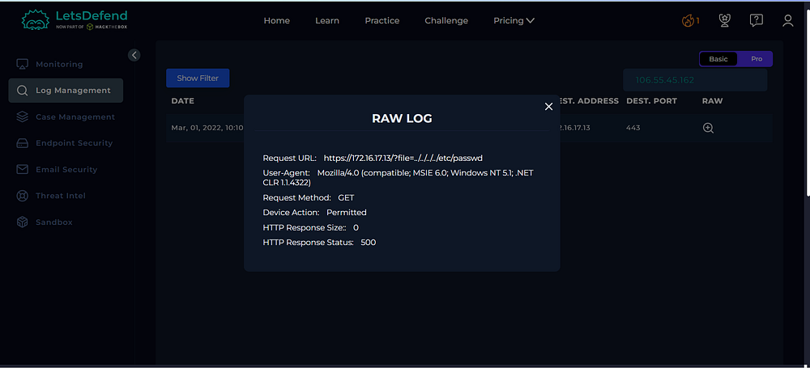
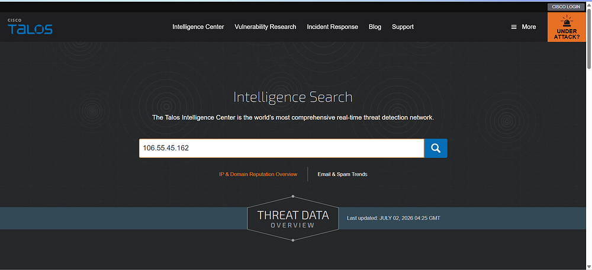
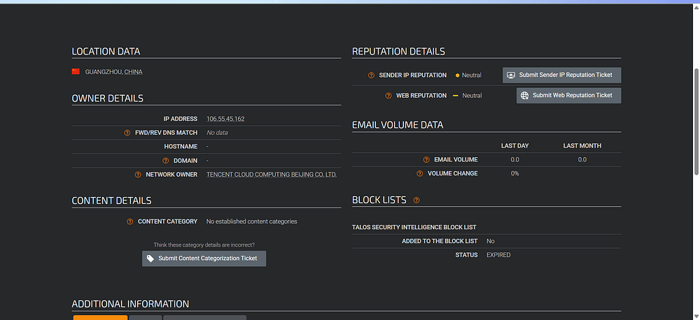
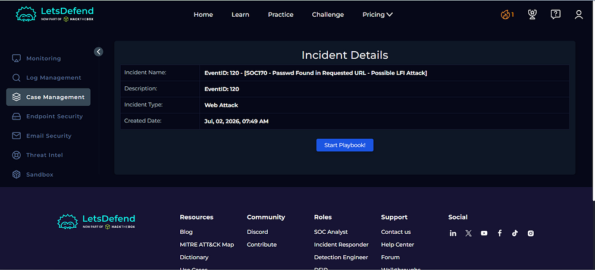
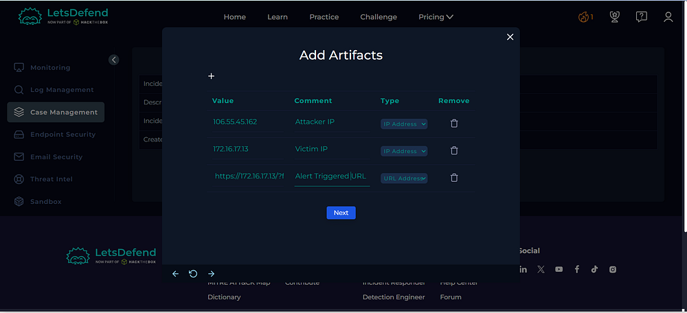
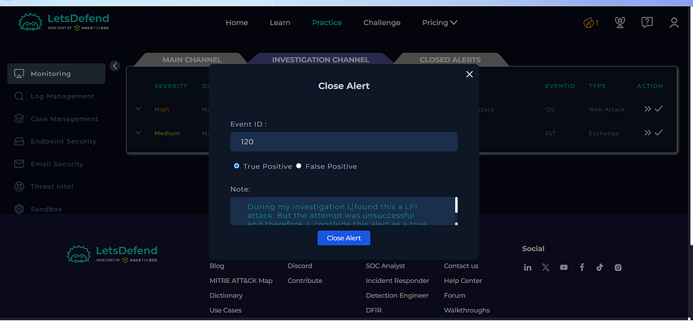

# Day 02 — SOC170: Passwd Found in Requested URL — Possible LFI Attack

## Overview

Today I investigated a Local File Inclusion (LFI) attack attempt detected in the Let'sDefend SOC environment.

The alert was triggered when a web request attempted to access the `/etc/passwd` file using path traversal sequences. I investigated the alert using raw logs, request and response analysis, threat intelligence, and the Case Management Playbook.

## Alert Details

- **Alert:** SOC170 — Passwd Found in Requested URL — Possible LFI Attack
- **Event ID:** 120
- **Event Time:** Mar 01, 2022, 10:10 AM
- **Level:** Security Analyst
- **Hostname:** WebServer1006
- **Destination IP:** 172.16.17.13
- **Source IP:** 106.55.45.162
- **HTTP Method:** GET
- **Device Action:** Allowed
- **Verdict:** True Positive

## Alert Evidence

### Requested URL

`https://172.16.17.13/?file=../../../../etc/passwd`

The request attempts to access the Linux `/etc/passwd` file through path traversal.

## Investigation Process

### 1. Monitoring — Investigation Channel

I first reviewed the **Monitoring > Investigation Channel** and identified the high-severity SOC170 alert.

**Figure 1 — Monitoring Tab**

### 2. Log Management — Source IP Investigation

I then reviewed **Log Management** and filtered the logs using the source IP:

`106.55.45.162`

This allowed me to investigate the traffic associated with the suspicious request.

**Figure 2 — Log Management**

### 3. Request and Response Analysis

The HTTP request contained:

`GET /?file=../../../../etc/passwd HTTP/1.1`

The request attempted to use path traversal to access `/etc/passwd`.

The server returned:

`HTTP/1.1 500 Internal Server Error`

with:

`Content-Length: 0`

No `/etc/passwd` contents were returned in the response. Based on the lab evidence, the LFI attempt was **not successful**.

**Figure 3 — Request and Response Analysis**

### 4. Threat Intelligence Analysis

I checked the source IP `106.55.45.162` using Cisco Talos Intelligence.

- **Location:** China
- **Reputation:** Neutral

The neutral reputation does not prove that the IP is malicious. However, the HTTP request itself was suspicious because it attempted to access `/etc/passwd` through path traversal.

**Figure 4 — Cisco Talos Intelligence**

**Figure 5 — Talos Result**

## Case Management — Playbook Answers

### 1. Is the Traffic Malicious?

**Yes**

The request contains a path traversal attempt targeting `/etc/passwd`, which is consistent with an LFI attack technique.

### 2. What Is the Attack Type?

**LFI — Local File Inclusion**

The attacker attempted to access a local file on the target server using path traversal.

### 3. Is It a Planned Test?

**Not Planned**

There were no indicators in the lab evidence suggesting that this was an authorized internal security simulation.

### 4. What Is the Direction of Traffic?

**Internet → Company Network**

The request originated from an external source IP and targeted the internal web server.

### 5. Was the Attack Successful?

**No**

The server returned a `500 Internal Server Error`, and no `/etc/passwd` data was returned. Therefore, based on the available lab evidence, the LFI attempt was unsuccessful.

### 6. Is Tier 2 Escalation Required?

**No**

Based on the lab's playbook criteria, Tier 2 escalation was not required because the attack attempt was unsuccessful.

**Figure 6 — Playbook**

## Artifacts

The following indicators were documented during the investigation:

| Type | Indicator |
|---|---|
| Source IP | `106.55.45.162` |
| Destination IP | `172.16.17.13` |
| Hostname | `WebServer1006` |
| Requested URL | `/?file=../../../../etc/passwd` |
| Attack Type | LFI |

**Figure 7 — Artifacts**

## Investigation Verdict

**True Positive — Unsuccessful LFI Attempt**

The alert was confirmed as a genuine malicious attack attempt. However, the available evidence showed that the attacker did not successfully retrieve the targeted `/etc/passwd` file.

## Response

The alert was closed as a **True Positive** after completing the investigation and documenting the relevant artifacts.

**Figure 8 — Closing Alert**

## What I Learned

From this investigation, I learned how to:

- Investigate LFI attack attempts
- Identify path traversal patterns
- Analyze HTTP requests and responses
- Understand `/etc/passwd` as a sensitive Linux file
- Use threat intelligence during an investigation
- Determine whether an attack was successful
- Document security artifacts
- Follow a SOC investigation playbook

## Tools Used

- Let'sDefend
- Cisco Talos Intelligence
- Log Management
- Threat Intelligence
- Case Management Playbook

## Key Takeaway

A request containing `../../../../etc/passwd` is a strong indicator of a potential LFI/path traversal attack. However, detecting an attack attempt does not automatically mean that exploitation was successful.

A SOC analyst should correlate:

**HTTP Request → Server Response → Threat Intelligence → Attack Type → Success/Failure → Verdict**

This investigation helped me understand how to distinguish between a **malicious attack attempt** and a **successful exploitation**.
