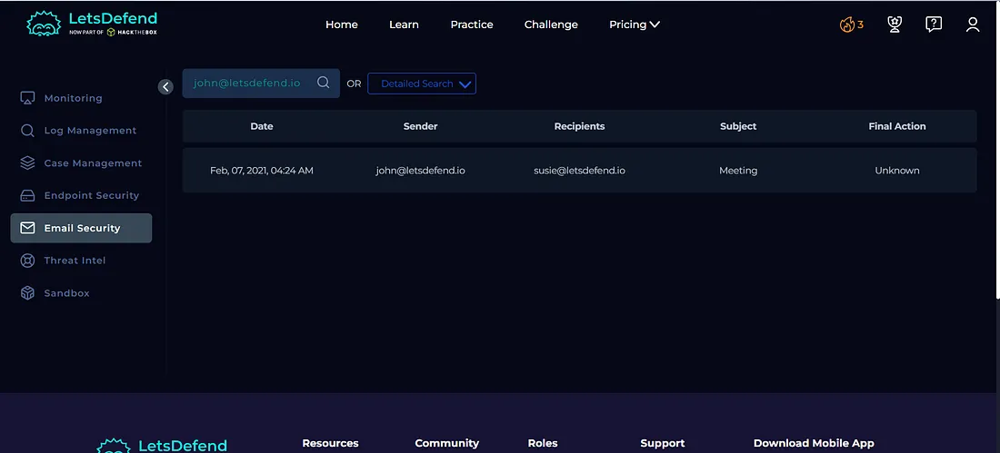
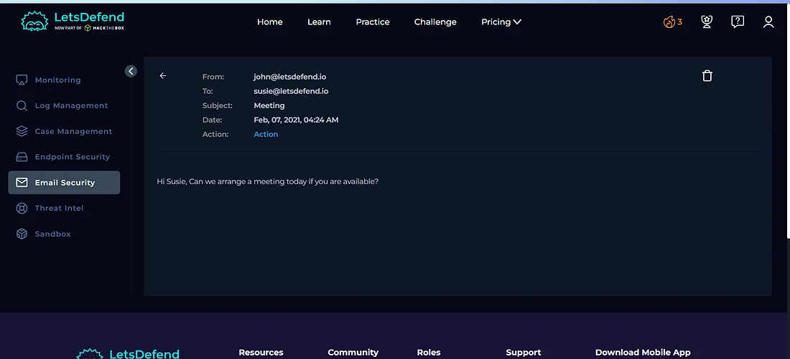
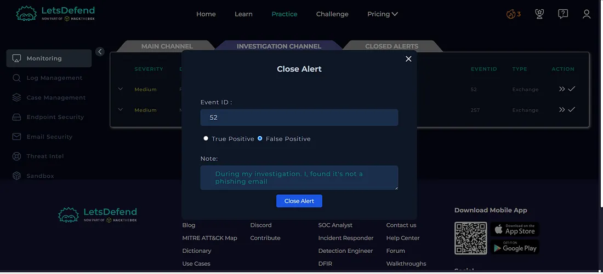
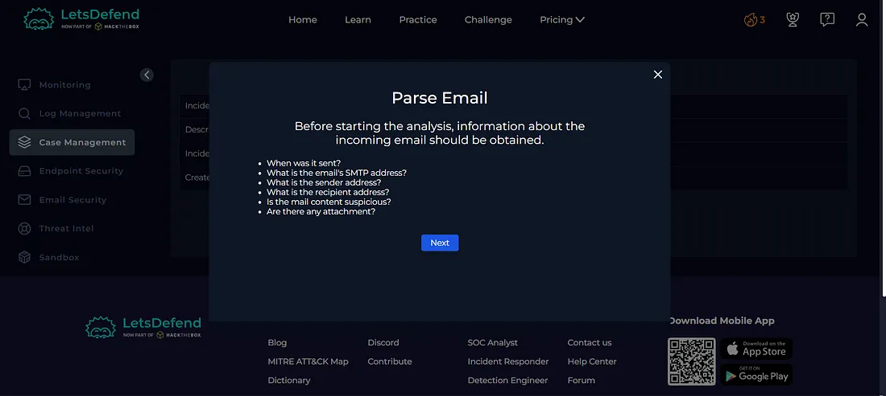
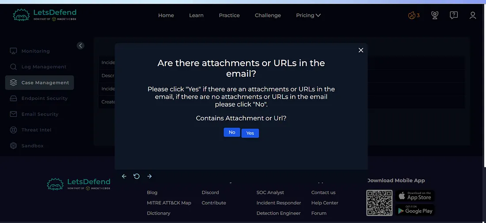
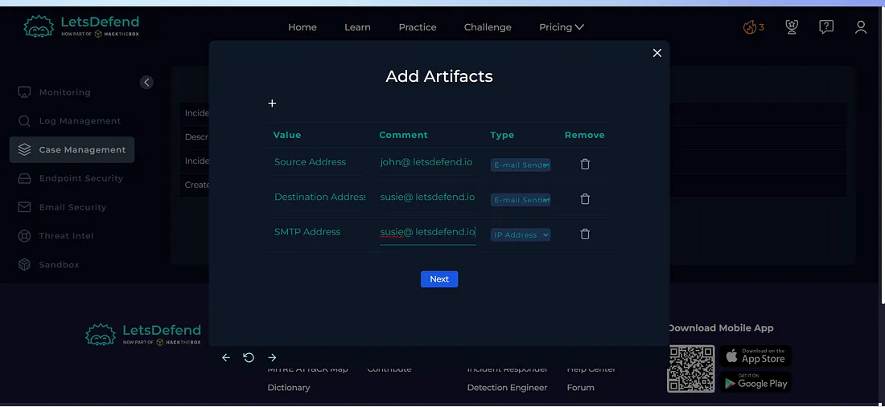
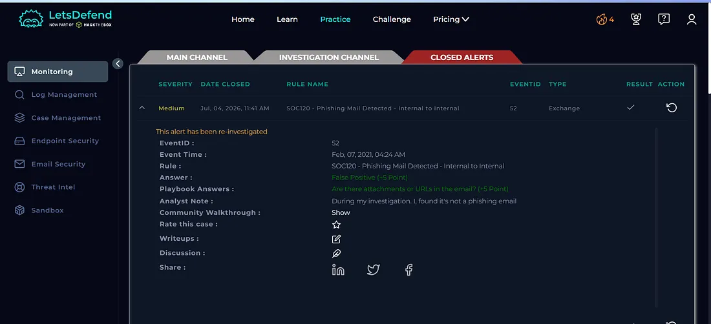

## Overview

Today I investigated a phishing-related alert in the Let'sDefend SOC environment.

The alert involved an internal-to-internal email that was flagged as a potential phishing email. I reviewed the email content, checked for attachments and URLs, documented the findings, and completed the Case Management Playbook.

## Alert Details

- **Alert:** SOC120 — Phishing Mail Detected — Internal to Internal
- **Event ID:** 52
- **Event Time:** Feb 07, 2021, 04:24 AM
- **Level:** Security Analyst
- **SMTP Address:** 172.16.20.3
- **Source Address:** john@letsdefend.io
- **Destination Address:** susie@letsdefend.io
- **Email Subject:** Meeting
- **Device Action:** Allowed
- **Verdict:** False Positive

## Investigation Process

### 1. Email Security Investigation

I navigated to the **Email Security** tab and searched for:

`john@letsdefend.io`

This allowed me to identify the email that triggered the alert.

**Figure 1 — Email Security Tab**

### 2. Email Content Analysis

The email was sent from:

`john@letsdefend.io`

to:

`susie@letsdefend.io`

with the subject:

`Meeting`

The device action was **Allowed**, indicating that the email was delivered to the intended user.

**Figure 2 — Email Content**

During the review, I found that the email did not contain any suspicious attachments or URLs.

### 3. Case Management — Playbook

I created a case and started the **Case Management Playbook**.

**Figure 3 — Playbook**

I proceeded to the **Parse Email** step and reviewed whether the email contained any attachments or URLs.

**Figure 4 — Parse Email**

The email did not contain any attachments or URLs, so I selected:

**No**

**Figure 5 — Attachment / URL Check**

### 4. Artifacts

I documented the relevant findings from the investigation as artifacts before completing the case.

**Figure 6 — Artifacts**

### 5. Closing the Alert

Based on the investigation, there was no evidence of malicious content or phishing indicators in the email.

Therefore, the alert was closed as:

**False Positive**

**Figure 7 — Closing Alert**

## Investigation Verdict

**False Positive**

The alert was determined to be a false positive because the email did not contain suspicious attachments or URLs, and no malicious indicators were identified during the investigation.

## What I Learned

From this investigation, I learned how to:

- Investigate internal-to-internal phishing alerts
- Analyze email sender and recipient information
- Review email content
- Check for suspicious attachments and URLs
- Use the Case Management Playbook
- Document investigation artifacts
- Determine False Positive vs True Positive
- Close an alert based on investigation findings

## Tools Used

- Let'sDefend
- Email Security
- Case Management
- Playbook
- Artifacts

## Key Takeaway

Not every phishing alert indicates a genuine phishing attack.

A SOC analyst should review the email content, attachments, URLs, and other available evidence before determining the final verdict.

**Email Analysis → Attachment/URL Check → Artifact Documentation → Playbook → Verdict**

In this investigation, no malicious indicators were identified, so the alert was closed as a **False Positive**.
