Today I investigated a possible IDOR (Insecure Direct Object Reference) attack detected against a web server in the Let'sDefend SOC environment.

The alert was triggered by consecutive POST requests to the `/get_user_info/` endpoint from an external source IP address. Threat intelligence checks showed that the source IP had been flagged as malicious.

Further investigation of the network logs revealed multiple requests containing different `user_id` values, with several successful HTTP `200` responses. This indicated that the attacker may have been attempting to access different user information through an IDOR vulnerability.

I investigated the alert using AbuseIPDB, Cisco Talos Intelligence, network logs, and the Case Management Playbook.

## Alert Details

- **Alert:** SOC169 — Possible IDOR Attack Detected
- **Event ID:** 119
- **Event Time:** Feb 28, 2022, 10:48 PM
- **Level:** Security Analyst
- **Hostname:** WebServer1005
- **Destination IP Address:** `172.16.17.15`
- **Source IP Address:** `134.209.118.137`
- **HTTP Request Method:** POST
- **Requested URL:** `https://172.16.17.15/get_user_info/`
- **User-Agent:** `Mozilla/4.0 (compatible; MSIE 6.0; Windows NT 5.1; .NET CLR 1.1.4322)`
- **Alert Trigger Reason:** Consecutive requests to the same page
- **Device Action:** Allowed
- **Verdict:** True Positive

## Investigation Process

### 1. Source IP Threat Intelligence Investigation

I started the investigation by analyzing the source IP address:

`134.209.118.137`

I checked the IP address using **AbuseIPDB** and **Cisco Talos Intelligence** to determine whether the source was associated with malicious activity.

**Figure 1 — AbuseIPDB**

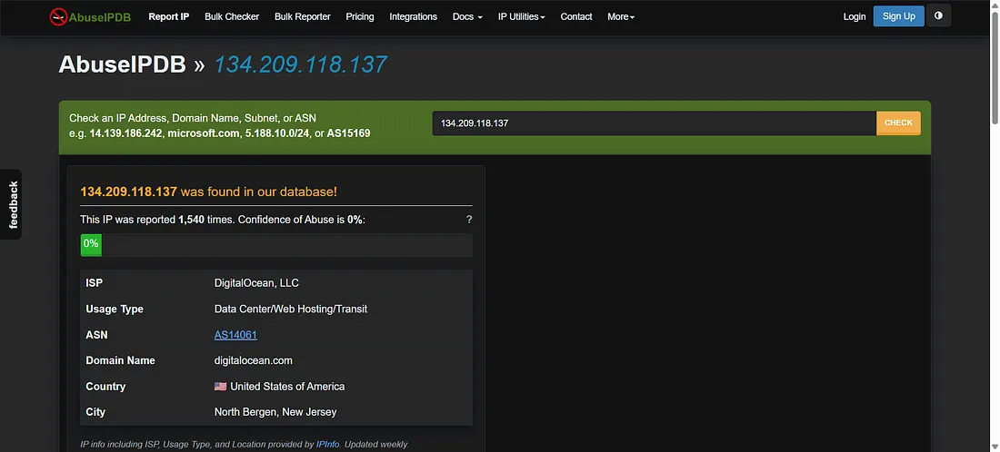

The source IP address was external to the company network and originated from the United States. The IP address had been flagged as malicious.

**Figure 2 — Cisco Talos Intelligence**

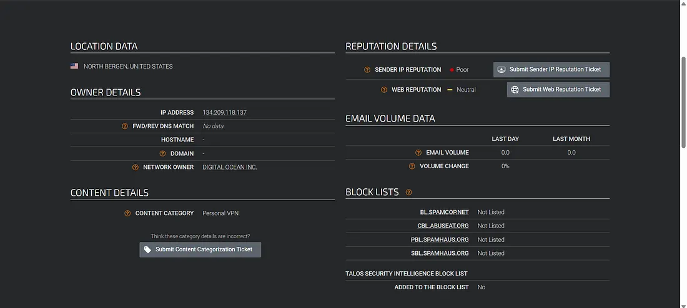

The threat intelligence results provided additional evidence that the source IP was suspicious and required further investigation.

### 2. Network Log Investigation

I then navigated to **Log Management** and searched the network logs related to the alert.

**Figure 3 — Raw Log**

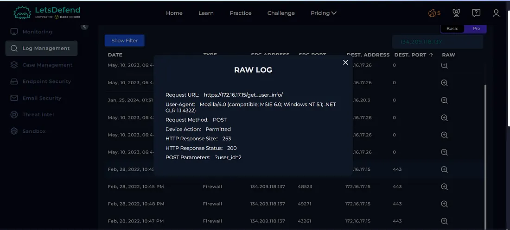

**Figure 4 — Raw Log**

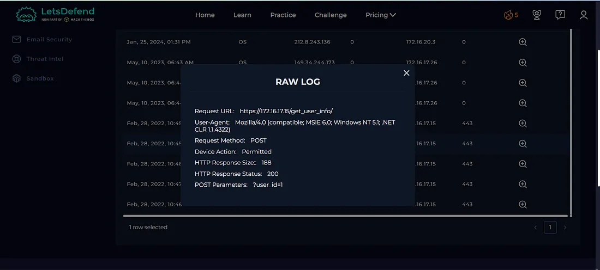

**Figure 5 — Raw Log**

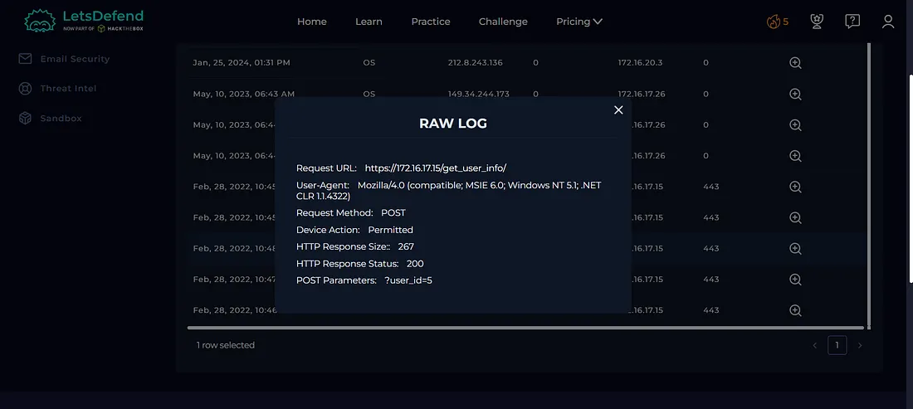

**Figure 6 — Raw Log**

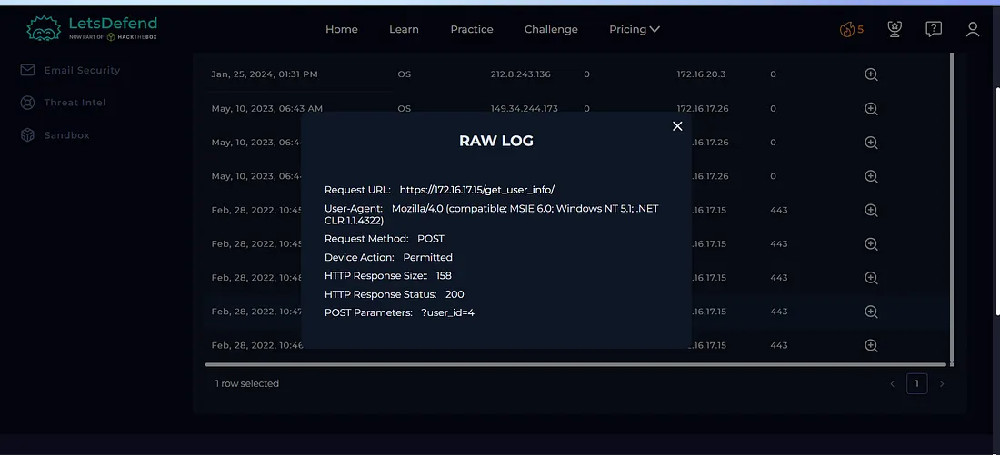

**Figure 7 — Raw Log**

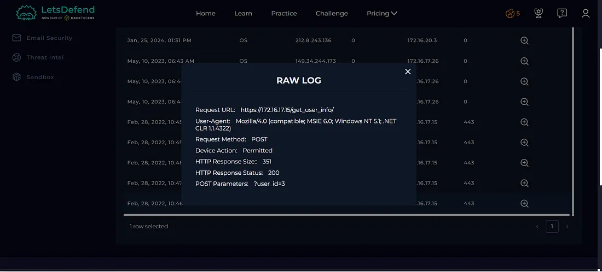

The search returned **five events** related to the investigation.

The logs showed that the source was sending multiple requests containing different `user_id` values.

Several of these requests returned an HTTP **200 status code**, indicating that the requests were successfully processed by the server.

This behavior was suspicious because the attacker appeared to be modifying the `user_id` value in repeated requests, which is consistent with attempting to access information belonging to different users.

### 3. IDOR Attack Identification

Based on the requested URL:

`https://172.16.17.15/get_user_info/`

and the repeated requests containing different `user_id` values, the activity was identified as a possible **IDOR (Insecure Direct Object Reference)** attack.

The successful HTTP `200` responses increased the concern that the server was accepting the modified object references.

This suggested that the attacker may have been attempting to access unauthorized user information by manipulating the `user_id` parameter.

### 4. Case Management — Playbook Answers

I completed the Case Management Playbook based on the evidence collected during the investigation.

#### Is the Activity Malicious?

**Yes**

The source IP address was flagged as malicious by threat intelligence sources, and the network logs showed suspicious repeated requests targeting the web server.

**Figure 8 — Playbook Answer**

#### What Type of Attack Was Detected?

**IDOR**

The repeated requests containing different `user_id` values against the `/get_user_info/` endpoint were consistent with an **Insecure Direct Object Reference (IDOR)** attack.

**Figure 9 — Playbook Answer**

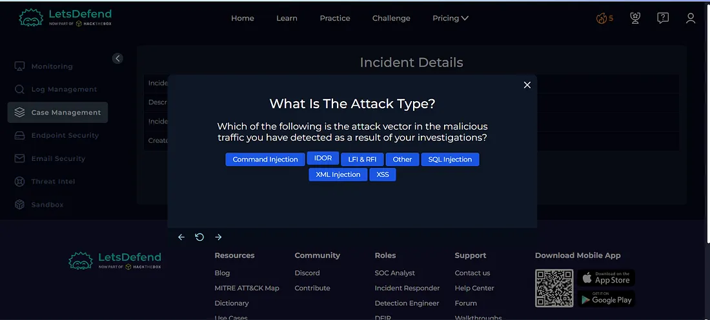

#### Was This a Planned Security Test?

**No**

There was no information or evidence indicating that the activity was part of an authorized or planned security test.

**Figure 10 — Playbook Answer**

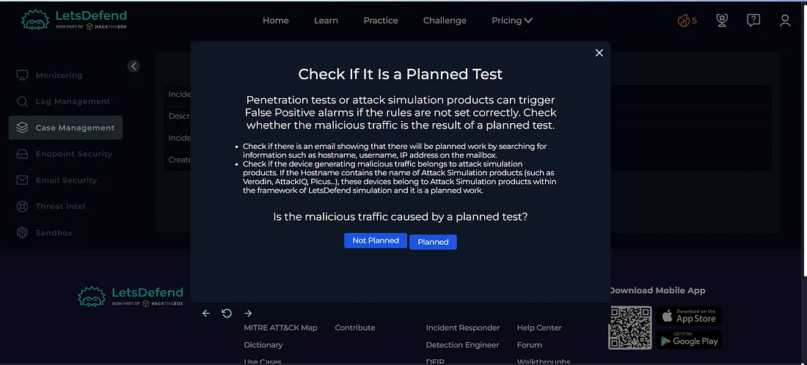

#### Was the Traffic Internet to Company Network?

**Yes**

The source IP address was external to the company network and the traffic was directed toward the internal web server.

**Figure 11 — Playbook Answer**

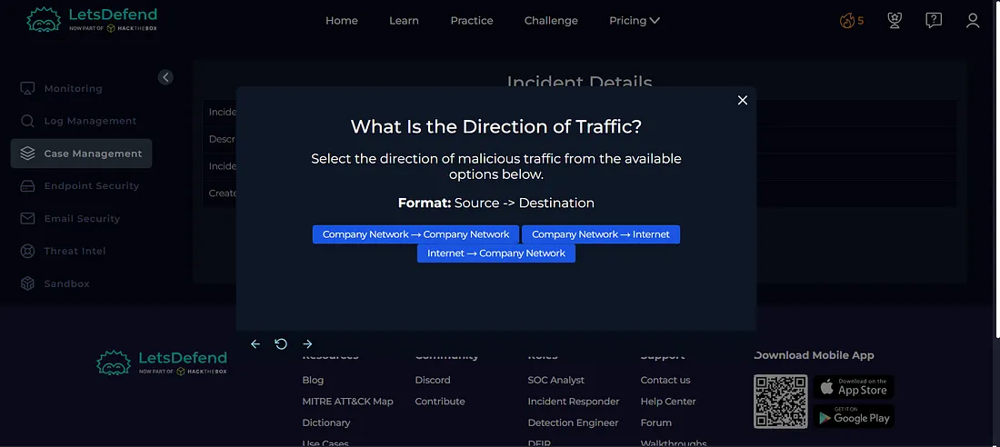

#### Was the Request Successful?

**Yes**

The network logs showed HTTP **200** response codes, indicating that the requested URL requests were successfully processed by the server.

**Figure 12 — Playbook Answer**

 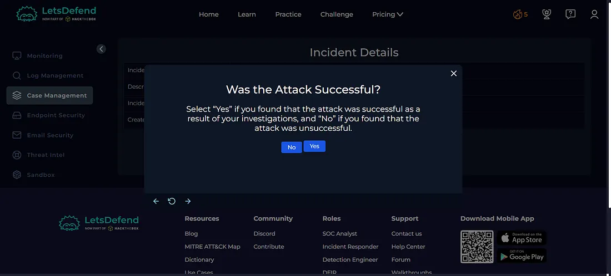

### 5. Host Containment

Based on the investigation findings, the web server endpoint was considered at risk.

I contained the affected server to prevent further unauthorized requests and reduce the potential impact while additional investigation could be performed.

**Figure 13 — Host Containment / Playbook Answer**

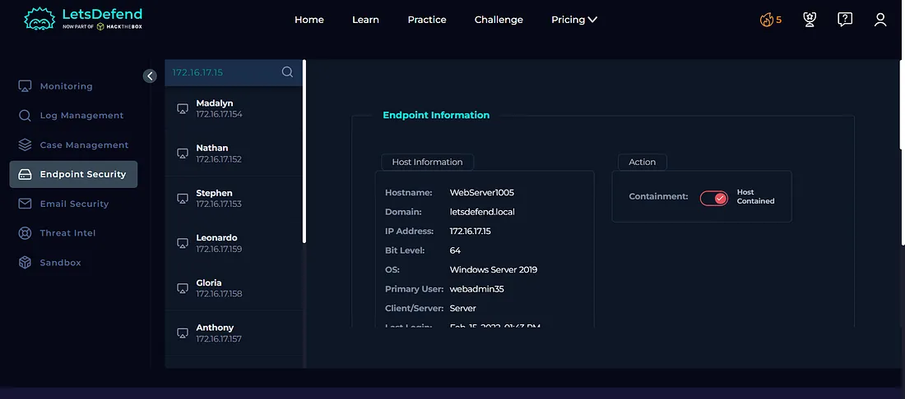

## Artifacts

The following indicators were documented during the investigation:

| Type | Indicator |
|---|---|
| Source IP | `134.209.118.137` |
| Destination IP | `172.16.17.15` |
| Hostname | `WebServer1005` |
| HTTP Method | `POST` |
| Requested URL | `https://172.16.17.15/get_user_info/` |
| Attack Type | `IDOR` |
| HTTP Response | `200` |
| Source Location | `United States` |

**Figure 14 — Artifacts**

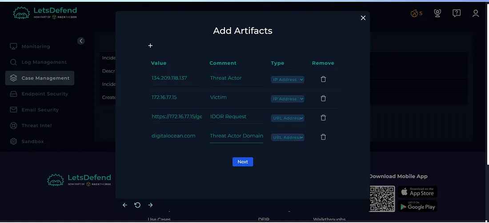

## Escalation

Based on the investigation findings and the completed playbook, the alert required further investigation by a **Tier 2 SOC Analyst**.

The case was escalated to Tier 2 for deeper analysis of the affected web server, potential unauthorized data access, and further incident response.

**Figure 15 — Escalation**

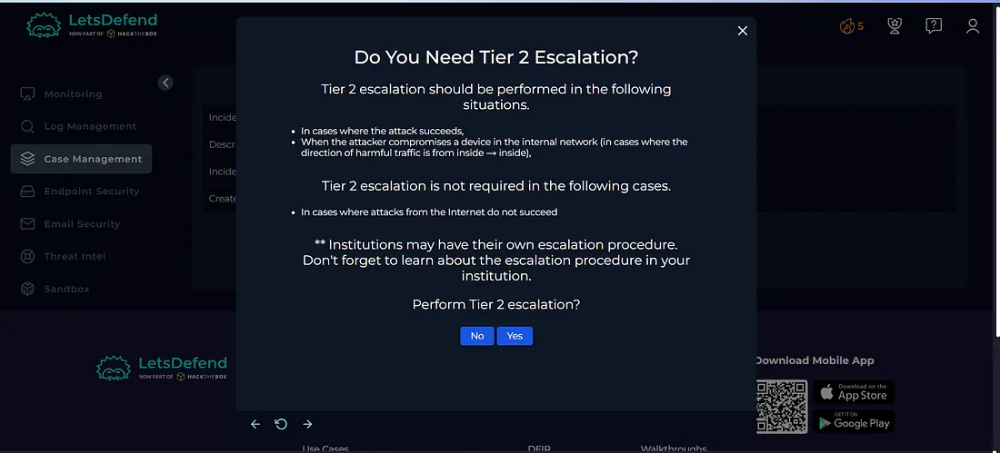

## Investigation Verdict

**True Positive — Possible IDOR Attack**

The alert was confirmed as a genuine malicious security event.

The external source IP was identified as malicious through threat intelligence analysis. Network logs showed multiple requests using different `user_id` values against the `/get_user_info/` endpoint, with several requests receiving successful HTTP `200` responses.

This activity was consistent with an attempted **IDOR attack** against the internal web server.

## Response

The affected web server was **contained** to prevent further suspicious activity.

The relevant indicators and findings were documented as artifacts, and the case was **escalated to Tier 2** for further investigation.

The alert was then closed as a **True Positive**.

**Figure 16 — Closed Alert**

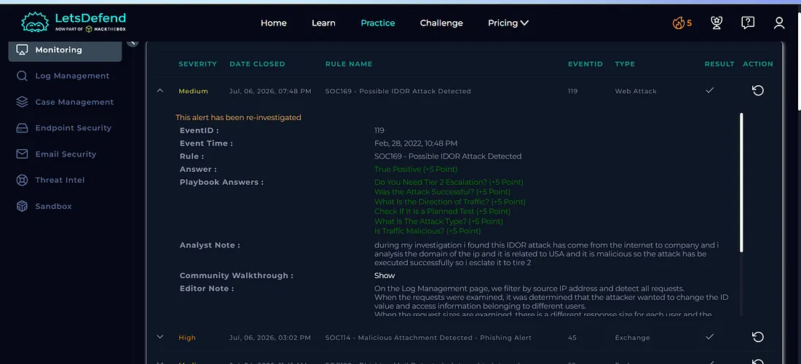

## What I Learned

From this investigation, I learned how to:

- Investigate possible IDOR attacks
- Analyze suspicious source IP addresses
- Use AbuseIPDB for threat intelligence
- Use Cisco Talos Intelligence for IP reputation analysis
- Investigate network logs
- Identify repeated HTTP requests
- Understand HTTP `200` response codes
- Identify suspicious manipulation of `user_id` parameters
- Understand the concept of Insecure Direct Object Reference (IDOR)
- Determine whether traffic is Internet-to-Company Network
- Perform host containment
- Document investigation artifacts
- Escalate incidents to Tier 2
- Determine True Positive vs False Positive
- Follow a SOC investigation playbook

## Tools Used

- Let'sDefend
- AbuseIPDB
- Cisco Talos Intelligence
- Log Management
- Network Logs
- Case Management Playbook

## Key Takeaway

An IDOR attack can occur when an application allows a user to access objects or information by modifying an identifier such as `user_id` without properly validating authorization.

In this investigation, the repeated requests with different `user_id` values and successful HTTP `200` responses indicated suspicious attempts to access different user information.

A SOC analyst should correlate:

**Source IP → Threat Intelligence → Network Logs → Repeated Requests → Parameter Manipulation → HTTP 200 Response → Containment → Escalation → Verdict**

This investigation helped me understand how a SOC analyst can identify suspicious web application activity, recognize potential IDOR behavior, contain the affected system, and escalate the incident for further investigation.
