Today I investigated a web security alert involving a possible Cross-Site Scripting (XSS) attack in the Let'sDefend SOC environment.

The alert was triggered because JavaScript code was detected inside a requested URL. Further investigation showed that the attacker attempted to inject a JavaScript payload through the `q` parameter of the search endpoint.

The source IP address was also checked using threat intelligence, and the network logs showed that the request resulted in an HTTP `302` response. No evidence of successful script execution or follow-up activity was identified.

I investigated the alert using AbuseIPDB, network logs, and the Case Management Playbook.

## Alert Details

- **Alert:** SOC166 — Javascript Code Detected in Requested URL
- **Event ID:** 116
- **Event Time:** Feb 26, 2022, 06:56 PM
- **Level:** Security Analyst
- **Hostname:** WebServer1002
- **Destination IP Address:** `172.16.17.17`
- **Source IP Address:** `112.85.42.13`
- **HTTP Request Method:** GET
- **Requested URL:** `https://172.16.17.17/search/?q=<$script>javascript:$alert(1)<$/script>`
- **Alert Trigger Reason:** Javascript code detected in URL
- **Device Action:** Allowed
- **Verdict:** True Positive

## Investigation Process

### 1. Request Analysis

I first reviewed the HTTP request that triggered the alert.

The request was:

`GET /search/?q=<$script>javascript:$alert(1)<$/script>`

The `q` parameter contained a JavaScript payload designed to execute JavaScript code through the web application's search functionality.

This behavior is consistent with a **Cross-Site Scripting (XSS)** attempt, specifically a possible **Reflected XSS** attack.

### 2. Source IP Reputation Investigation

The request originated from the following source IP:

`112.85.42.13`

I checked the source IP address using **AbuseIPDB** to determine whether it had been associated with suspicious activity.

**Figure 1 — AbuseIPDB**

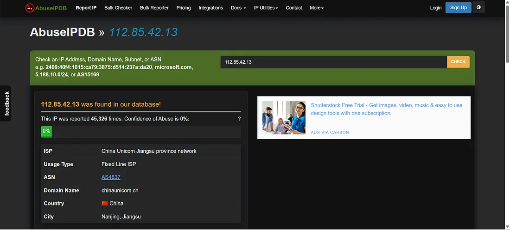

The IP address had multiple reports associated with malicious activity, including brute-force and scanning behavior.

This provided additional context that the source was suspicious and required further investigation.

### 3. HTTP Response Analysis

I then reviewed the network logs to determine whether the XSS payload was successfully processed by the web server.

The request resulted in an HTTP **302 Found** response with a response size of **0 bytes**.

**Figure 2 — Raw Log**

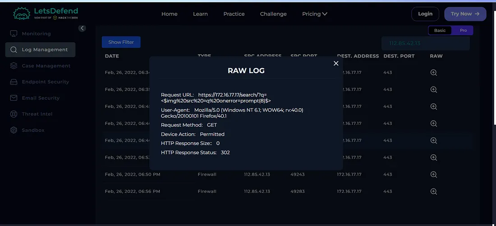

The HTTP `302` response indicated that the request was redirected and no page content was returned in the response.

There was no evidence that the injected JavaScript payload was successfully executed.

Based on the available evidence, the XSS attempt was considered **unsuccessful**.

### 4. Pattern of Activity

I reviewed the logs before and after the alert to identify any additional activity from the source IP.

No signs of follow-up activity or successful exploitation were identified.

This supported the conclusion that the detected XSS attempt did not successfully compromise the web server.

## Case Management — Playbook Answers

I completed the Case Management Playbook based on the evidence collected during the investigation.

### Is the Traffic Malicious?

**Yes**

The request contained a clear JavaScript/XSS payload:

``

The source IP was also associated with suspicious activity according to AbuseIPDB.

**Figure 3 — Playbook Answer**

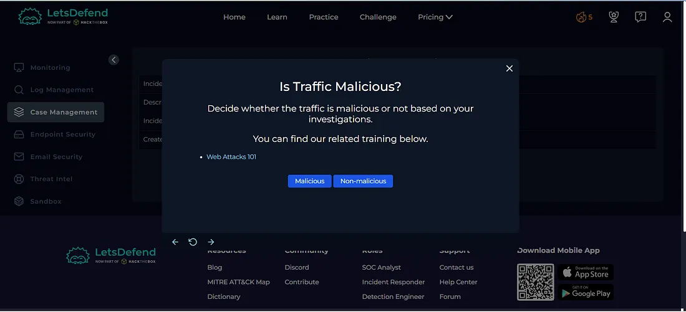

### What Type of Attack Was Detected?

**Cross-Site Scripting (Reflected XSS)**

The attacker attempted to inject JavaScript code through the `q` parameter in the requested URL.

**Figure 4 — Playbook Answer**

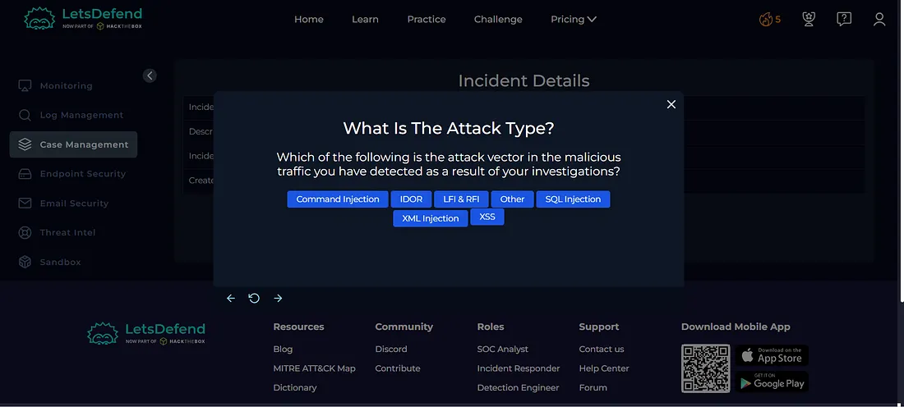

### Was This a Planned Security Test?

**No**

There was no evidence indicating that the malicious request was part of an authorized or planned security test.

**Figure 5 — Playbook Answer**

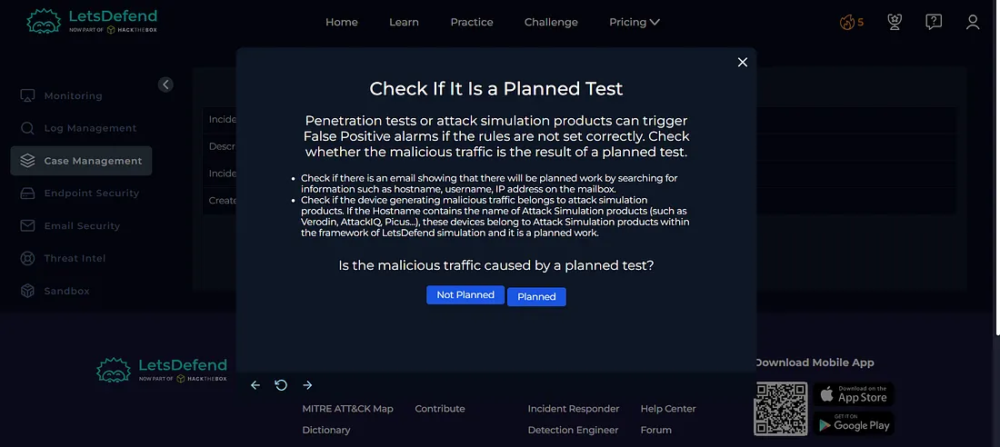

### Was the Traffic Internet to Company Network?

**Yes**

The malicious request originated from an external IP address and was directed toward the internal company web server.

Therefore, the traffic direction was:

**Internet → Company Network**

**Figure 6 — Playbook Answer**

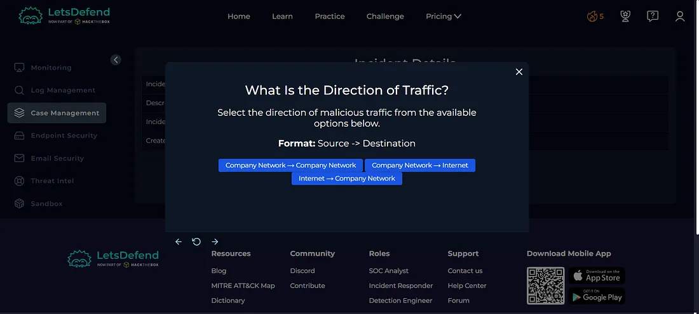

### Was the Attack Successful?

**No**

The request resulted in an HTTP `302 Found` response with a response size of `0` bytes.

No evidence of successful JavaScript execution or follow-up exploitation was identified.

**Figure 7 — Playbook Answer**

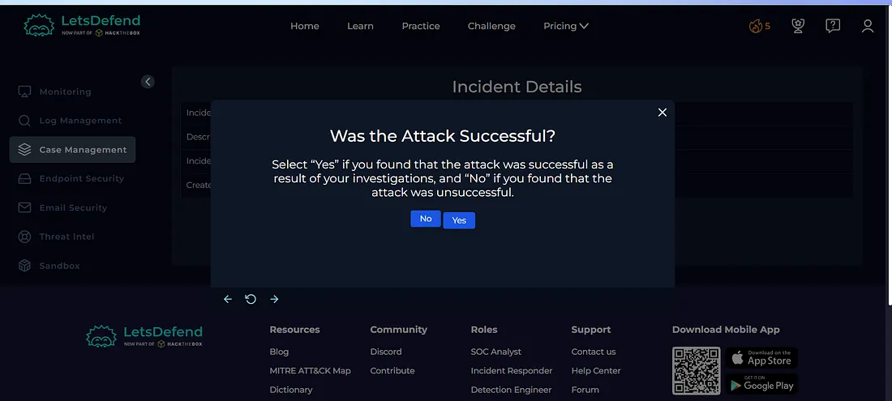

## Artifacts

The following indicators were documented during the investigation:

| Type | Indicator |
|---|---|
| Source IP | `112.85.42.13` |
| Destination IP | `172.16.17.17` |
| Hostname | `WebServer1002` |
| HTTP Method | `GET` |
| Requested URL | `https://172.16.17.17/search/?q=<$script>javascript:$alert(1)<$/script>` |
| Attack Type | `Reflected XSS` |
| HTTP Response | `302 Found` |
| Response Size | `0 bytes` |
| Traffic Direction | `Internet → Company Network` |

**Figure 8 — Artifacts**

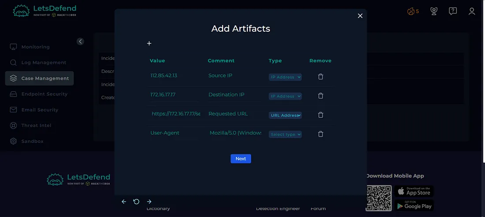

## Tier 2 Escalation

Based on the investigation, the attack was unsuccessful and there was no evidence of successful exploitation or compromise.

Therefore, **Tier 2 escalation was not required**.

**Figure 9 — Escalation**

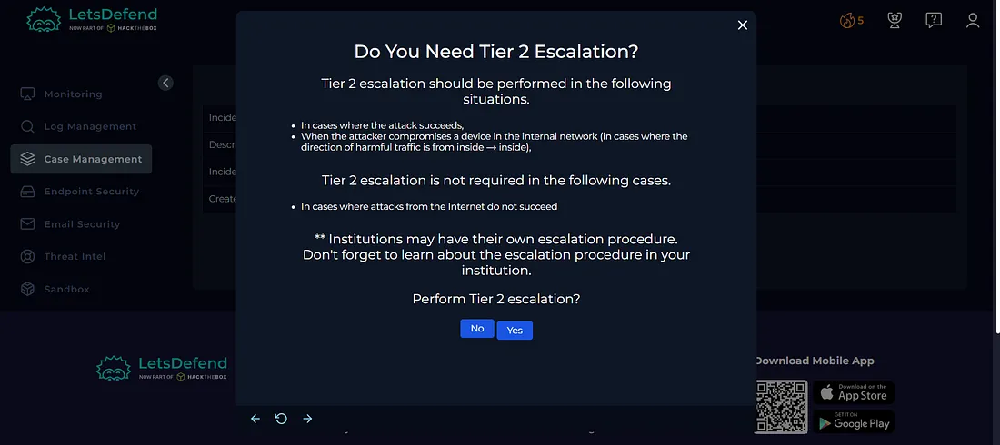

## Investigation Verdict

**True Positive — Unsuccessful Reflected XSS Attempt**

The alert was confirmed as a genuine malicious security event.

The request contained a JavaScript payload attempting to perform a Reflected XSS attack through the `q` parameter.

However, the attack was unsuccessful because the request resulted in an HTTP `302` response with no response content, and no evidence of JavaScript execution or follow-up exploitation was identified.

## Response

No host containment was required because the attack was unsuccessful and there was no evidence of successful compromise.

The malicious indicators and investigation findings were documented as artifacts.

Since the activity was confirmed as malicious, the alert was closed as a **True Positive**.

**Figure 10 — Close Alert**

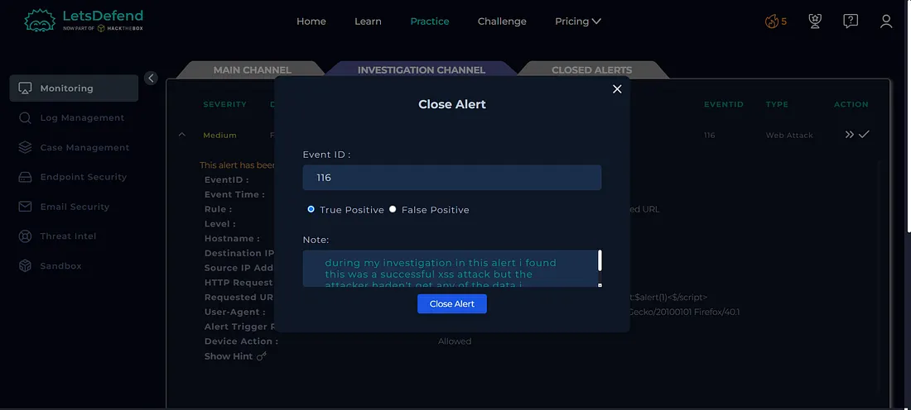

**Figure 11 — Closed Alert**

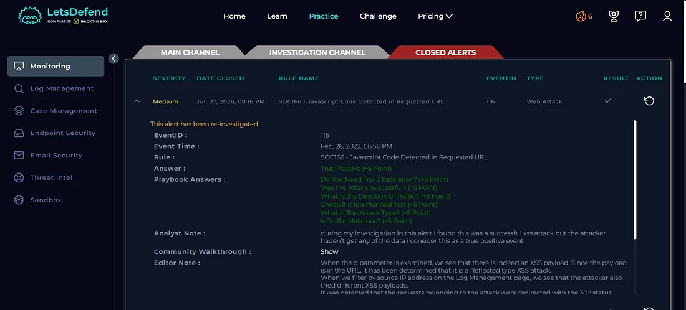

## What I Learned

From this investigation, I learned how to:

- Investigate Cross-Site Scripting (XSS) alerts
- Identify JavaScript injection attempts
- Understand Reflected XSS attacks
- Analyze suspicious HTTP requests
- Investigate URL parameters
- Use AbuseIPDB for IP reputation analysis
- Analyze HTTP response codes
- Understand HTTP `302 Found` responses
- Determine whether an attack was successful
- Review activity before and after an alert
- Document investigation artifacts
- Determine True Positive vs False Positive
- Understand when Tier 2 escalation is required
- Follow a SOC investigation playbook

## Tools Used

- Let'sDefend
- AbuseIPDB
- Log Management
- Network Logs
- Case Management Playbook

## Key Takeaway

A JavaScript payload inside a URL parameter can indicate an attempted **Reflected XSS attack**.

In this investigation, the attacker attempted to inject JavaScript through the `q` parameter, but the request resulted in an HTTP `302` response with no response content and there was no evidence of successful execution.

A SOC analyst should correlate:

**HTTP Request → Payload Analysis → Source IP Reputation → HTTP Response → Attack Success/Failure → Artifacts → Escalation → Verdict**

This investigation helped me understand how a SOC analyst can identify XSS attempts, determine whether the attack was successful, and make an appropriate escalation and response decision.
