Today I investigated a possible SQL Injection attack in the Let'sDefend SOC environment.

The alert was triggered when an external source sent a suspicious SQL injection payload through a web application's search parameter. I investigated the source IP reputation, analyzed the HTTP request, decoded the requested URL, reviewed the server response, and completed the Case Management Playbook.

## Alert Details

- **Alert:** SOC165 — Possible SQL Injection Payload Detected
- **Event ID:** 115
- **Event Time:** Feb 25, 2022, 11:34 AM
- **Level:** Security Analyst
- **Hostname:** WebServer1001
- **Destination IP:** 172.16.17.18
- **Source IP:** 167.99.169.17
- **HTTP Method:** GET
- **Device Action:** Allowed
- **Verdict:** True Positive

## Investigation Process

### 1. Source IP Reputation

The suspicious request originated from:

`167.99.169.17`

I checked the source IP using **AbuseIPDB** and found multiple reports associated with the address.

**Figure 1 — AbuseIPDB**

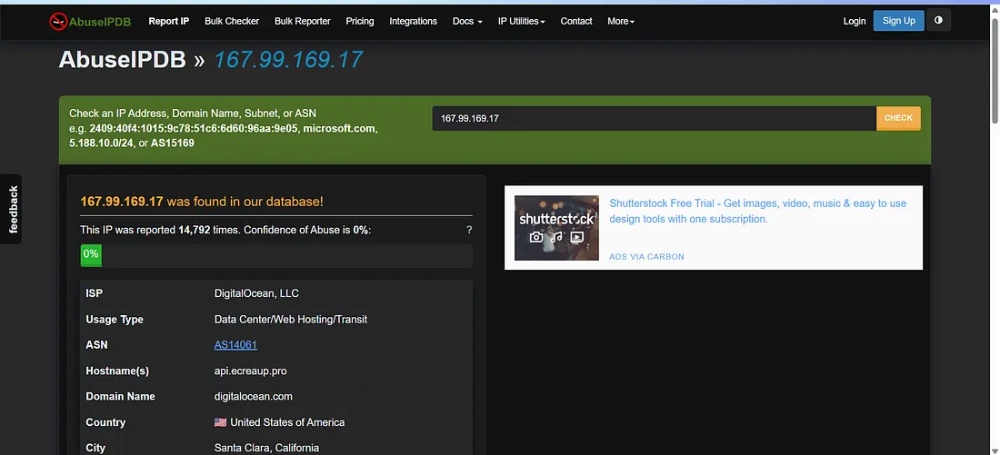

I then checked the IP reputation using **VirusTotal**. The IP was flagged as malicious by multiple security vendors.

**Figure 2 — VirusTotal**

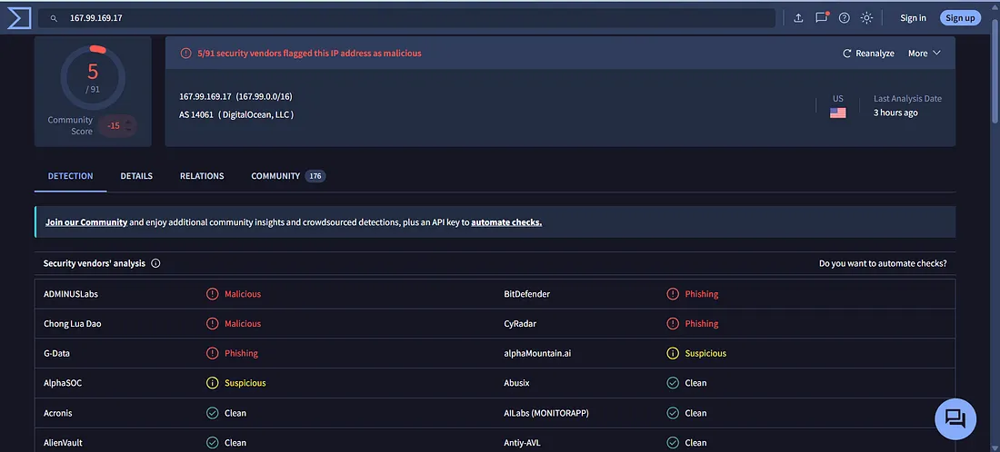

### 2. Log Management Investigation

I reviewed the **Log Management** tab and identified the suspicious HTTP request associated with the source IP.

**Figure 3 — Log Management**

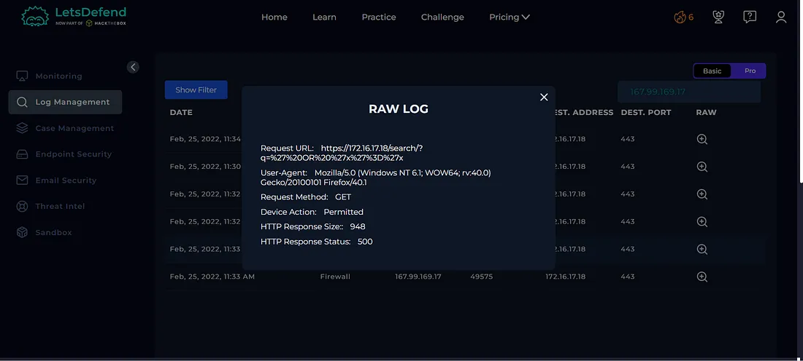

The requested URL contained an encoded SQL injection payload.

---

### 3. URL Analysis

I decoded the requested URL to understand the payload.

The decoded request contained a SQL injection pattern similar to:

`" OR 1 = 1 --`

This is a common SQL injection technique that attempts to alter the logic of a database query.

**Figure 4 — URL Decoder**

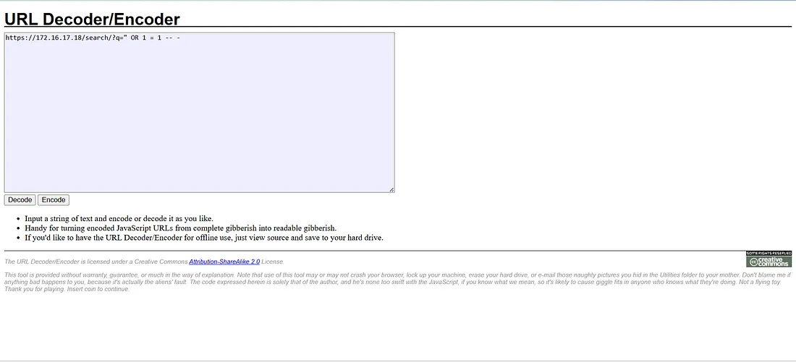

---

## Case Management — Playbook Answers

### 1. Is the Traffic Malicious?

**Yes**

The request contained a SQL injection payload targeting the web application's search parameter.

**Figure 5 — Playbook**

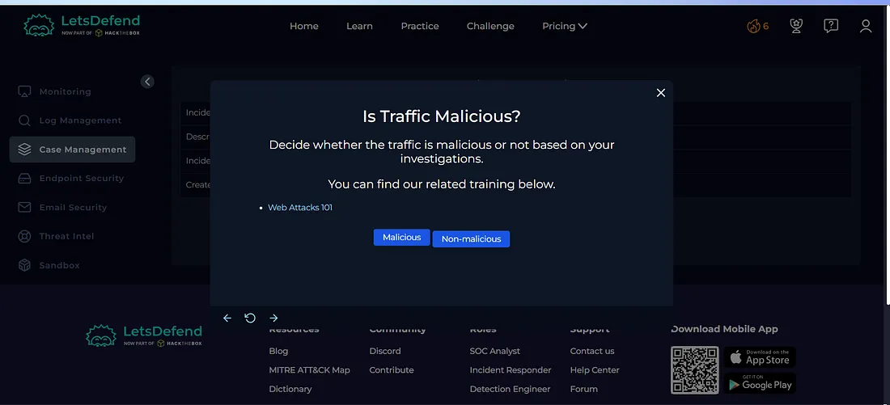

### 2. What Is the Attack Type?

**SQL Injection**

The URL contained the SQL injection pattern `OR 1 = 1`, indicating an attempt to manipulate the application's database query.

**Figure 6 — Playbook**

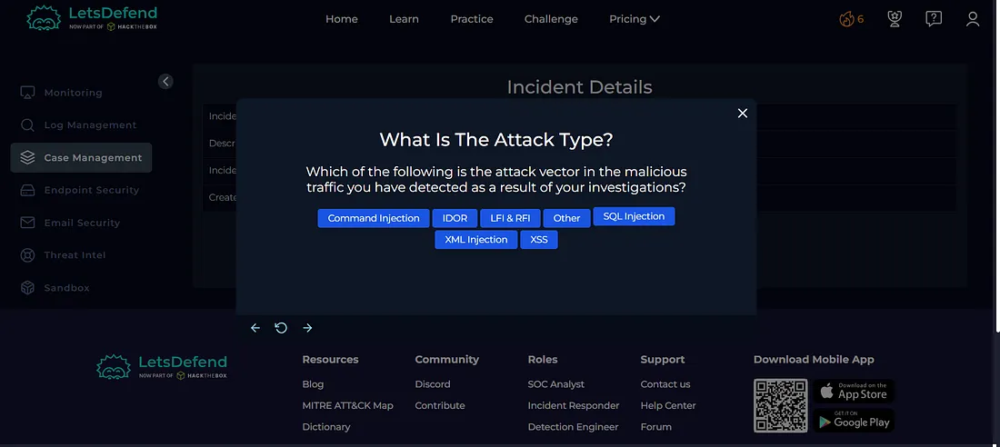

### 3. Is It a Planned Test?

**Not Planned**

There was no evidence indicating that this activity was part of an authorized security test.

**Figure 7 — Playbook**

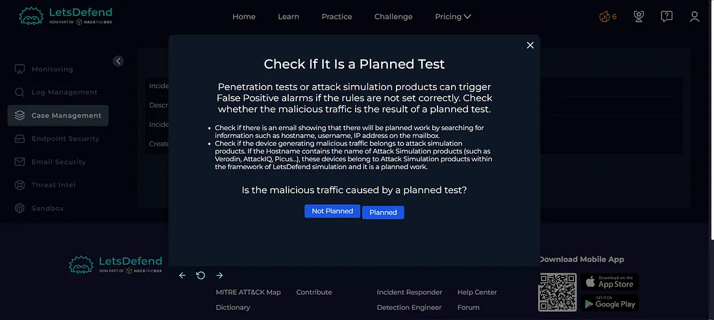

### 4. What Is the Direction of Traffic?

**Internet → Company Network**

The request originated from an external IP address and targeted an internal web server.

**Figure 8 — Playbook**

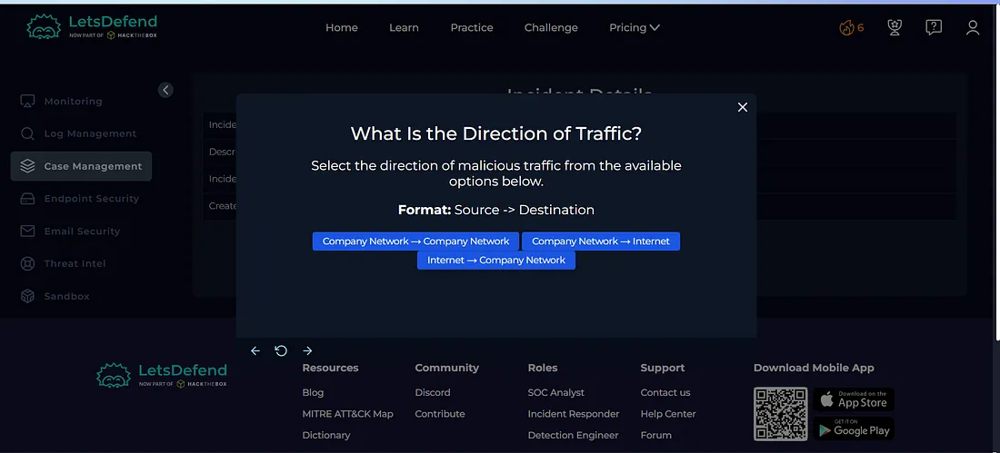

### 5. Was the Attack Successful?

**No**

The server returned an **HTTP 500 Internal Server Error**, indicating that the request was unsuccessful based on the available lab evidence.

**Figure 9 — Playbook**

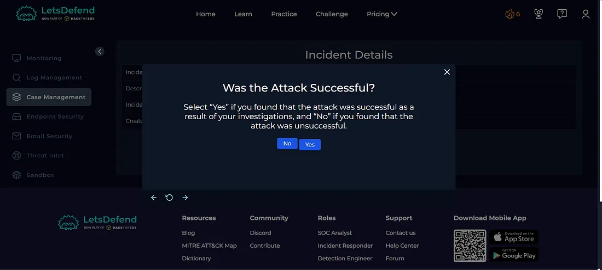

---

## Artifacts

The following indicators were documented during the investigation:

| Type | Indicator |
|---|---|
| Source IP | `167.99.169.17` |
| Destination IP | `172.16.17.18` |
| Hostname | `WebServer1001` |
| HTTP Method | `GET` |
| Attack Type | SQL Injection |
| Payload | `OR 1 = 1` |

**Figure 10 — Artifacts**

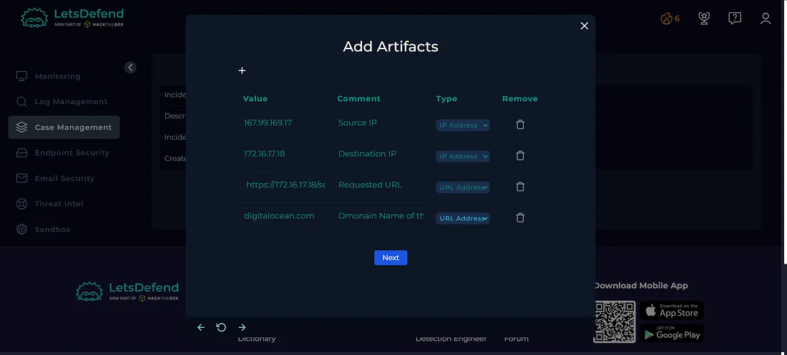

Based on the playbook results, the alert did not require Tier 2 escalation.

**Figure 11 — Escalation**

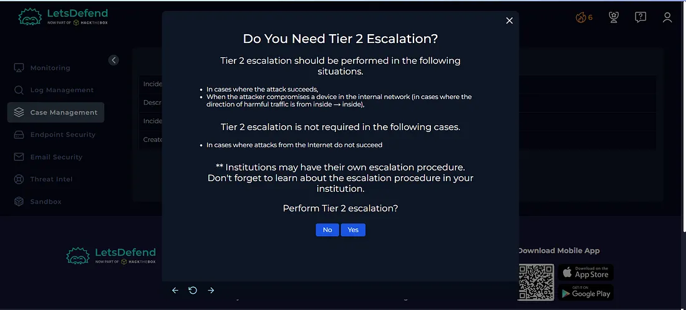

---

## Investigation Verdict

**True Positive — Unsuccessful SQL Injection Attempt**

The alert was confirmed as a genuine SQL injection attack attempt.

The malicious payload was identified in the HTTP request, but the server returned an HTTP 500 error, indicating that the attack was unsuccessful based on the available lab evidence.

---

## Response

The relevant indicators were documented as artifacts, and the alert was closed as a **True Positive** without escalation.

**Figure 12 — Close Alert**

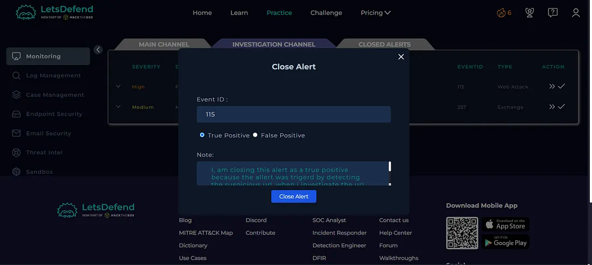

**Figure 13 — Closed Alert**

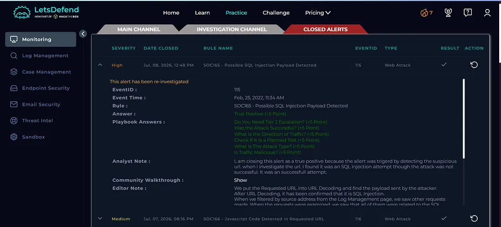

---

## What I Learned

From this investigation, I learned how to:

- Investigate SQL injection alerts
- Identify SQL injection payloads
- Decode URL-encoded requests
- Analyze HTTP requests and responses
- Investigate source IP reputation
- Use AbuseIPDB and VirusTotal for threat intelligence
- Determine attack success or failure
- Document security artifacts
- Follow a SOC investigation playbook

---

## Tools Used

- Let'sDefend
- AbuseIPDB
- VirusTotal
- URL Decoder
- Log Management
- Case Management Playbook

---

## Key Takeaway

A suspicious SQL injection payload in a URL is a strong indicator of an attempted web application attack. However, identifying the payload alone does not mean the attack was successful.

A SOC analyst should correlate:

**Source IP → URL Analysis → Payload Decoding → Server Response → Playbook → Verdict**

This investigation helped me understand how to identify and investigate SQL injection attempts and determine whether the attack was successful.
