Today I investigated a command injection attack detected in the Let'sDefend SOC environment.

The alert was triggered when a POST request contained the `whoami` command in the request body. Further investigation showed multiple command injection attempts from the same external source IP. Endpoint investigation also revealed that the commands were present in the command-line and process history of the affected web server, confirming that the attack was successful.

I investigated the alert using source IP reputation, Log Management, Endpoint Security, command-line history, and the Case Management Playbook.

## Alert Details

- **Alert:** SOC168 — Whoami Command Detected in Request Body
- **Event ID:** 118
- **Event Time:** Feb 28, 2022, 04:12 AM
- **Level:** Security Analyst
- **Hostname:** WebServer1004
- **Destination IP:** 172.16.17.16
- **Source IP:** 61.177.172.87
- **HTTP Method:** POST
- **Requested URL:** `https://172.16.17.16/video/`
- **Alert Trigger Reason:** Request Body Contains `whoami`
- **Device Action:** Allowed
- **Verdict:** True Positive

---

## Investigation Process

### 1. Source IP Reputation

The suspicious request originated from:

`61.177.172.87`

I checked the source IP using **AbuseIPDB** and found multiple reports associated with the address.

**Figure 1 — AbuseIPDB**

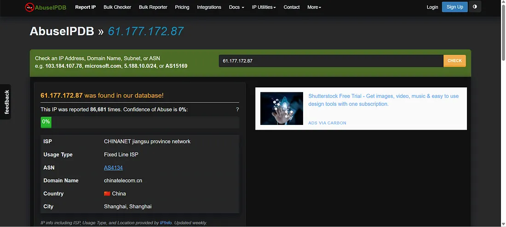

I then checked the IP reputation using **VirusTotal**. The IP was identified as malicious by multiple security vendors.

**Figure 2 — VirusTotal**

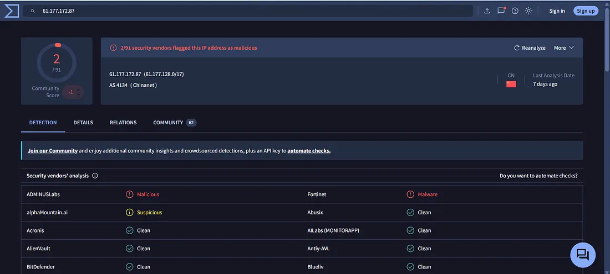

---

### 2. Log Management Investigation

I reviewed the **Log Management** tab to investigate the requests associated with the suspicious source IP.

**Figure 3 — Log Management**

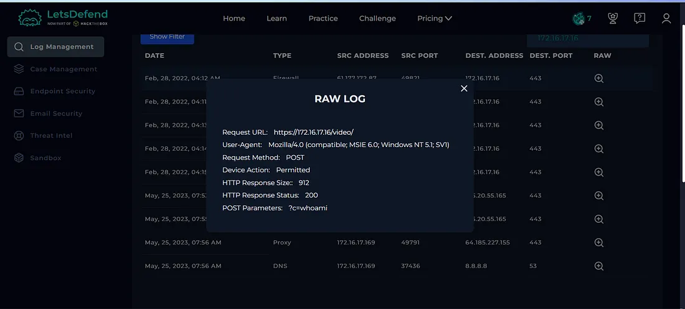

The logs showed multiple requests from the same source IP containing different command injection attempts.

The requests received **HTTP 200** responses with different response sizes, indicating that the server processed the requests.

---

### 3. Endpoint Security Investigation

I then investigated **WebServer1004** using the **Endpoint Security** section.

I reviewed the command-line and process history to determine whether the commands from the HTTP requests were actually executed on the server.

**Figure 4 — Endpoint Security**

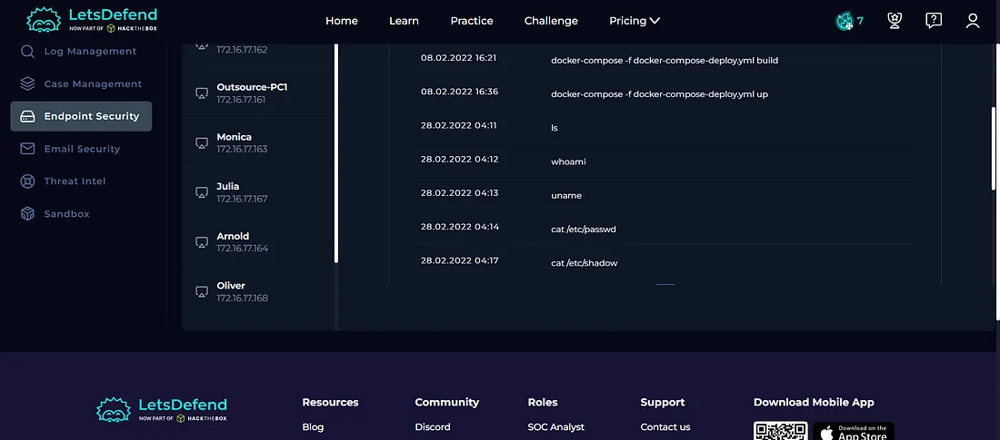

The command-line history contained commands matching the commands observed in the POST request parameters.

This provided strong evidence that the commands were executed on the affected web server.

---

## Case Management — Playbook Answers

### 1. Is the Traffic Malicious?

**Yes**

The traffic was malicious based on the suspicious command injection activity, source IP reputation, and the commands observed during the investigation.

**Figure 5 — Playbook**

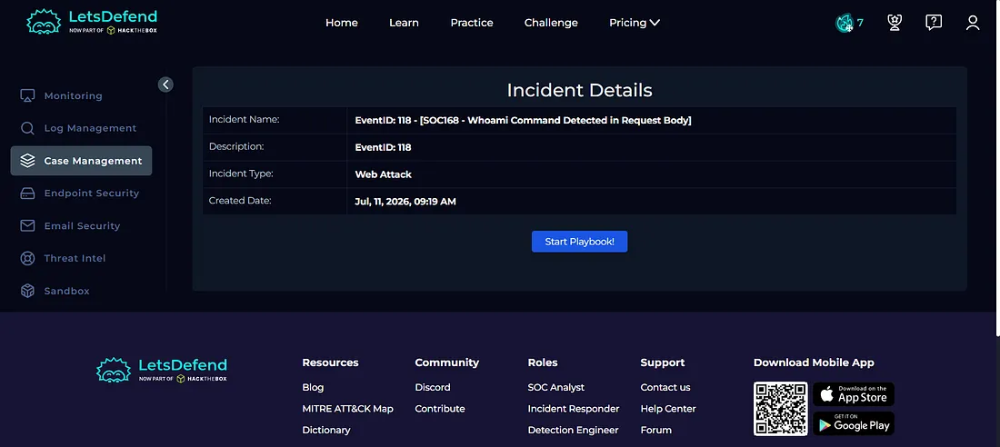

### 2. What Is the Attack Type?

**Command Injection**

The attacker modified POST request parameters to send operating system commands to the web server.

**Figure 6 — Playbook**

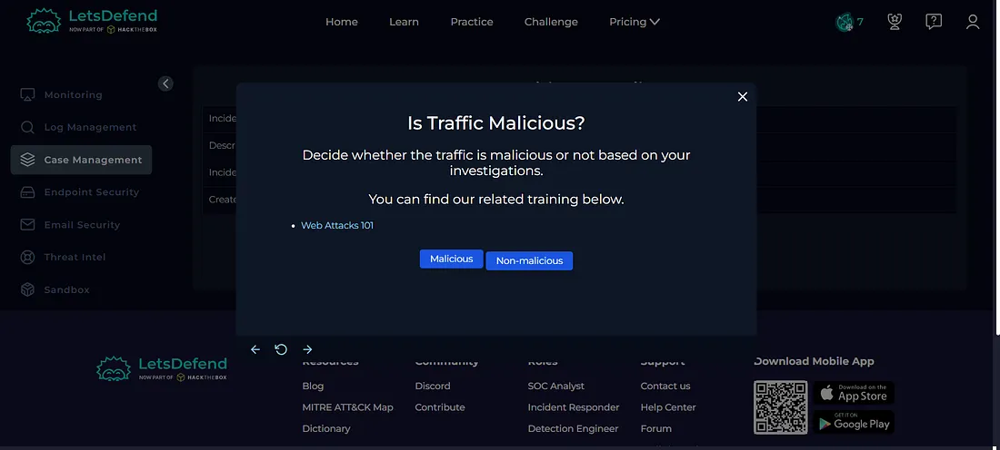

### 3. Is It a Planned Test?

**Not Planned**

There was no evidence indicating that the activity was part of an authorized security test.

**Figure 7 — Playbook**

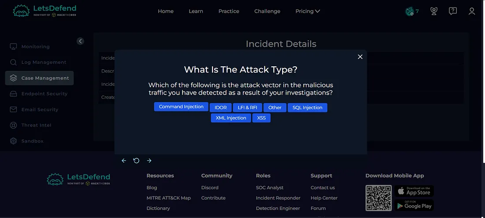

### 4. What Is the Direction of Traffic?

**Internet → Company Network**

The malicious requests originated from an external IP address and targeted the internal web server.

**Figure 8 — Playbook**

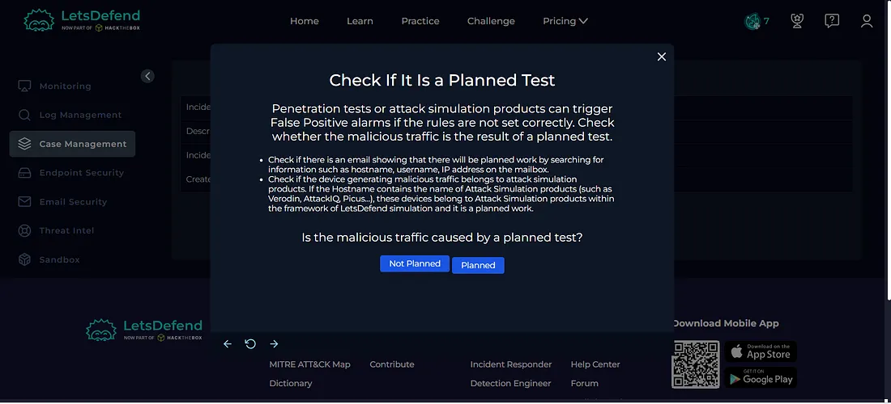

### 5. Was the Attack Successful?

**Yes**

The investigation showed that the commands observed in the POST request were also present in the command-line and process history of the affected web server.

This confirmed that the command injection was successful.

**Figure 9 — Playbook**

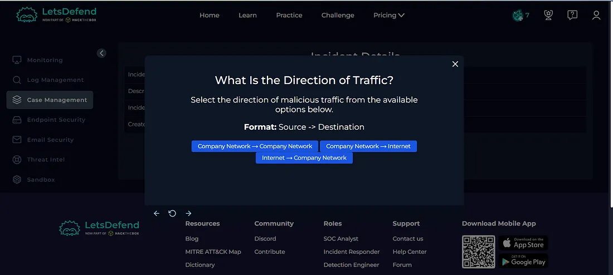

### 6. Should the Host Be Contained?

**Yes**

Since the attack was successful, the affected server should be contained to prevent further malicious activity and limit potential impact.

**Figure 10 — Playbook**

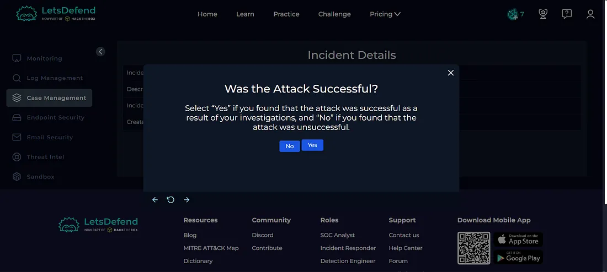

---

## Host Containment

Based on the successful command injection and evidence of command execution, I contained the affected endpoint.

Host containment helps prevent further communication and malicious activity while allowing additional incident response investigation.

**Figure 11 — Host Containment**

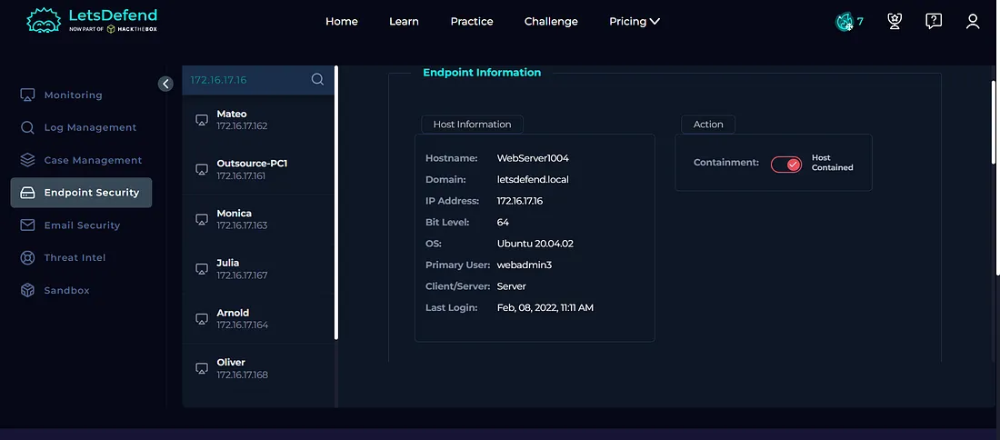

---

## Artifacts

The following indicators were documented during the investigation:

| Type | Indicator |
|---|---|
| Source IP | `61.177.172.87` |
| Destination IP | `172.16.17.16` |
| Hostname | `WebServer1004` |
| HTTP Method | `POST` |
| Requested URL | `/video/` |
| Detected Command | `whoami` |
| Attack Type | Command Injection |

**Figure 12 — Artifacts**

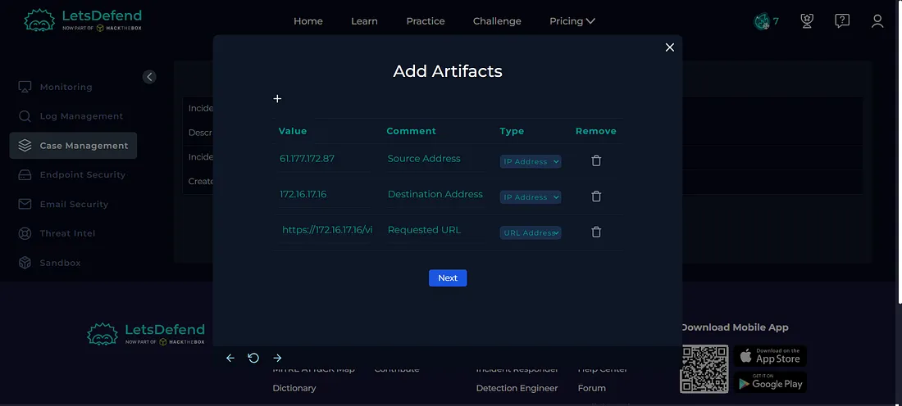

---

## Tier 2 Escalation

Since the command injection attack was successful and commands were executed on the affected server, the incident required escalation to a **Tier 2 Analyst** for further investigation and response.

**Figure 13 — Tier 2 Escalation**

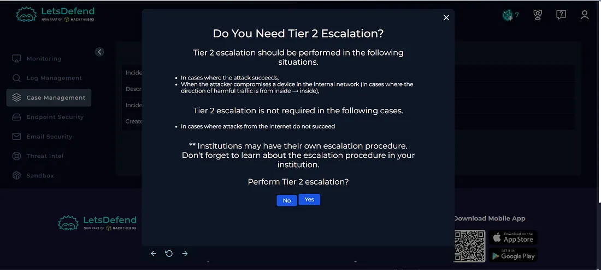

---

## Investigation Verdict

**True Positive — Successful Command Injection Attack**

The alert was confirmed as a genuine command injection attack.

The attacker sent malicious commands through POST request parameters, and endpoint investigation confirmed that the commands were present in the command-line and process history of the affected web server.

---

## Response

The affected endpoint was **contained** to prevent further malicious activity.

The relevant indicators were documented as artifacts, and the incident was escalated to **Tier 2** for further investigation.

The alert was then closed as a **True Positive**.

**Figure 14 — Closed Alert**

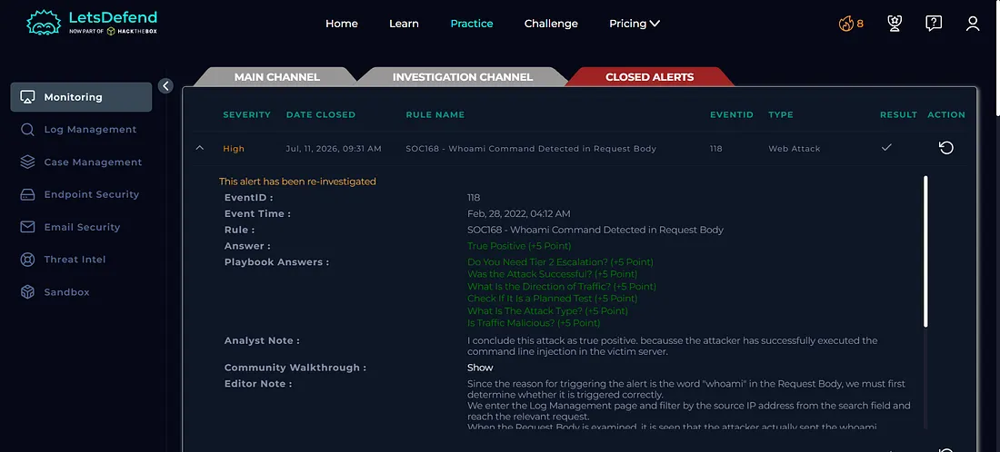

---

## What I Learned

From this investigation, I learned how to:

- Investigate command injection alerts
- Identify malicious commands in HTTP request bodies
- Analyze POST request parameters
- Investigate source IP reputation
- Analyze web server logs
- Review command-line and process history
- Determine whether commands were successfully executed
- Perform host containment
- Document security artifacts
- Understand Tier 2 escalation
- Determine True Positive vs False Positive
- Follow a SOC investigation playbook

---

## Tools Used

- Let'sDefend
- AbuseIPDB
- VirusTotal
- Log Management
- Endpoint Security
- Terminal / Command History
- Case Management Playbook

---

## Key Takeaway

A command such as `whoami` inside an HTTP request can be an indicator of attempted command injection. However, a SOC analyst should not rely only on the request itself.

The analyst should correlate:

**Source IP → HTTP Request → Log Analysis → Endpoint Command History → Execution Evidence → Containment → Escalation → Verdict**

In this investigation, the endpoint evidence confirmed that the commands were executed, making this a **successful command injection attack** and requiring containment and Tier 2 escalation.
