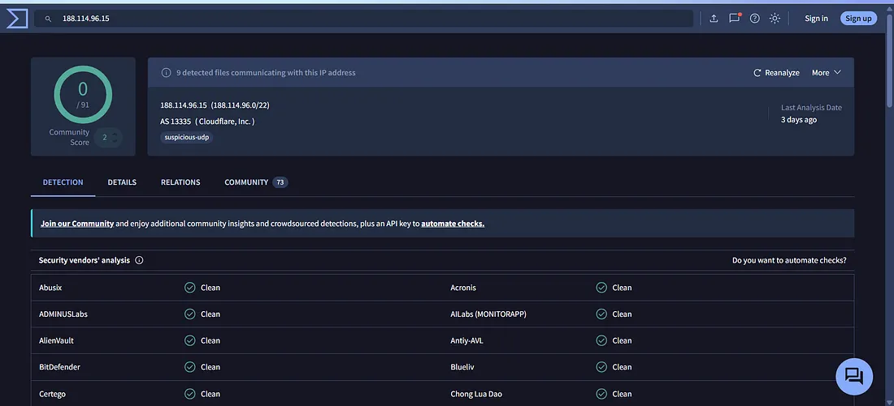
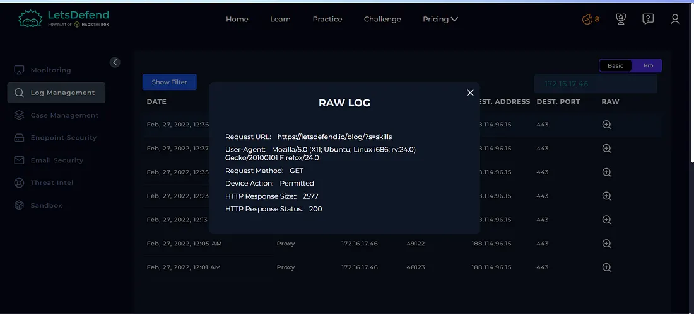
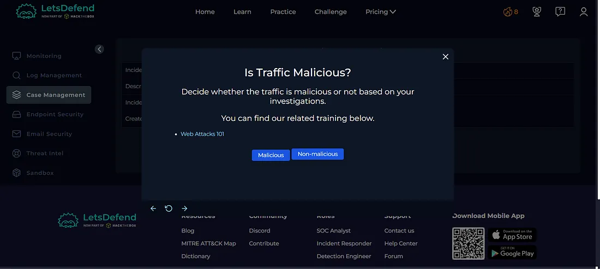
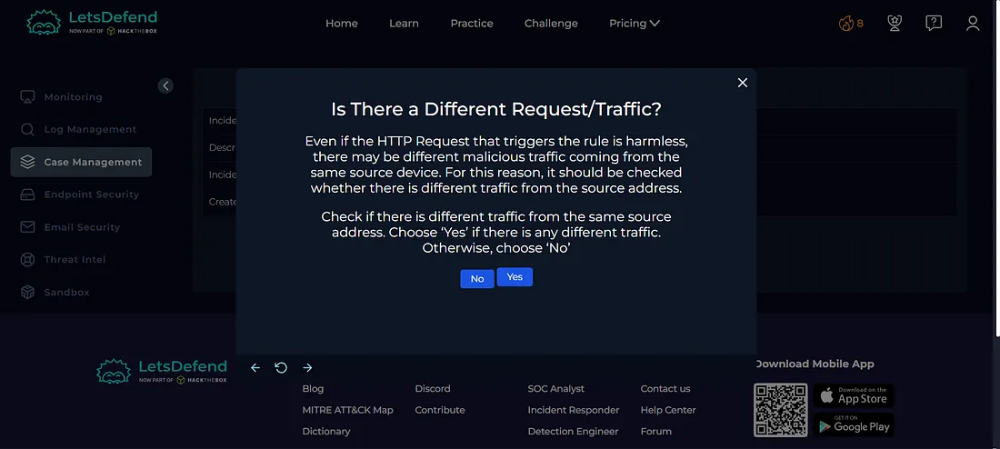
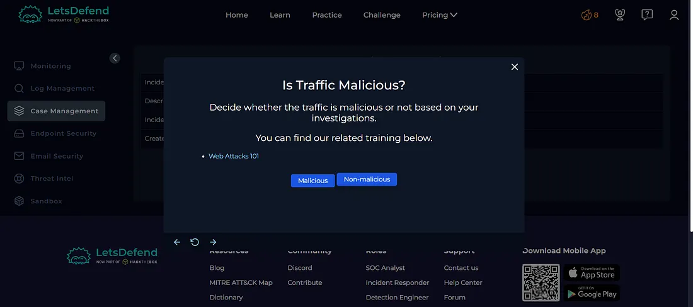
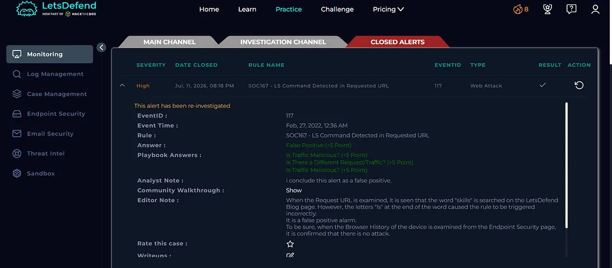

Today I investigated a SOC167 alert triggered by an `ls` command detected in the requested URL within the Let'sDefend SOC environment.

Although the alert initially appeared suspicious because it detected the string `LS` in the URL, further investigation showed that the request was a legitimate search query related to becoming a SOC Analyst. I reviewed the source IP reputation, related network requests, and logs to determine whether any malicious activity was present.

The alert was ultimately determined to be a **False Positive**.

## Alert Details

- **Alert:** SOC167 — LS Command Detected in Requested URL
- **Event ID:** 117
- **Event Time:** Feb 27, 2022, 12:36 AM
- **Level:** Security Analyst
- **Hostname:** EliotPRD
- **Destination IP:** 188.114.96.15
- **Source IP:** 172.16.17.46
- **HTTP Method:** GET
- **Requested URL:** `https://letsdefend.io/blog/?s=skills`
- **User-Agent:** Mozilla/5.0 (X11; Ubuntu; Linux i686; rv:24.0) Gecko/20100101 Firefox/24.0
- **Alert Trigger Reason:** URL Contains LS
- **Device Action:** Allowed
- **Verdict:** False Positive

## Investigation Process

### 1. Source IP Reputation

The alert originated from the source IP:

`172.16.17.46`

I checked the IP reputation using **VirusTotal**.

**Figure 1 — VirusTotal**

The IP was not identified as malicious.

This indicated that there was no immediate threat intelligence evidence connecting the source IP with malicious activity.

### 2. Log Management Investigation

I then moved to **Log Management** and filtered the logs using the source and destination IP addresses.

**Figure 2 — Log Management**

I reviewed the related requests to determine whether the source IP had generated any additional suspicious traffic.

The requests were legitimate searches related to learning about becoming a SOC Analyst. No malicious commands, exploit payloads, or suspicious requests were identified during the investigation.

This was important because an apparently harmless alert can sometimes be associated with other malicious requests from the same source.

## Case Management — Playbook Answers

### 3. Is the Traffic Malicious?

**No — Non-malicious**

The requested URL:

`https://letsdefend.io/blog/?s=skills`

was a legitimate search request and did not contain an actual command execution attempt.

**Figure 3 — Playbook**

### 4. Are There Any Other Requests?

**Yes**

The Log Management investigation showed multiple requests from the same source that needed to be reviewed.

**Figure 4 — Playbook**

### 5. Are the Other Requests Malicious?

**No — Non-malicious**

The additional requests were also legitimate searches and did not contain malicious activity.

**Figure 5 — Playbook**

## Investigation Verdict

**False Positive**

The alert was triggered because the requested URL contained the string `LS`. However, the investigation showed that this was part of a legitimate search query and not an actual Linux `ls` command execution attempt.

The source IP was not identified as malicious, and the related requests were also legitimate.

## Response

No containment or escalation was required because the investigation did not identify malicious activity.

The alert was closed as a **False Positive**.

**Figure 6 — Closed Alert**

## What I Learned

From this investigation, I learned how to:

- Investigate alerts triggered by suspicious keywords
- Check IP reputation using threat intelligence
- Review related network requests
- Analyze URLs and request parameters
- Differentiate legitimate activity from malicious activity
- Avoid making a decision based only on an alert trigger
- Determine False Positive vs True Positive
- Follow a SOC investigation playbook

## Tools Used

- Let'sDefend
- VirusTotal
- Log Management
- Threat Intelligence
- Case Management Playbook

## Key Takeaway

A SOC alert does not always indicate malicious activity. In this investigation, the alert was triggered because the URL contained the string `LS`, but the actual request was a legitimate search query.

A SOC analyst should always correlate:

**Alert → IP Reputation → Related Logs → Request Analysis → Playbook → Verdict**

This investigation helped me understand the importance of validating alerts with additional evidence before classifying them as malicious.
