Today I investigated a malware detection alert in the Let'sDefend SOC environment.

The alert involved a suspicious executable file named `Invoice.exe`. I analyzed the file using its MD5 hash, VirusTotal, and Hybrid Analysis. The investigation also revealed communication with a suspicious external IP address that was identified as a potential Command and Control (C2) address.

Based on the available evidence, the affected machine was communicating with the C2 infrastructure, so I contained the host and classified the alert as a **True Positive**.

## Alert Details

- **Alert:** SOC104 — Malware Detected
- **Event ID:** 36
- **Event Time:** Dec 01, 2020, 10:23 AM
- **Level:** Security Analyst
- **Source IP:** 10.15.15.18
- **Source Hostname:** AdamPRD
- **File Name:** Invoice.exe
- **File Hash (MD5):** f83fb9ce6a83da58b20685c1d7e1e546
- **File Size:** 473.00 KB
- **Device Action:** Allowed
- **Verdict:** True Positive

## Investigation Process

### 1. File Reputation Analysis

I started the investigation by analyzing the MD5 hash provided in the alert:

`f83fb9ce6a83da58b20685c1d7e1e546`

I submitted the hash to **VirusTotal** to check the reputation of the file.

**Figure 1 — VirusTotal**

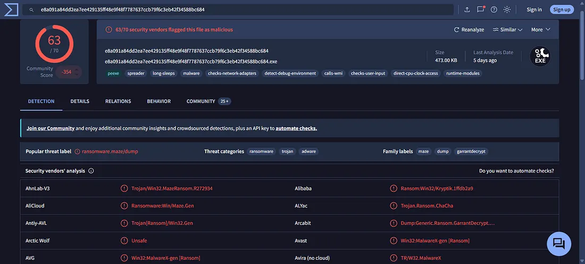

The VirusTotal results indicated that the file was malicious.

### 2. Hybrid Analysis

I then analyzed the suspicious file using **Hybrid Analysis** for additional malware analysis.

**Figure 2 — Hybrid Analysis**

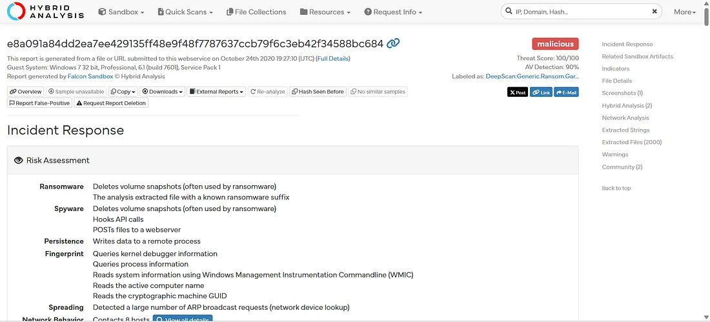

The analysis confirmed that the file exhibited malicious characteristics.

I then reviewed the **Contacted Hosts** information to identify external infrastructure associated with the malware.

**Figure 3 — Hybrid Analysis — Contacted Hosts**

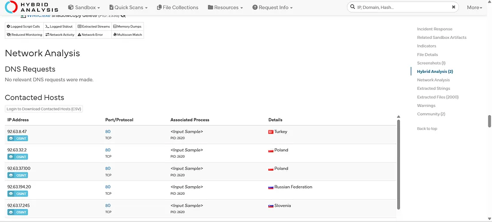

The analysis revealed several contacted IP addresses.

### 3. Log Management Investigation

I then moved to the **Log Management** tab and searched for activity related to the source IP:

`10.15.15.18`

**Figure 4 — Log Management**

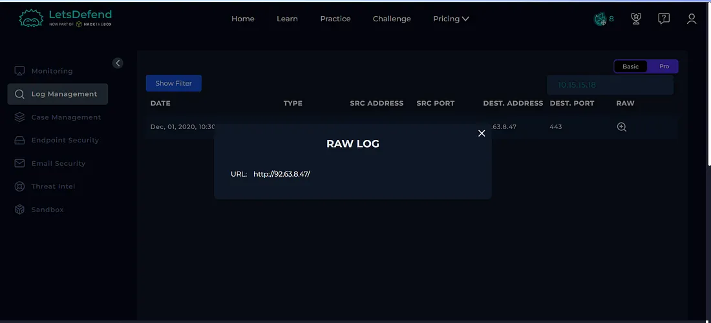

The logs showed communication with the following external IP address:

`92.63.8.47`

This IP address required further investigation because it was associated with the malicious file activity.

### 4. C2 IP Reputation Analysis

I checked the reputation of:

`92.63.8.47`

using VirusTotal.

**Figure 5 — VirusTotal — IP Reputation**

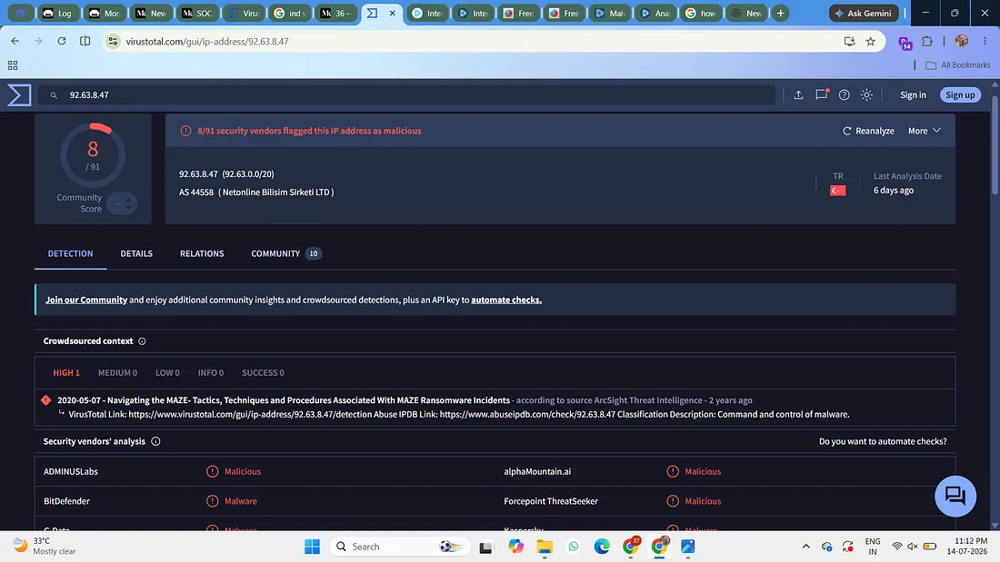

The IP address was identified as malicious, providing additional evidence that the affected system was communicating with potentially malicious infrastructure.

## Case Management — Playbook Answers

### 5. Is the Malware Quarantined?

**No**

The malware was not quarantined according to the available alert evidence.

**Figure 6 — Playbook**

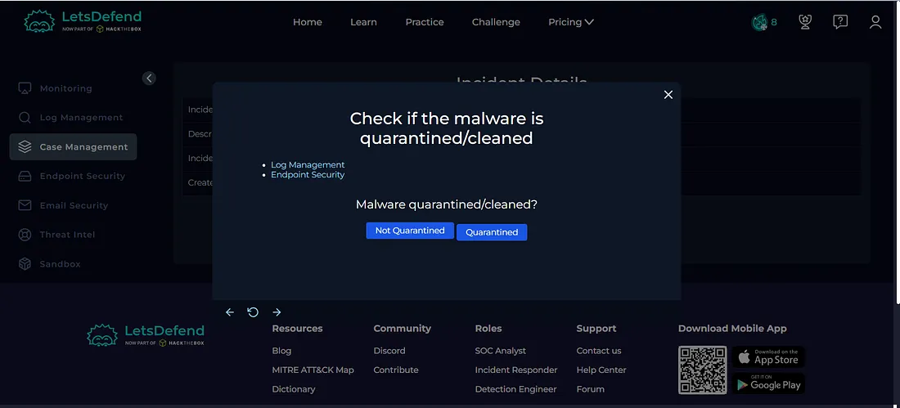

### 6. Is the File Malicious?

**Yes**

The file was identified as malicious through VirusTotal and Hybrid Analysis.

**Figure 7 — Playbook**

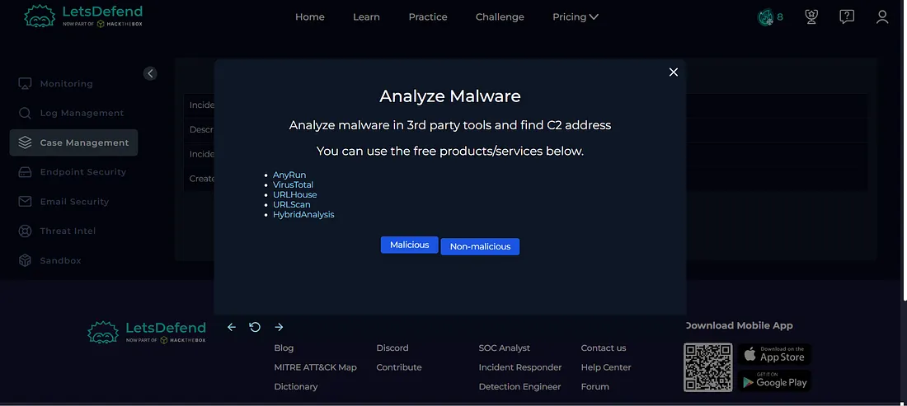

### 7. Did the Machine Access the C2 Address?

**Yes**

The investigation identified communication between the affected machine:

`10.15.15.18`

and the suspicious external IP:

`92.63.8.47`

This indicated potential C2 communication.

**Figure 8 — Playbook**

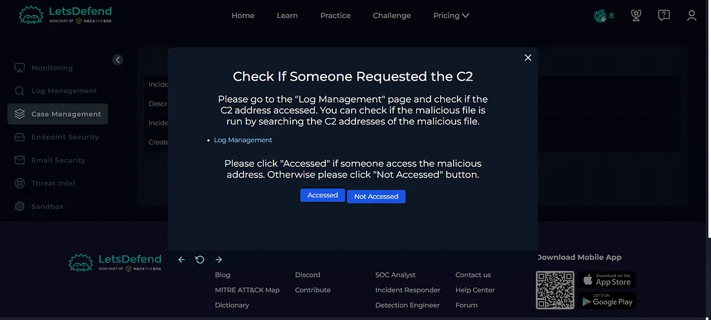

### 8. Host Containment

Since the affected machine was communicating with suspected C2 infrastructure, I contained the host to prevent further communication and limit potential impact.

**Figure 9 — Host Containment**

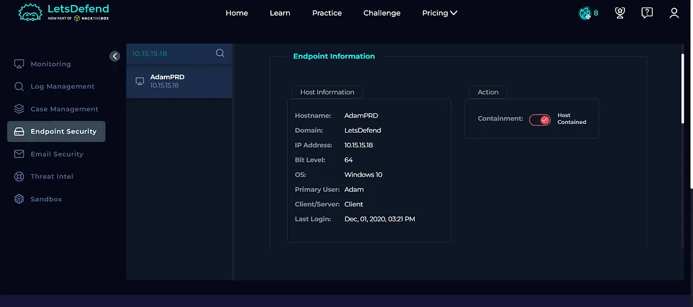

## Artifacts

The following indicators were documented during the investigation:

| Type | Indicator |
| --- | --- |
| Source IP | `10.15.15.18` |
| Hostname | `AdamPRD` |
| File Name | `Invoice.exe` |
| MD5 | `f83fb9ce6a83da58b20685c1d7e1e546` |
| File Size | `473.00 KB` |
| Suspected C2 IP | `92.63.8.47` |

**Figure 10 — Artifacts**

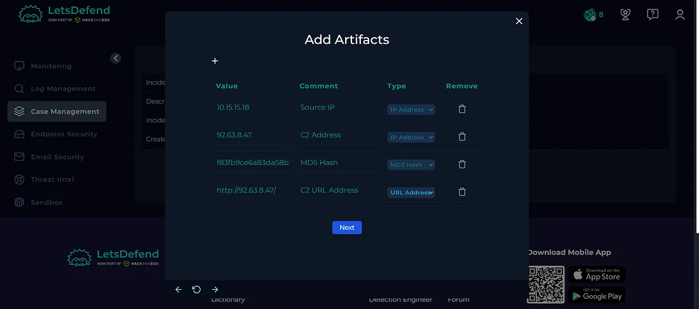

## Investigation Verdict

**True Positive — Malware Detected with C2 Communication**

The alert was confirmed as a genuine malware incident.

The file `Invoice.exe` was identified as malicious through multiple analysis sources. Further investigation revealed that the affected machine communicated with a suspicious IP address associated with potential C2 infrastructure.

## Response

The affected host was **contained** to prevent further communication with the suspected C2 infrastructure.

The relevant indicators were documented as artifacts, and the alert was closed as a **True Positive**.

**Figure 11 — Closed Alert**

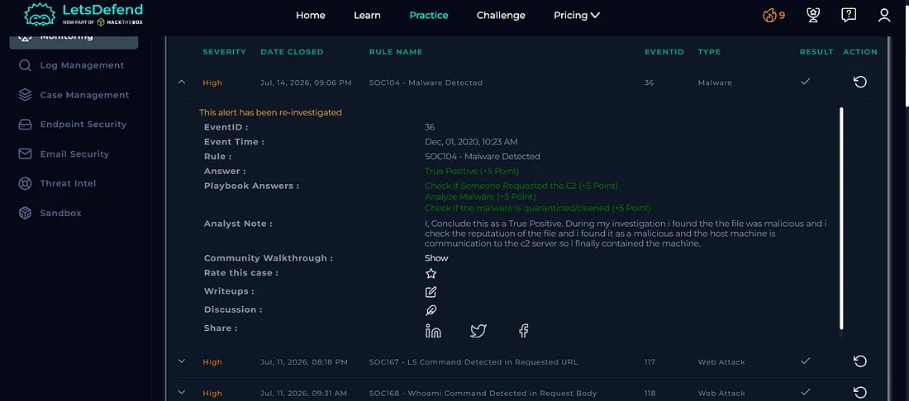

## What I Learned

From this investigation, I learned how to:

- Investigate malware detection alerts
- Analyze file hashes using VirusTotal
- Use Hybrid Analysis for malware analysis
- Identify contacted hosts
- Investigate suspicious IP addresses
- Identify potential C2 communication
- Analyze logs using Log Management
- Perform host containment
- Document investigation artifacts
- Determine True Positive vs False Positive
- Follow a SOC investigation playbook

## Tools Used

- Let'sDefend
- VirusTotal
- Hybrid Analysis
- Log Management
- Threat Intelligence
- Case Management Playbook

## Key Takeaway

A malware detection alert should not be investigated only by checking the file reputation. A SOC analyst should also investigate the file's behavior, contacted hosts, network logs, and the reputation of associated IP addresses.

The investigation flow was:

**Malware Alert → Hash Analysis → VirusTotal → Hybrid Analysis → Contacted Hosts → Log Investigation → C2 Identification → Host Containment → Verdict**

This investigation helped me understand how to investigate malware alerts and identify potential C2 communication from an affected endpoint.
