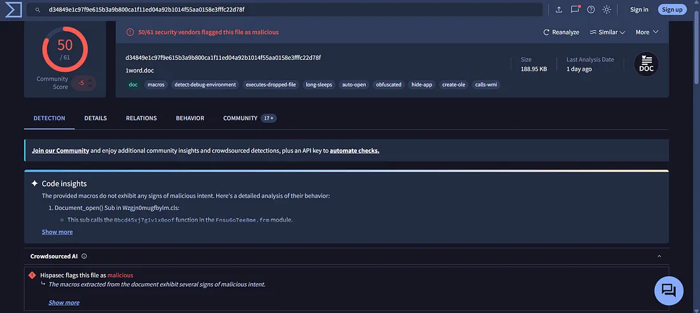
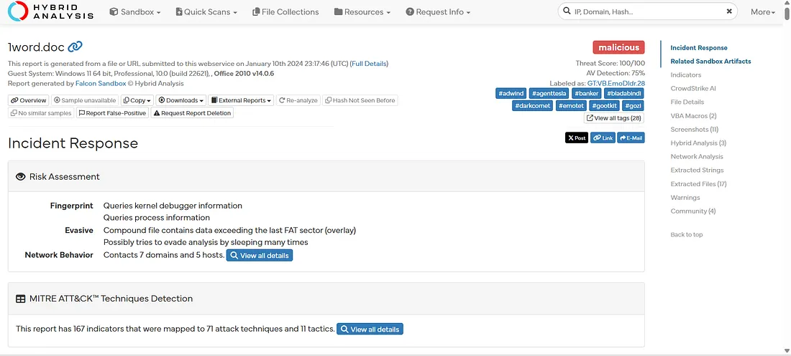
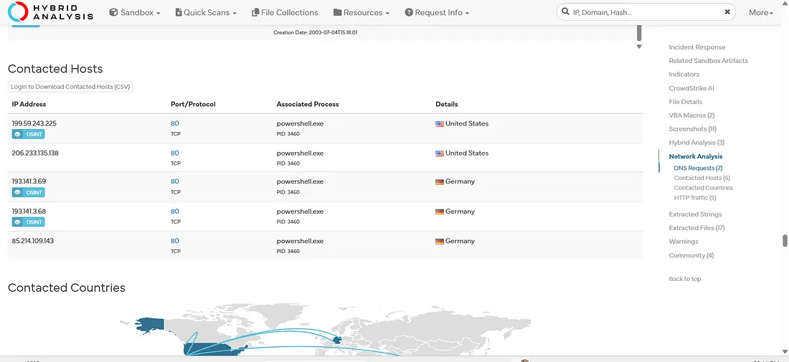
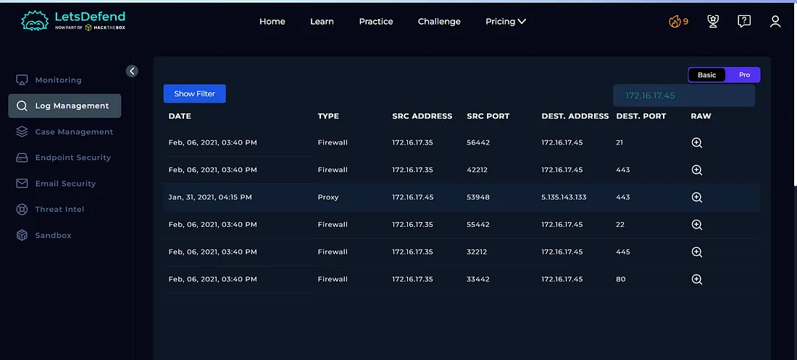
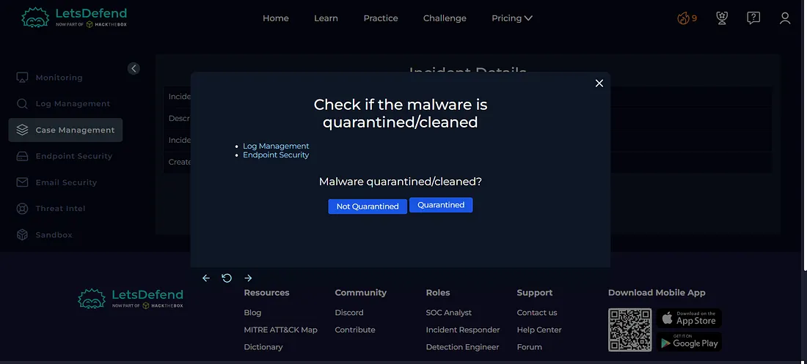
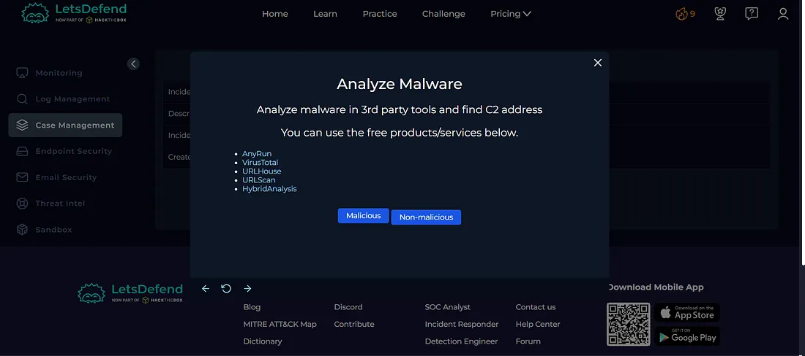
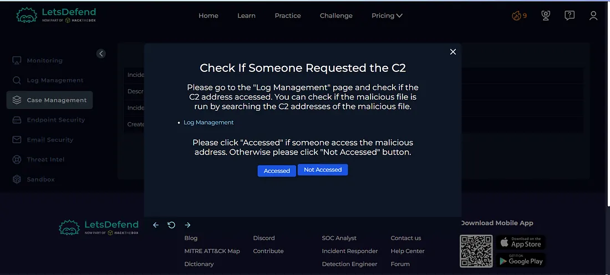
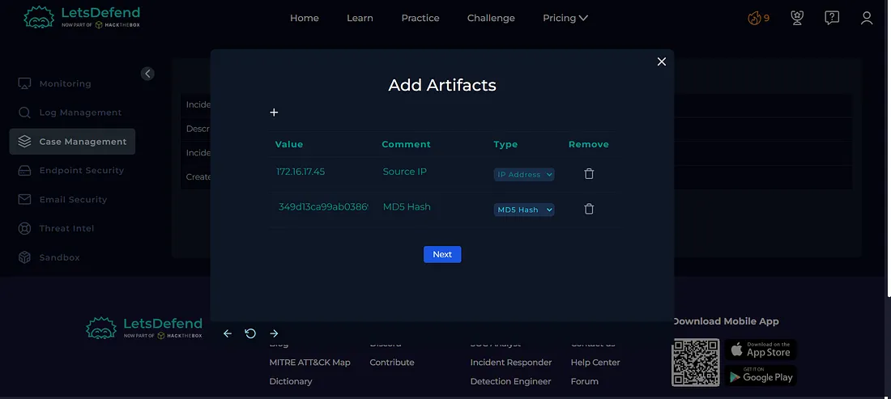
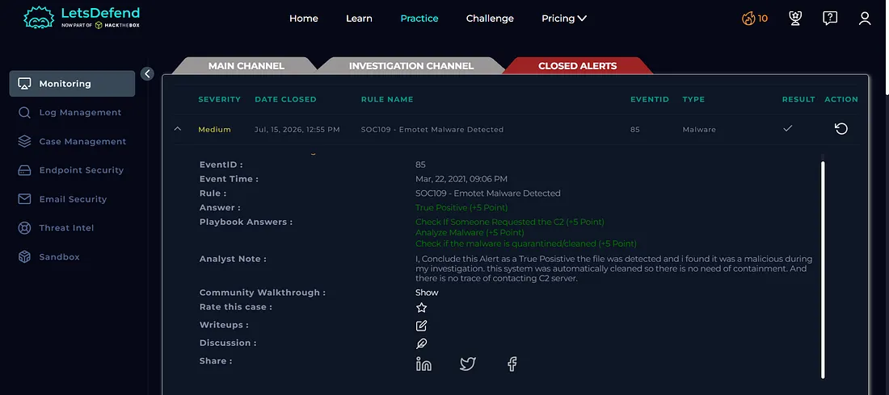

Today I investigated an Emotet malware detection alert in the Let'sDefend SOC environment.

The alert involved a suspicious Microsoft Word document named `1word.doc`. The file was identified as malicious through VirusTotal and Hybrid Analysis. Further investigation showed that the security control had already cleaned the malicious file.

I also reviewed the endpoint's network activity and found no evidence of communication with the identified Command and Control (C2) infrastructure.

Based on the available evidence, the alert was confirmed as a **True Positive**, while no C2 communication was observed.

## Alert Details

- **Alert:** SOC109 — Emotet Malware Detected
- **Event ID:** 85
- **Event Time:** Mar 22, 2021, 09:06 PM
- **Level:** Security Analyst
- **Source IP:** 172.16.17.45
- **Source Hostname:** RichardPRD
- **File Name:** 1word.doc
- **File Hash (MD5):** 349d13ca99ab03869548d75b99e5a1d0
- **File Size:** 188.95 KB
- **Device Action:** Cleaned
- **Verdict:** True Positive

## Investigation Process

### 1. File Reputation Analysis

I started the investigation by analyzing the MD5 hash provided in the alert:

`349d13ca99ab03869548d75b99e5a1d0`

I submitted the hash to **VirusTotal** to check the reputation of the file.

**Figure 1 — VirusTotal**

The VirusTotal results identified the file as malicious and associated it with Emotet-related malware activity.

### 2. Hybrid Analysis

I then analyzed the suspicious file using **Hybrid Analysis** for additional behavioral analysis.

**Figure 2 — Hybrid Analysis**

The analysis confirmed that the file exhibited malicious characteristics.

I also reviewed the **Contacted Hosts** information to identify any external infrastructure associated with the malicious file.

**Figure 3 — Hybrid Analysis — Contacted Hosts**

Several contacted host indicators were identified during the analysis.

### 3. Log Management Investigation

Next, I moved to the **Log Management** tab and searched for activity associated with the affected endpoint:

`172.16.17.45`

**Figure 4 — Log Management**

The investigation did not identify any suspicious network activity associated with the endpoint.

No evidence was found showing communication between the affected machine and the identified C2 infrastructure.

## Case Management — Playbook Answers

### 4. Was the Malware Quarantined/Cleaned?

**Yes**

The alert details showed that the device action was:

`Cleaned`

This indicates that the security control had already cleaned the detected malicious file.

**Figure 5 — Playbook**

### 5. Is the File Malicious?

**Yes**

The file was confirmed as malicious through VirusTotal and Hybrid Analysis analysis.

**Figure 6 — Playbook**

### 6. Did the Machine Communicate with the C2 Server?

**No**

The Log Management investigation did not show communication between the affected endpoint and the identified C2 infrastructure.

**Figure 7 — Log Management**

### 7. Was the C2 Address Accessed?

**No**

Based on the available logs, the affected machine did not access the identified C2 addresses.

**Figure 8 — Playbook**

## Artifacts

The following indicators were documented during the investigation:

| Type | Indicator |
| --- | --- |
| Source IP | `172.16.17.45` |
| Hostname | `RichardPRD` |
| File Name | `1word.doc` |
| MD5 | `349d13ca99ab03869548d75b99e5a1d0` |
| File Size | `188.95 KB` |
| Malware | `Emotet` |

**Figure 9 — Artifacts**

## Investigation Verdict

**True Positive — Emotet Malware Detected**

The alert was confirmed as a genuine malware detection.

The file `1word.doc` was identified as malicious through multiple malware analysis sources. The security control had already cleaned the detected file.

However, the endpoint investigation did not show any communication with the identified C2 infrastructure.

## Response

The malicious file had already been **cleaned** by the security control.

No C2 communication was identified during the investigation, so additional containment was not required based on the available evidence.

The relevant indicators were documented as artifacts, and the alert was closed as a **True Positive**.

**Figure 10 — Closed Alert**

## What I Learned

From this investigation, I learned how to:

- Investigate Emotet malware alerts
- Analyze file hashes using VirusTotal
- Use Hybrid Analysis for malware analysis
- Review contacted hosts
- Investigate endpoint network activity
- Identify potential C2 infrastructure
- Determine whether a host communicated with C2
- Understand the difference between malware detection and successful C2 communication
- Review automated malware cleaning actions
- Document investigation artifacts
- Determine True Positive vs False Positive
- Follow a SOC investigation playbook

## Tools Used

- Let'sDefend
- VirusTotal
- Hybrid Analysis
- Log Management
- Threat Intelligence
- Case Management Playbook

## Key Takeaway

Detecting malware on an endpoint does not necessarily mean that the system communicated with a C2 server.

In this investigation, the malicious Emotet file was detected and cleaned, while the endpoint showed no evidence of communication with the identified C2 infrastructure.

The investigation flow was:

**Malware Alert → Hash Analysis → VirusTotal → Hybrid Analysis → Contacted Hosts → Log Investigation → C2 Verification → Playbook → Verdict**

This investigation helped me understand how a SOC analyst can distinguish between **malware detection**, **C2 communication**, and **successful compromise** while validating an alert using multiple sources of evidence.
