# Day 13 — SOC145: Ransomware Detected

## Overview

Today I investigated a ransomware detection alert in the Let'sDefend SOC environment.

The alert involved a suspicious executable file named `ab.exe` detected on the endpoint `MarkPRD`. I analyzed the file using VirusTotal and Hybrid Analysis and investigated the affected endpoint for network, browser, and command-line activity.

The malware analysis revealed ransomware-related behavior, including the execution of Windows utilities such as `wmic.exe`, `wbadmin.exe`, `bcdedit.exe`, and `vssadmin.exe`. These utilities can be abused by ransomware to disable recovery mechanisms and remove shadow copies.

No suspicious outbound communication or C2 access was identified during the investigation.

Based on the available evidence, the alert was confirmed as a **True Positive**.

## Alert Details

- **Alert:** SOC145 — Ransomware Detected
- **Event ID:** 92
- **Event Time:** May 23, 2021, 07:32 PM
- **Level:** Security Analyst
- **Source IP:** `172.16.17.88`
- **Source Hostname:** `MarkPRD`
- **File Name:** `ab.exe`
- **File Hash (MD5):** `0b486fe0503524cfe4726a4022fa6a68`
- **File Size:** `775.50 KB`
- **Device Action:** Allowed
- **Verdict:** True Positive

## Investigation Process

### 1. File Reputation Analysis

I started the investigation by analyzing the MD5 hash provided in the alert:

`0b486fe0503524cfe4726a4022fa6a68`

I submitted the hash to **VirusTotal** to investigate the reputation and behavior of the file.

**Figure 1 — VirusTotal**

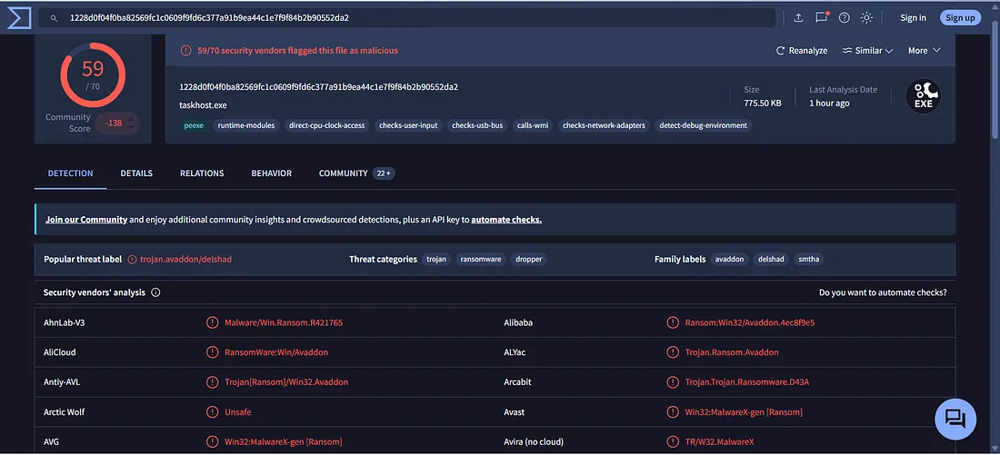

The VirusTotal results indicated that the file was malicious and associated with ransomware-related behavior.

---

### 2. Network Investigation

I then reviewed the network activity associated with the affected endpoint:

`172.16.17.88`

**Figure 2 — Log Management**

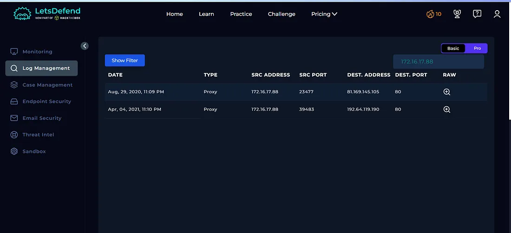

No suspicious outbound network connections were identified during the investigation.

This indicated that there was no observable suspicious external communication from the affected endpoint based on the available logs.

---

### 3. Endpoint Security Investigation

Next, I investigated the affected endpoint using **Endpoint Security**.

I reviewed the browser history, command history, and network connection information.

**Figure 3 — Endpoint Security**

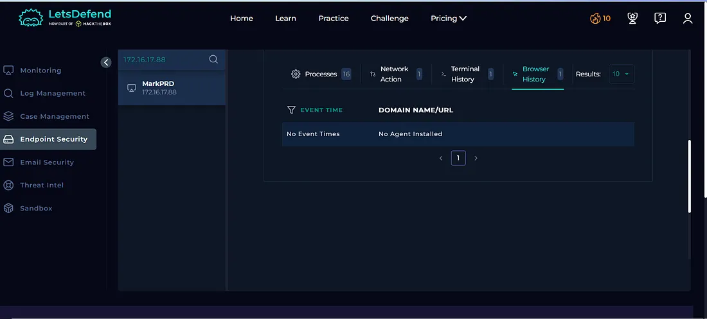

**Figure 4 — Endpoint Security**

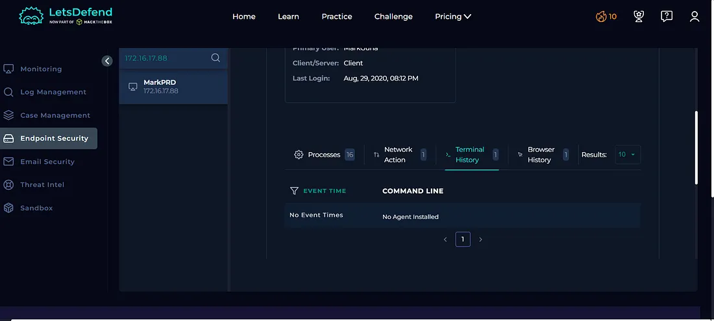

**Figure 5 — Endpoint Security**

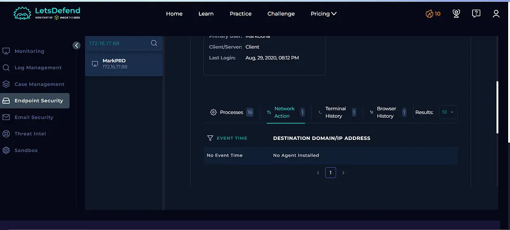

The initial endpoint investigation did not show suspicious browser activity, command history, or network connections.

However, the malware analysis provided additional evidence about processes executed by the malicious file.

---

### 4. Malicious Process Analysis

The investigation identified several Windows processes associated with the malicious file:

- `wmic.exe`
- `wbadmin.exe`
- `bcdedit.exe`
- `vssadmin.exe`

These processes are legitimate Windows utilities, but ransomware can abuse them to interfere with system recovery mechanisms.

**Figure 6 — Endpoint Security**

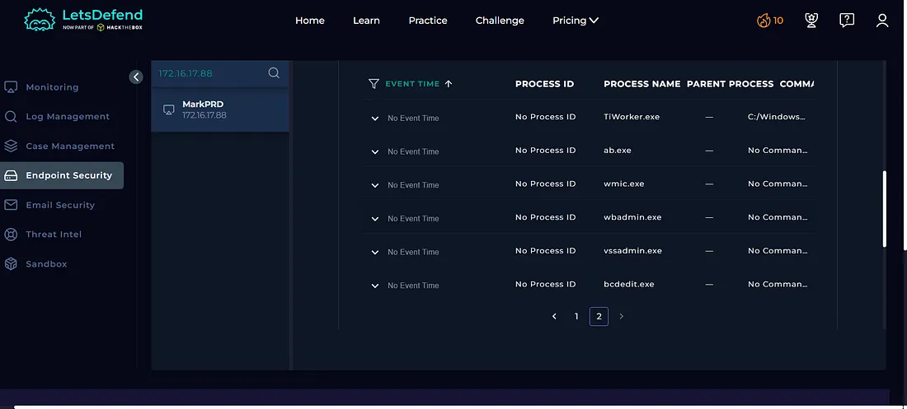

The presence of these processes provided additional evidence supporting the ransomware classification.

---

### 5. Dynamic Malware Analysis

I then analyzed the suspicious file using **Hybrid Analysis** to investigate its behavior.

**Figure 7 — Hybrid Analysis**

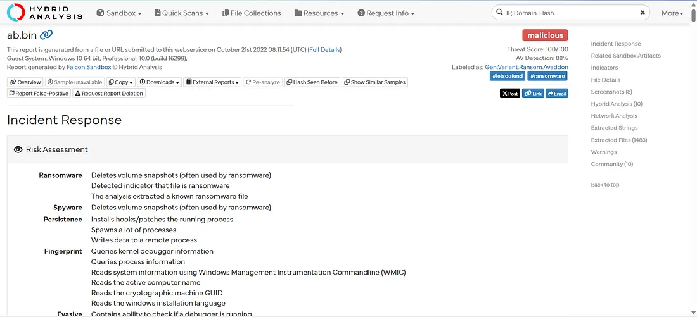

The analysis showed multiple processes associated with the malicious sample.

Further analysis identified commands such as:

`wmic SHADOWCOPY DELETE /nointeractive`

and:

`vssadmin Delete Shadows /All /Quiet`

**Figure 8 — Hybrid Analysis**

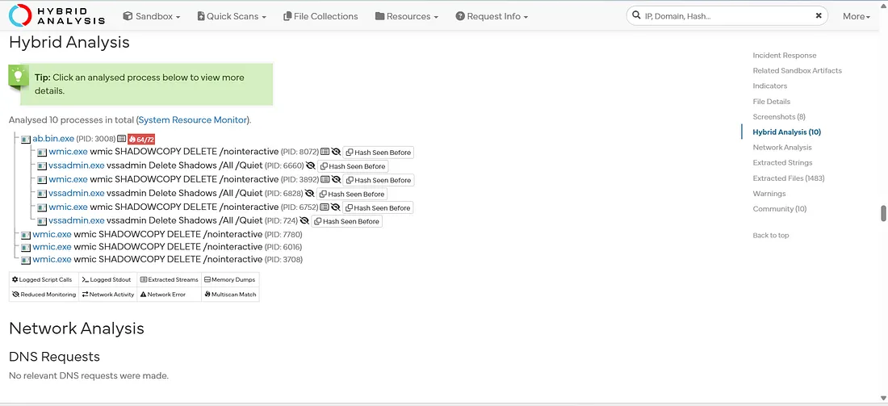

These commands are significant in ransomware investigations because deleting Volume Shadow Copies can prevent users from restoring previous versions of files and recovering from ransomware activity.

The analysis also showed the use of Windows utilities such as `wmic.exe` and `vssadmin.exe`.

---

## Indicators of Compromise (IOCs)

The following indicators were identified during the investigation:

| Type | Indicator |
|---|---|
| Source IP | `172.16.17.88` |
| Hostname | `MarkPRD` |
| Malicious File | `ab.exe` |
| MD5 | `0b486fe0503524cfe4726a4022fa6a68` |
| Malicious Process | `wmic.exe` |
| Malicious Process | `wbadmin.exe` |
| Malicious Process | `bcdedit.exe` |
| Malicious Process | `vssadmin.exe` |

---

## Case Management — Playbook Answers

### 1. Was the Malware Quarantined?

**No**

The malware was not quarantined according to the alert evidence.

**Figure 9 — Playbook**

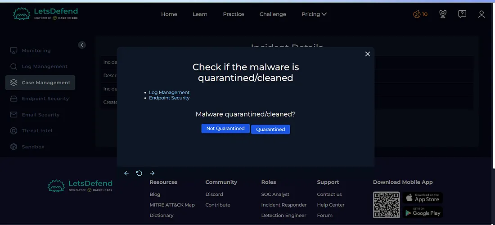

### 2. Is the File Malicious?

**Yes**

The file was identified as malicious through malware analysis and demonstrated ransomware-related behavior.

**Figure 10 — Playbook**

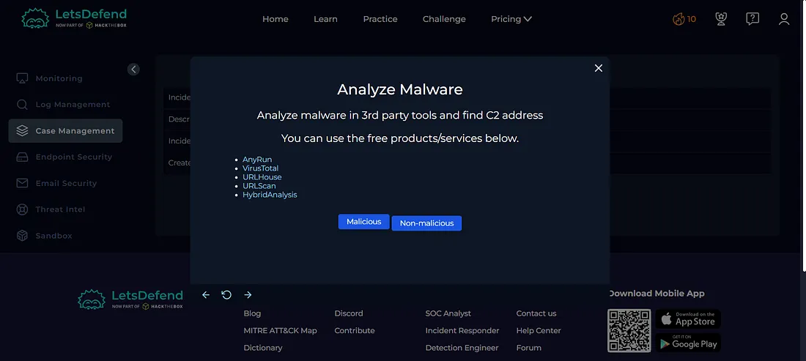

### 3. Was the C2 Address Accessed?

**No**

The network investigation did not identify communication with the suspected C2 infrastructure.

**Figure 11 — Playbook**

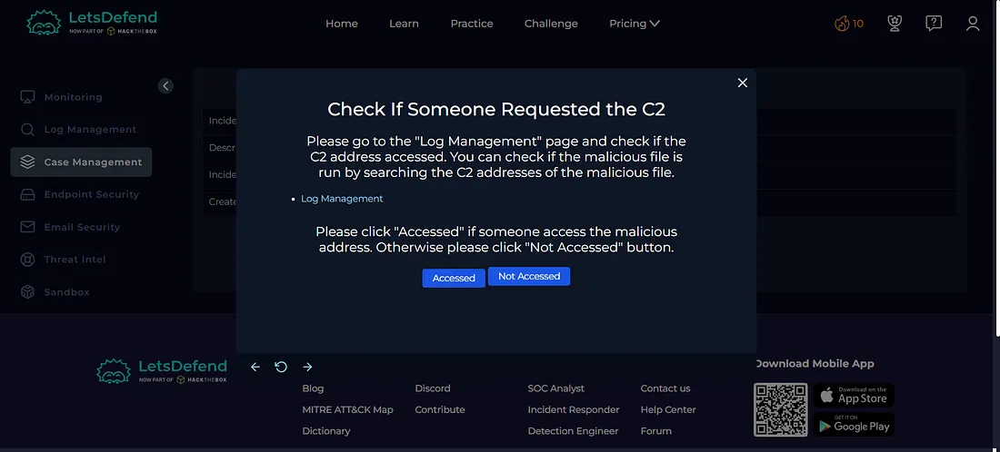

---

## Artifacts

The relevant indicators identified during the investigation were documented as artifacts.

**Figure 12 — Artifacts**

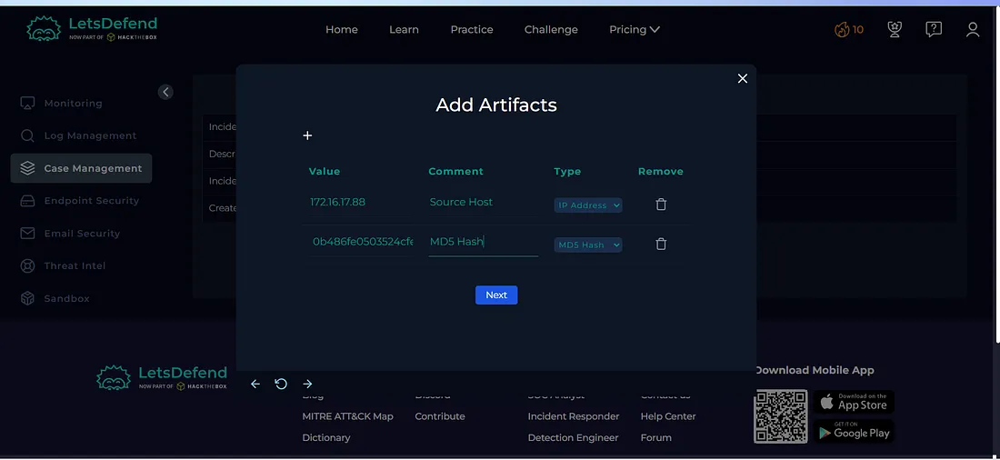

---

## Investigation Verdict

**True Positive — Ransomware Detected**

The alert was confirmed as a genuine ransomware-related security event.

The malicious file demonstrated suspicious behavior, including the execution of Windows utilities associated with disabling or removing recovery mechanisms.

Although no C2 communication was identified during the investigation, the malware behavior itself provided sufficient evidence to classify the alert as a **True Positive**.

---

## Response

The relevant malware indicators and processes were documented as artifacts.

The investigation confirmed ransomware-related activity, and the alert was closed as a **True Positive**.

**Figure 13 — Close Alert**

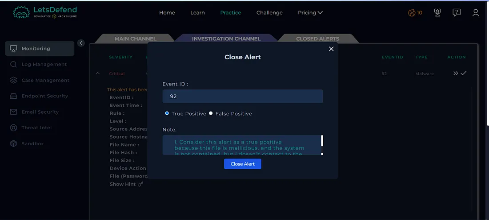

**Figure 14 — Closed Alert**

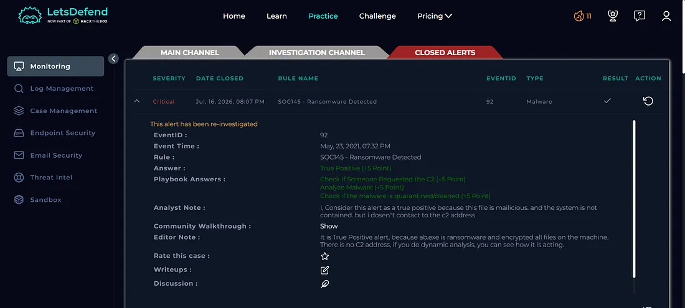

---

## What I Learned

From this investigation, I learned how to:

- Investigate ransomware detection alerts
- Analyze malicious files using VirusTotal
- Use Hybrid Analysis for dynamic malware analysis
- Investigate endpoint activity
- Analyze malicious processes
- Understand how ransomware can abuse Windows utilities
- Identify `wmic.exe`, `wbadmin.exe`, `bcdedit.exe`, and `vssadmin.exe`
- Understand the significance of shadow copy deletion
- Investigate C2 communication
- Document Indicators of Compromise
- Determine True Positive vs False Positive
- Follow a SOC investigation playbook

---

## Tools Used

- Let'sDefend
- VirusTotal
- Hybrid Analysis
- Endpoint Security
- Log Management
- Threat Intelligence
- Case Management Playbook

---

## Key Takeaway

Ransomware investigations should not focus only on the malicious file itself. A SOC analyst should also examine the processes executed by the malware and look for behavior that can prevent system recovery.

In this investigation, the use of Windows utilities such as:

`wmic.exe → wbadmin.exe → bcdedit.exe → vssadmin.exe`

provided important evidence of ransomware-related activity.

The investigation flow was:

**Malware Alert → Hash Analysis → VirusTotal → Endpoint Investigation → Process Analysis → Hybrid Analysis → Recovery Mechanism Abuse → C2 Verification → Verdict**

This investigation helped me understand how behavioral evidence can be used to identify ransomware activity even when no C2 communication is observed.
