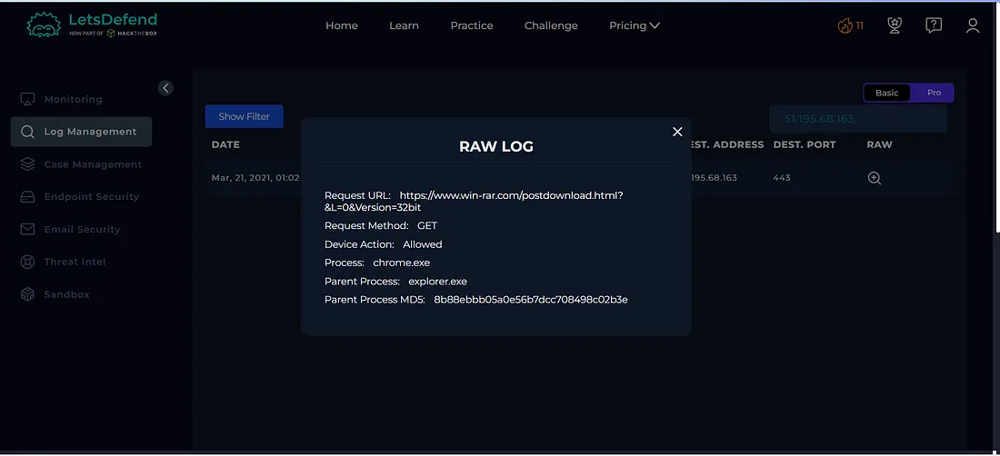
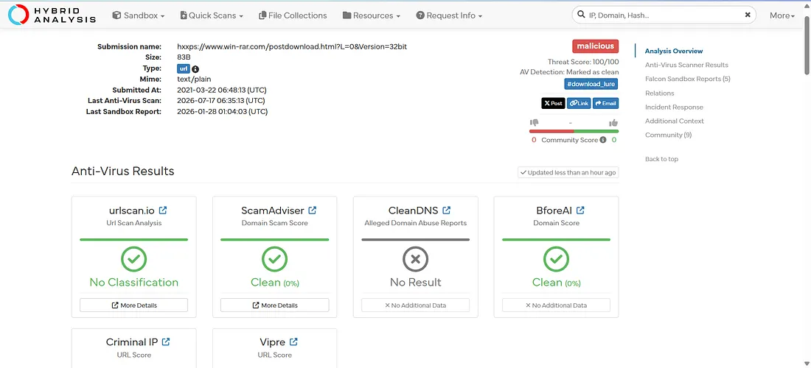
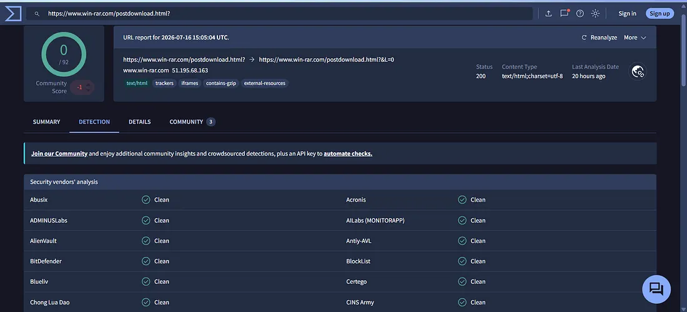
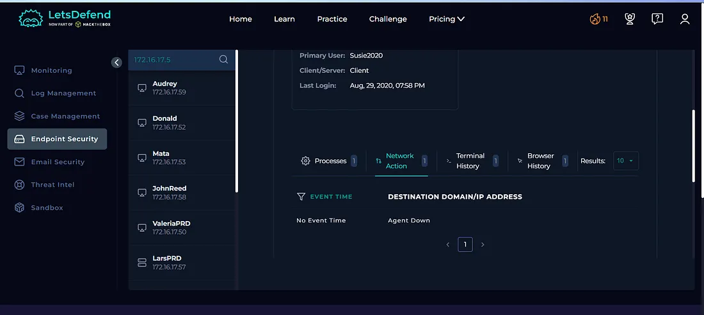
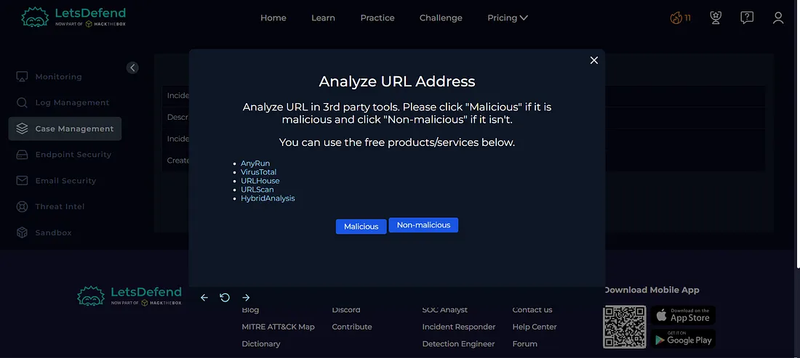
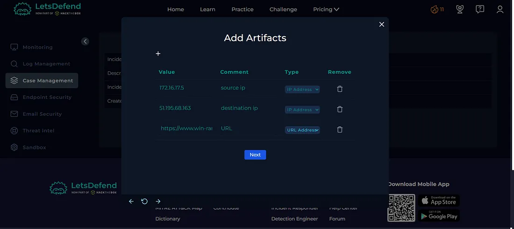
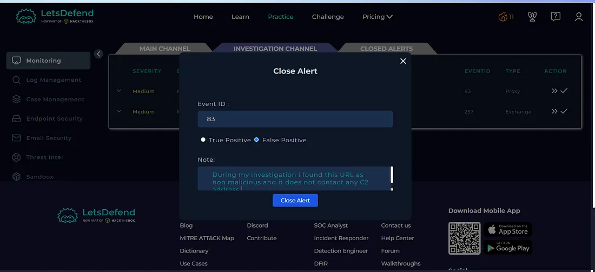
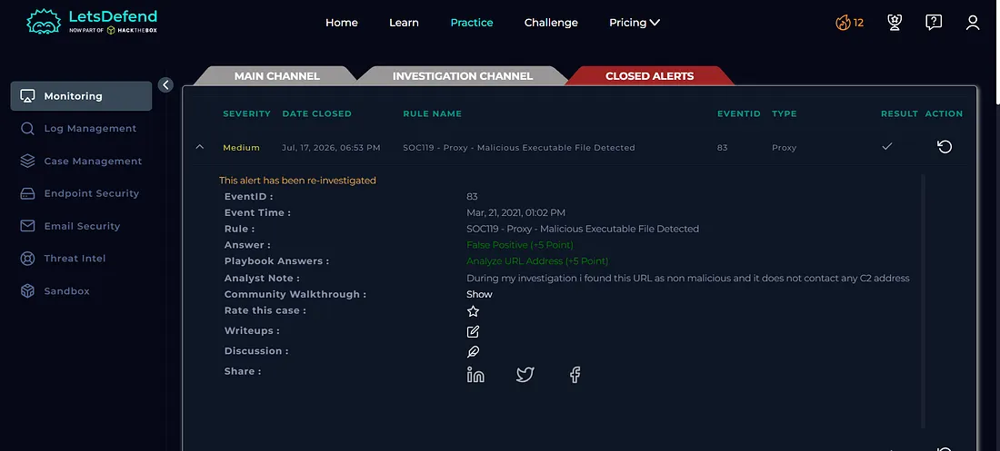

# Day 14 — SOC119: Proxy — Malicious Executable File Detected

## Overview

Today I investigated a proxy alert involving a potentially malicious executable file in the Let'sDefend SOC environment.

The alert was triggered when the endpoint accessed a download-related URL associated with `win-rar.com`. I investigated the network logs, analyzed the requested URL using Hybrid Analysis and VirusTotal, and reviewed the affected endpoint for any suspicious activity.

The threat intelligence results did not identify the requested URL as malicious, and the endpoint investigation showed no suspicious activity. Based on the available evidence, the alert was classified as a **False Positive**.

## Alert Details

- **Alert:** SOC119 — Proxy — Malicious Executable File Detected
- **Event ID:** 83
- **Event Time:** Mar 21, 2021, 01:02 PM
- **Level:** Security Analyst
- **Source IP:** `172.16.17.5`
- **Source Hostname:** `SusieHost`
- **Destination IP:** `51.195.68.163`
- **Destination Hostname:** `win-rar.com`
- **Username:** `Susie`
- **Request URL:** `https://www.win-rar.com/postdownload.html?&L=0&Version=32bit`
- **User Agent:** Chrome — Windows
- **Device Action:** Allowed
- **Verdict:** False Positive

---

## Investigation Process

### 1. Log Management Investigation

I started the investigation by reviewing the network logs associated with the alert.

**Figure 1 — Log Management Tab**

The logs showed that the endpoint `SusieHost` accessed the requested URL associated with `win-rar.com`.

The activity required further analysis to determine whether the requested resource was actually malicious.

---

### 2. Hybrid Analysis

I submitted the requested URL to **Hybrid Analysis** for sandbox analysis.

**Figure 2 — Hybrid Analysis**

The analysis did not provide evidence indicating that the requested resource was malicious.

---

### 3. VirusTotal Analysis

I then submitted the URL to **VirusTotal** for additional threat intelligence analysis.

**Figure 3 — VirusTotal**

The VirusTotal results did not identify the requested URL as malicious.

This provided additional evidence that the alert may have been triggered by legitimate activity rather than an actual malicious executable download.

---

### 4. Endpoint Security Investigation

I then reviewed the affected endpoint using **Endpoint Security**.

**Figure 4 — Endpoint Security**

The endpoint investigation did not show suspicious process activity, command execution, or other malicious behavior associated with the alert.

This further supported the conclusion that there was no confirmed malicious activity on the endpoint.

---

## Case Management — Playbook Answers

### 5. Is the Activity Malicious?

**No — Non-malicious**

The VirusTotal and Hybrid Analysis results did not identify the requested URL as malicious.

**Figure 5 — Playbook**

The endpoint investigation also did not reveal suspicious activity.

---

## Artifacts

The relevant indicators identified during the investigation were documented as artifacts.

**Figure 6 — Artifacts**

| Type | Indicator |
|---|---|
| Source IP | `172.16.17.5` |
| Source Hostname | `SusieHost` |
| Username | `Susie` |
| Destination IP | `51.195.68.163` |
| Destination Hostname | `win-rar.com` |
| Request URL | `https://www.win-rar.com/postdownload.html?&L=0&Version=32bit` |

---

## Investigation Verdict

**False Positive**

The alert was determined to be a false positive after correlating multiple sources of evidence.

The requested URL was analyzed using Hybrid Analysis and VirusTotal, and neither identified malicious activity. The endpoint investigation also showed no suspicious behavior associated with the request.

---

## Response

No containment or escalation was required because the investigation did not identify confirmed malicious activity.

The relevant indicators were documented as artifacts, and the alert was closed as a **False Positive**.

**Figure 7 — Close Alert**

**Figure 8 — Closed Alert**

## What I Learned

From this investigation, I learned how to:

- Investigate proxy-based security alerts
- Analyze suspicious URLs
- Use Hybrid Analysis for URL analysis
- Use VirusTotal for threat intelligence
- Review network logs
- Investigate endpoint activity
- Correlate multiple sources of evidence
- Identify False Positive alerts
- Document security artifacts
- Determine when containment is not required
- Follow a SOC investigation playbook

## Tools Used

- Let'sDefend
- Hybrid Analysis
- VirusTotal
- Log Management
- Endpoint Security
- Threat Intelligence
- Case Management Playbook

## Key Takeaway

A security alert does not always indicate that the detected activity is malicious.

In this investigation, the proxy alert was triggered by an executable-related URL, but further analysis showed no malicious indicators in the URL and no suspicious activity on the affected endpoint.

A SOC analyst should correlate:

**Proxy Alert → Log Analysis → URL Analysis → Threat Intelligence → Endpoint Investigation → Playbook → Verdict**

This investigation helped me understand the importance of validating proxy alerts using multiple sources of evidence before classifying them as malicious.
