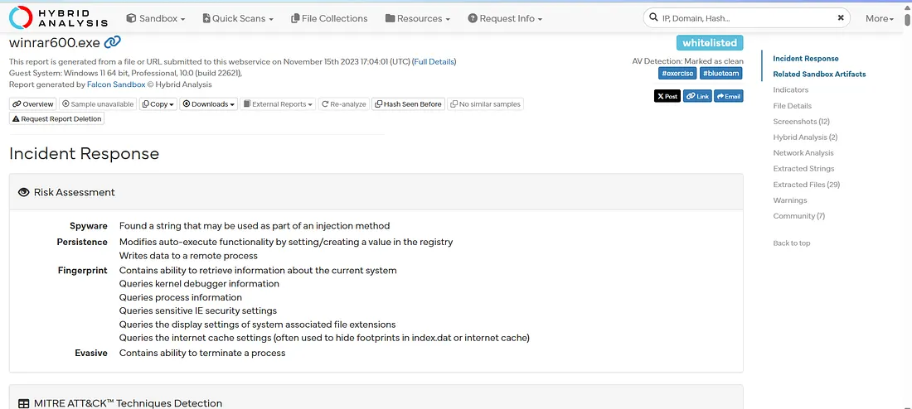
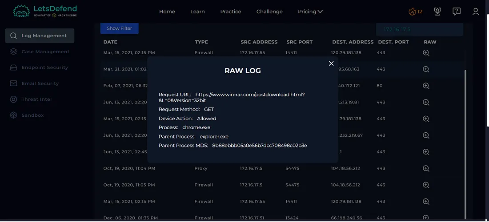
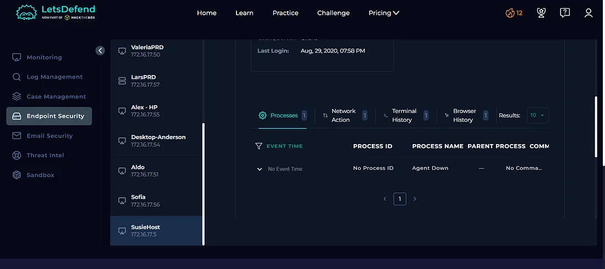
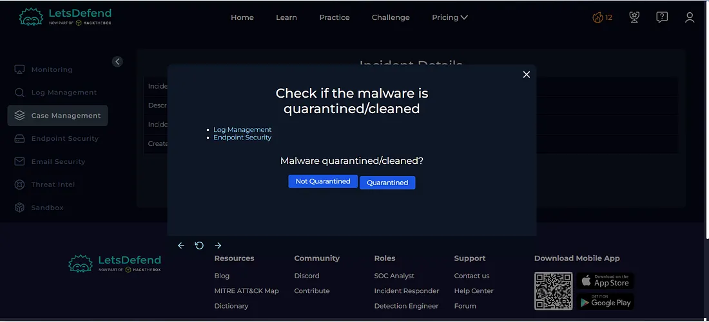
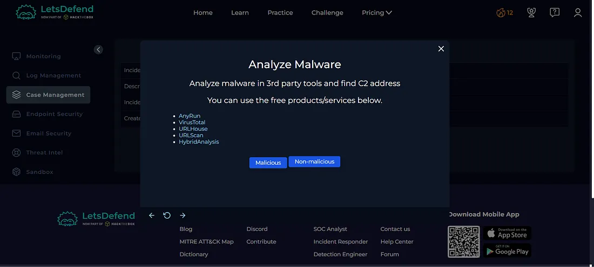
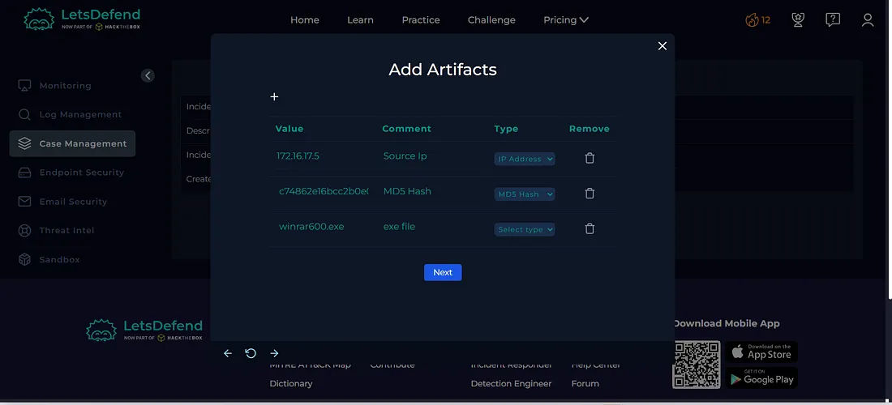
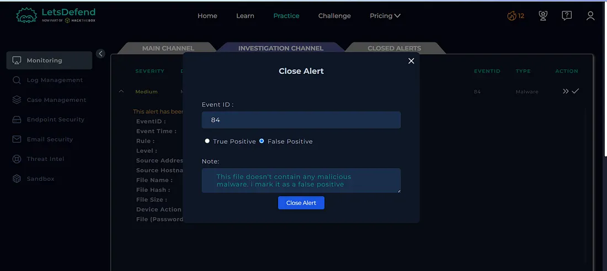
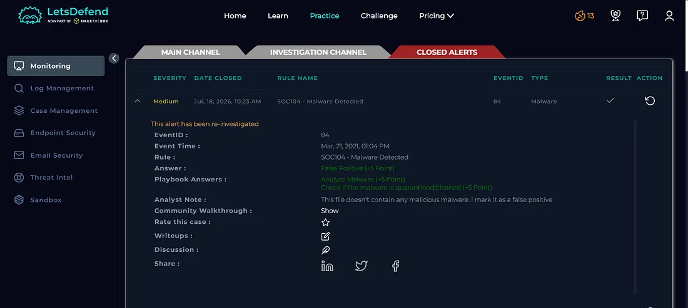

# Day 15 — SOC104: Malware Detected — Event ID 84

## Overview

Today I investigated a malware detection alert in the Let'sDefend SOC environment.

The alert involved a file named `winrar600.exe` detected on the endpoint `SusieHost`. I analyzed the provided MD5 hash using VirusTotal and Hybrid Analysis, reviewed the related network activity in Log Management, and checked the endpoint for additional suspicious activity.

The available evidence did not provide conclusive proof that the file was malicious. The file appeared to be associated with WinRAR, and no suspicious endpoint activity was identified.

Based on the available evidence, the alert was classified as a **False Positive**.

## Alert Details

- **Alert:** SOC104 — Malware Detected
- **Event ID:** 84
- **Event Time:** Mar 21, 2021, 01:04 PM
- **Level:** Security Analyst
- **Source IP:** `172.16.17.5`
- **Source Hostname:** `SusieHost`
- **File Name:** `winrar600.exe`
- **File Hash (MD5):** `c74862e16bcc2b0e02cadb7ab14e3cd6`
- **File Size:** `2.95 MB`
- **Device Action:** Allowed
- **Verdict:** False Positive

---

## Investigation Process

### 1. File Hash Analysis

The alert already provided the MD5 hash:

`c74862e16bcc2b0e02cadb7ab14e3cd6`

Since the hash was available, I did not need to download the suspicious file. I used the hash to perform threat intelligence analysis.

---

### 2. VirusTotal Analysis

I searched for the MD5 hash using **VirusTotal**.

**Figure 1 — VirusTotal**

The VirusTotal results showed only limited detection and did not provide sufficient evidence to conclusively classify the file as malicious.

Because the VirusTotal results were inconclusive, I continued the investigation using Hybrid Analysis.

---

### 3. Hybrid Analysis

I searched for the same hash using **Hybrid Analysis**.

**Figure 2 — Hybrid Analysis**

The analysis showed that the application had been dropped or rewritten by another process.

However, the available evidence indicated that the file was associated with a WinRAR component, and there was no conclusive evidence showing that the file was actually malicious.

---

### 4. Log Management Investigation

I then investigated the source endpoint:

`172.16.17.5`

using the **Log Management** tab.

**Figure 3 — Log Management**

The investigation identified a related connection associated with the endpoint.

I reviewed the available network activity to determine whether the file was associated with suspicious external communication.

---

### 5. Endpoint Security Investigation

Next, I checked the affected endpoint using **Endpoint Security**.

**Figure 4 — Endpoint Security**

No additional suspicious endpoint activity was identified in the available logs.

There was no evidence of suspicious process execution or other malicious behavior associated with the alert.

---

## Case Management — Playbook Answers

### 6. Was the File Quarantined?

**No**

The device action was **Allowed**, indicating that the file was not quarantined by the security control.

**Figure 5 — Playbook**

---

### 7. Is the File Malicious?

**No — Non-malicious**

The investigation did not provide conclusive evidence that the file was malicious.

The VirusTotal results were inconclusive, Hybrid Analysis did not provide sufficient evidence of malicious behavior, and the endpoint investigation did not reveal suspicious activity.

**Figure 6 — Playbook**

---

## Artifacts

The relevant indicators identified during the investigation were documented as artifacts.

| Type | Indicator |
|---|---|
| Source IP | `172.16.17.5` |
| Source Hostname | `SusieHost` |
| File Name | `winrar600.exe` |
| MD5 | `c74862e16bcc2b0e02cadb7ab14e3cd6` |
| File Size | `2.95 MB` |

**Figure 7 — Artifacts**

---

## Investigation Verdict

**False Positive**

The alert was determined to be a false positive after correlating the available evidence.

The file did not have sufficient malicious indicators, the Hybrid Analysis results were inconclusive, and the endpoint investigation did not identify suspicious activity.

The available evidence was more consistent with a legitimate WinRAR-related file than with confirmed malware.

---

## Response

No containment or escalation was required because the investigation did not identify confirmed malicious activity.

The relevant indicators were documented as artifacts, and the alert was closed as a **False Positive**.

**Figure 8 — Close Alert**

**Figure 9 — Closed Alert**

---

## What I Learned

From this investigation, I learned how to:

- Investigate malware detection alerts
- Analyze file hashes using VirusTotal
- Use Hybrid Analysis for additional malware analysis
- Investigate related network connections
- Review endpoint security logs
- Correlate multiple sources of evidence
- Handle inconclusive threat intelligence results
- Distinguish legitimate files from confirmed malware
- Determine False Positive vs True Positive
- Document investigation artifacts
- Follow a SOC investigation playbook

---

## Tools Used

- Let'sDefend
- VirusTotal
- Hybrid Analysis
- Log Management
- Endpoint Security
- Threat Intelligence
- Case Management Playbook

---

## Key Takeaway

A malware alert should not automatically be classified as malicious based only on the alert name or a single security tool.

In this investigation, the available evidence from VirusTotal and Hybrid Analysis was inconclusive, while the endpoint investigation did not reveal suspicious activity. Correlating these findings helped determine that the alert was a **False Positive**.

The investigation flow was:

**Malware Alert → Hash Analysis → VirusTotal → Hybrid Analysis → Log Investigation → Endpoint Investigation → Playbook → Verdict**

This investigation helped me understand the importance of validating malware alerts using multiple sources of evidence before making a final determination.
