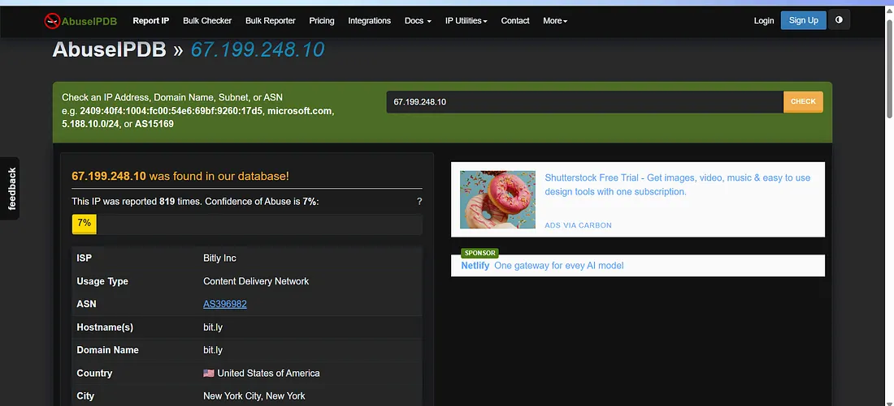
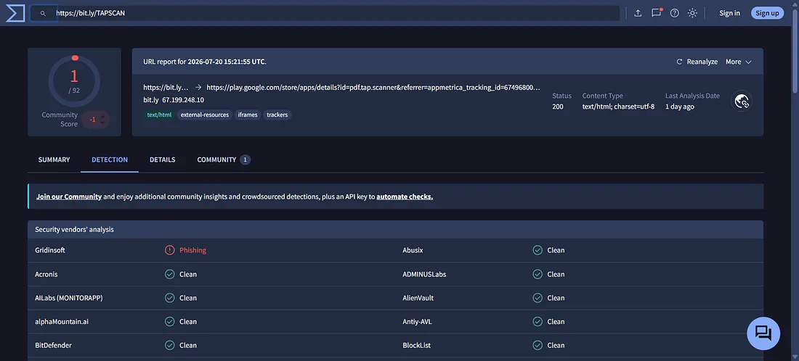
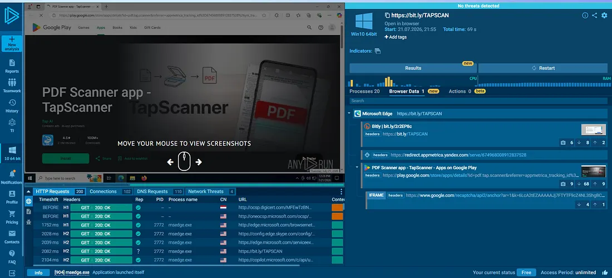
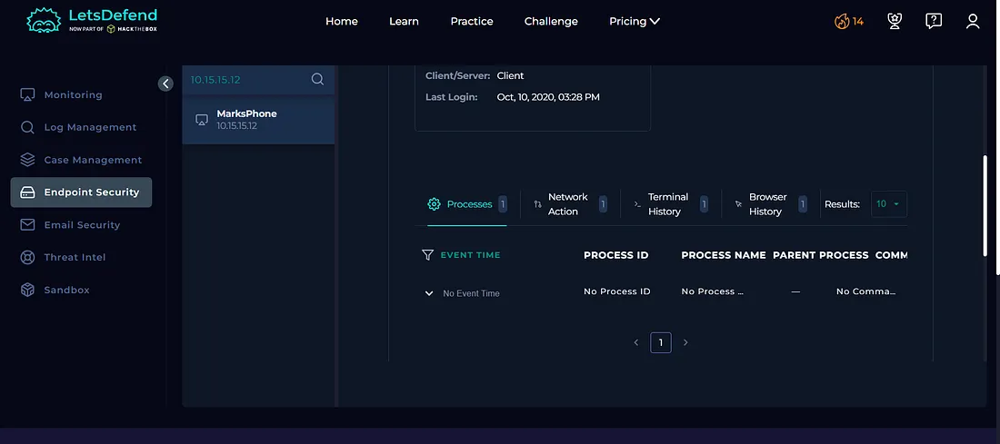
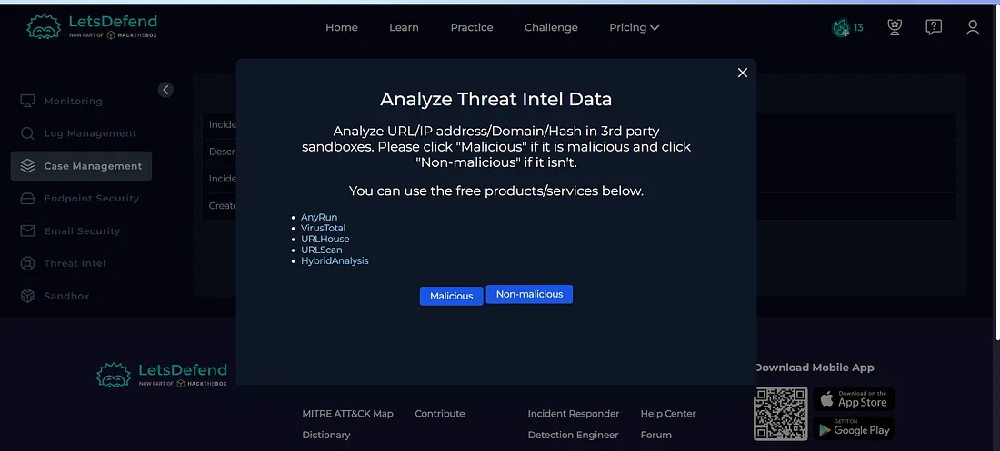
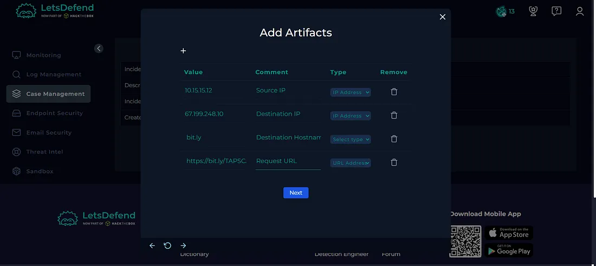
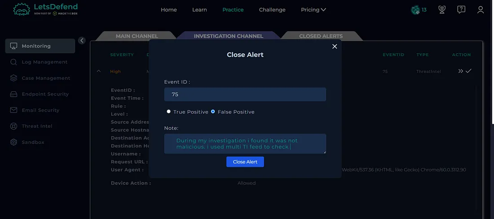
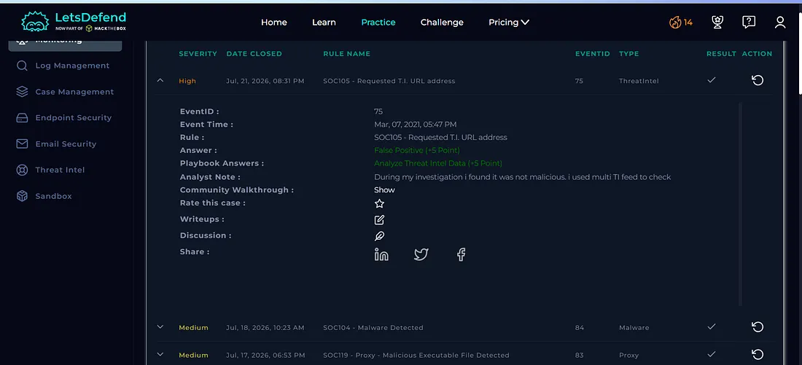

# Day 16 — SOC105: Requested T.I. URL Address

## Overview

Today I investigated a threat intelligence URL alert in the Let'sDefend SOC environment.

The alert was triggered when an endpoint accessed a shortened URL hosted through Bitly. The URL was initially flagged as potentially malicious by threat intelligence sources, so I investigated the URL using AbuseIPDB, VirusTotal, and Any.Run.

Dynamic analysis showed that the shortened URL redirected to the Google Play Store and did not demonstrate malicious behavior. I also reviewed the affected endpoint and found no suspicious processes or network activity.

Based on the available evidence, the alert was classified as a **False Positive**.

## Alert Details

- **Alert:** SOC105 — Requested T.I. URL Address
- **Event ID:** 75
- **Event Time:** Mar 07, 2021, 05:47 PM
- **Level:** Security Analyst
- **Source IP:** `10.15.15.12`
- **Source Hostname:** `MarksPhone`
- **Destination IP:** `67.199.248.10`
- **Destination Hostname:** `bit.ly`
- **Username:** `Mark`
- **Request URL:** `https://bit.ly/TAPSCAN`
- **Device Action:** Allowed
- **Verdict:** False Positive

---

## Investigation Process

### 1. Source and Domain Reputation

I started the investigation by checking the destination domain using **AbuseIPDB**.

**Figure 1 — AbuseIPDB**

The destination was associated with the Bitly shortened URL service.

Since shortened URLs can hide their final destination, further analysis was required before determining whether the URL was malicious.

---

### 2. VirusTotal Analysis

I then submitted the shortened URL to **VirusTotal**.

**Figure 2 — VirusTotal**

The shortened URL was flagged by threat intelligence sources as potentially malicious.

However, a threat intelligence detection alone was not sufficient to confirm that the URL was actually malicious. Therefore, I continued the investigation using dynamic analysis.

---

### 3. Dynamic Analysis Using Any.Run

I analyzed the URL using **Any.Run** to observe its behavior in a controlled environment.

**Figure 3 — Any.Run**

The dynamic analysis showed that the URL redirected to the **Google Play Store** and did not demonstrate malicious behavior.

This provided important evidence that the initial threat intelligence detection could have been a false positive.

---

### 4. Endpoint Security Investigation

I then investigated the affected endpoint:

`MarksPhone`

using the **Endpoint Security** section.

**Figure 4 — Endpoint Security**

The endpoint investigation did not identify any suspicious processes or suspicious network activity associated with the URL request.

No containment was required based on the available evidence.

---

## Case Management — Playbook Answers

### 5. Is the Activity Malicious?

**No — Non-malicious**

The dynamic analysis showed that the shortened URL redirected to the Google Play Store and did not exhibit malicious behavior.

**Figure 5 — Playbook**

---

## Artifacts

The following indicators were documented during the investigation:

| Type | Indicator |
|---|---|
| Source IP | `10.15.15.12` |
| Source Hostname | `MarksPhone` |
| Username | `Mark` |
| Destination IP | `67.199.248.10` |
| Destination Hostname | `bit.ly` |
| Requested URL | `https://bit.ly/TAPSCAN` |
| Final Destination | Google Play Store |

**Figure 6 — Artifacts**

---

## Investigation Verdict

**False Positive**

The alert was determined to be a false positive after correlating threat intelligence, dynamic URL analysis, and endpoint telemetry.

Although the shortened URL was initially flagged as potentially malicious, Any.Run showed that it redirected to the Google Play Store without demonstrating malicious behavior.

The endpoint investigation also showed no suspicious process or network activity.

---

## Response

No containment or escalation was required because the investigation did not identify confirmed malicious activity.

The relevant indicators were documented as artifacts, and the alert was closed as a **False Positive**.

**Figure 7 — Close Alert**

**Figure 8 — Closed Alert**

---

## What I Learned

From this investigation, I learned how to:

- Investigate threat intelligence URL alerts
- Understand the risks of shortened URLs
- Analyze URLs using AbuseIPDB
- Use VirusTotal for URL reputation analysis
- Perform dynamic analysis using Any.Run
- Identify URL redirections
- Investigate endpoint activity
- Correlate threat intelligence with sandbox results
- Determine False Positive vs True Positive
- Document security artifacts
- Understand when containment is not required
- Follow a SOC investigation playbook

---

## Tools Used

- Let'sDefend
- AbuseIPDB
- VirusTotal
- Any.Run
- Endpoint Security
- Threat Intelligence
- Case Management Playbook

---

## Key Takeaway

A URL being flagged by a threat intelligence source does not automatically mean that the URL is malicious.

In this investigation, the shortened Bitly URL was initially flagged as potentially malicious, but dynamic analysis showed that it redirected to the Google Play Store without malicious behavior. Endpoint investigation also found no suspicious activity.

A SOC analyst should correlate:

**URL Alert → Threat Intelligence → URL Reputation → Dynamic Analysis → Redirection Analysis → Endpoint Investigation → Playbook → Verdict**

This investigation helped me understand why suspicious or shortened URLs should be validated using multiple sources of evidence before classifying them as malicious.
