# Day 17 — SOC282: Phishing Alert — Deceptive Mail Detected

## Overview

Today I investigated a phishing alert involving a deceptive email in the Let'sDefend SOC environment.

The email appeared to offer a free coffee voucher, but the investigation revealed multiple malicious indicators. The SMTP server had a poor reputation, the email attachment was identified as malicious, and endpoint telemetry showed that a malicious process named `Coffee.exe` had been executed.

Further analysis identified the malware as **AsyncRAT**, indicating that the phishing email had resulted in malicious activity on the endpoint.

Based on the available evidence, the alert was confirmed as a **True Positive**.

## Alert Details

- **Alert:** SOC282 — Phishing Alert — Deceptive Mail Detected
- **Event ID:** 257
- **Event Time:** May 13, 2024, 09:22 AM
- **Level:** Security Analyst
- **SMTP IP:** `103.80.134.63`
- **Source Address:** `free@coffeeshooop.com`
- **Destination Address:** `Felix@letsdefend.io`
- **Email Subject:** `Free Coffee Voucher`
- **Device Action:** Allowed
- **Verdict:** True Positive

---

## Investigation Process

### 1. SMTP Server Reputation Analysis

I started the investigation by analyzing the SMTP server:

`103.80.134.63`

I checked the IP reputation using **VirusTotal**.

**Figure 1 — VirusTotal**

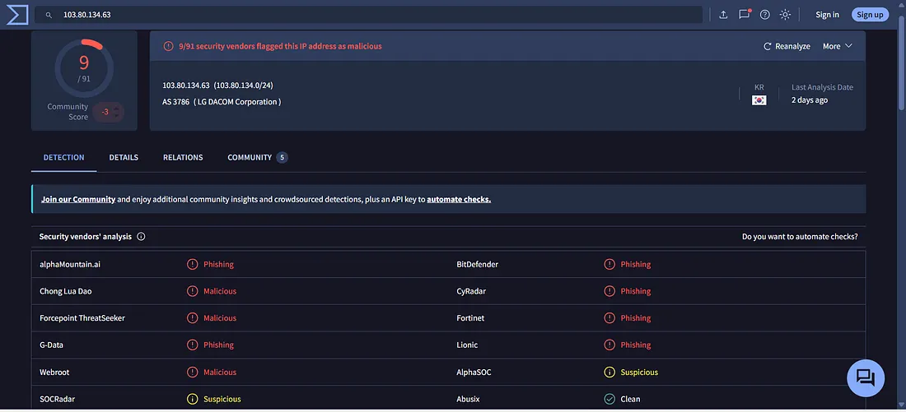

The SMTP server was flagged by multiple security vendors, indicating a poor reputation.

I then checked the same IP using **Cisco Talos Intelligence**.

**Figure 2 — Cisco Talos Intelligence**

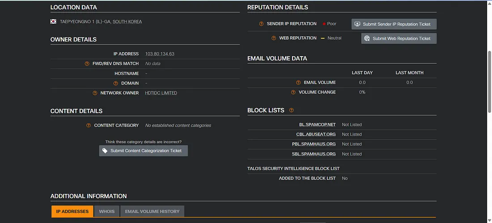

Cisco Talos also showed a poor reputation for the SMTP server and indicated that the IP was associated with a Spamhaus block list.

---

### 2. WHOIS Investigation

I performed a reverse IP lookup to gather additional information about the SMTP server.

**Figure 3 — WHOIS**

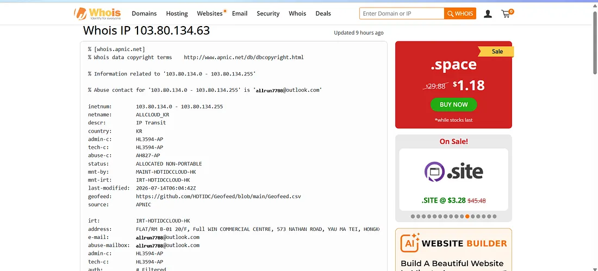

The IP address was associated with infrastructure located in Korea, which was consistent with the location information observed during the threat intelligence investigation.

---

### 3. Email URL and Attachment Analysis

The email contained a suspicious button/file that pointed to the following URL:

`hxxps://files-ld.s3.us-east-2.amazonaws.com/59cbd215-76ea-434d-93ca-4d6aec3bac98-free-coffee.zip`

The button and the attached file both led to the same URL.

I submitted the URL/file to **VirusTotal** for further analysis.

**Figure 4 — VirusTotal**

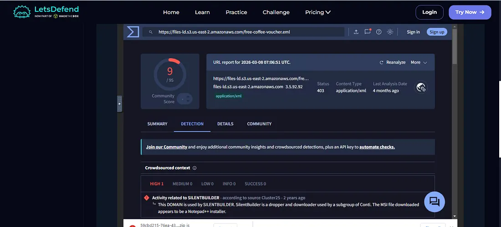

The analysis showed that the file was flagged by multiple security vendors, including vendors such as Fortinet, Bitdefender, and Kaspersky.

This provided strong evidence that the attachment was malicious.

---

### 4. Endpoint Detection and Response Investigation

I then reviewed the endpoint telemetry to determine whether the recipient interacted with the malicious email.

The EDR logs revealed that a process named:

`Coffee.exe`

was executed on the endpoint.

**Figure 5 — VirusTotal**

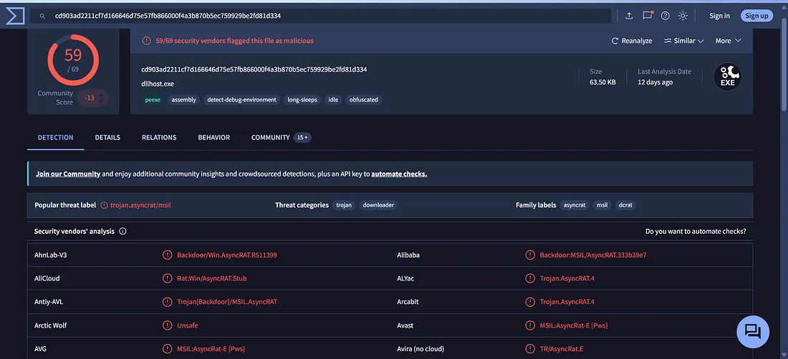

The file was detected by multiple security vendors.

Further investigation using Cisco Talos provided additional evidence that the file was malicious.

**Figure 6 — Cisco Talos Intelligence**

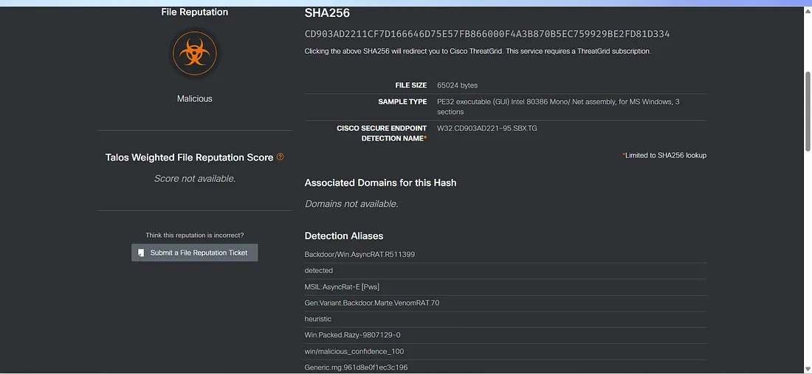

The malware was identified as **AsyncRAT**, a Remote Access Trojan capable of providing attackers with remote access to a compromised system.

This significantly increased the severity of the incident because the malicious attachment was not only delivered but also executed.

---

## Case Management — Playbook Answers

### 5. Does the Email Contain an Attachment or URL?

**Yes**

The phishing email contained a malicious file/link leading to the suspicious ZIP file.

**Figure 7 — Playbook**

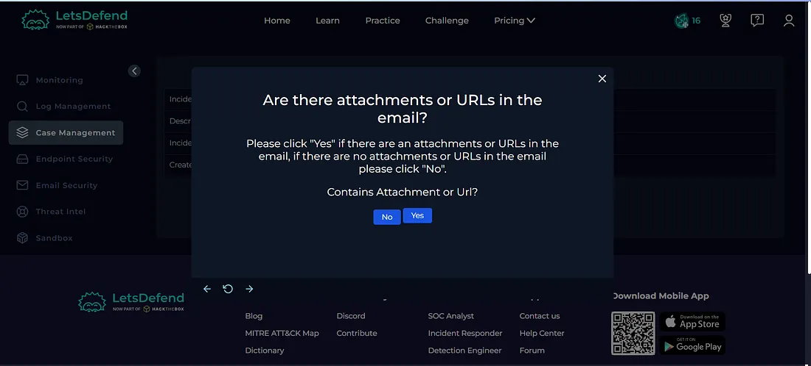

---

### 6. Is the Attachment Malicious?

**Yes**

Threat intelligence and malware analysis confirmed that the attachment was malicious.

**Figure 8 — Playbook**

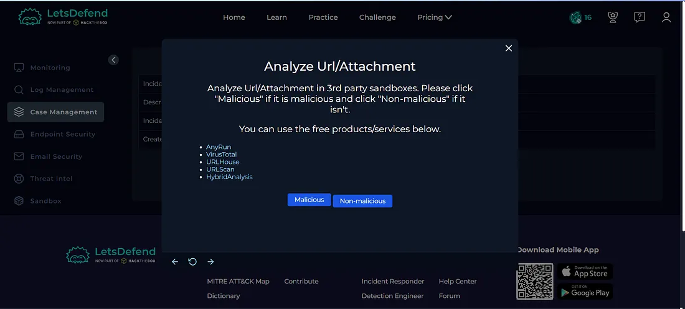

---

### 7. Was the Email Delivered to the User?

**Yes**

The device action was **Allowed**, indicating that the email was delivered to the intended recipient.

**Figure 9 — Playbook**

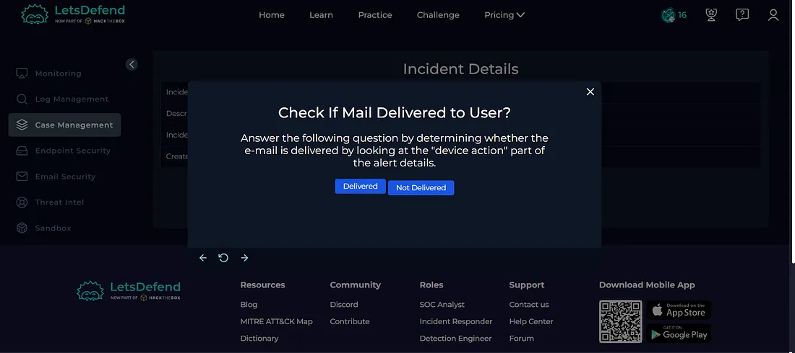

---

### 8. Should the Malicious Email Be Deleted?

**Yes**

Since the email contained a confirmed malicious attachment, it should be removed from the recipient's mailbox.

**Figure 10 — Playbook**

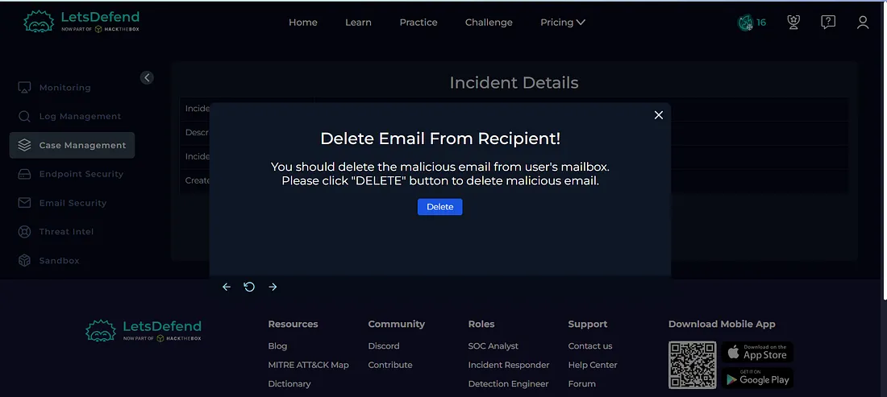

**Figure 11 — Email Security**

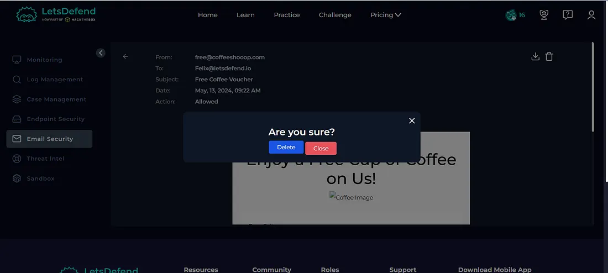

---

### 9. Did the User Open the Malicious File?

**Yes**

The EDR logs showed browser activity associated with the URL contained in the phishing email.

This provided evidence that the recipient interacted with the malicious content.

**Figure 12 — Playbook**

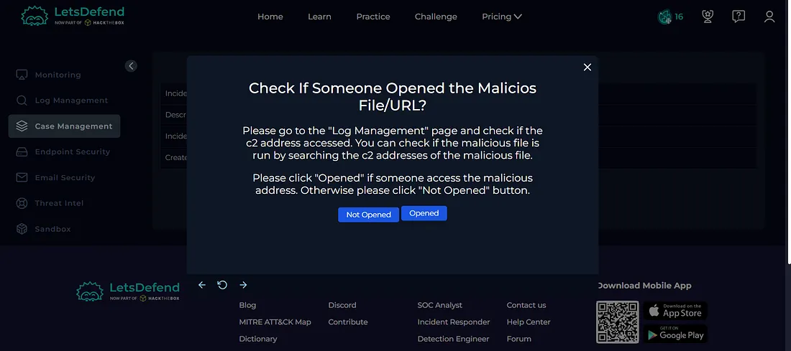

**Figure 13 — Endpoint Security**

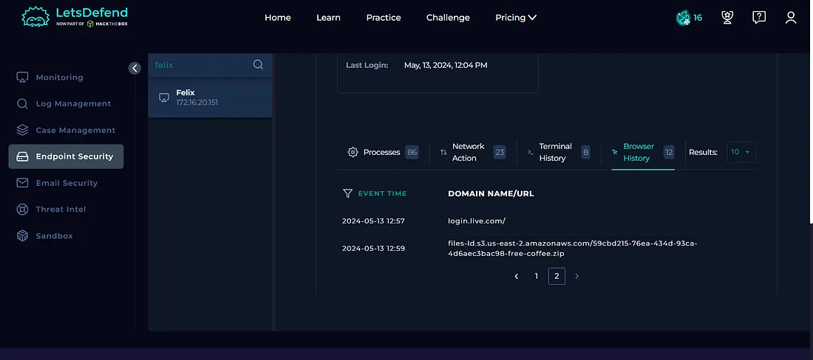

---

### 10. Should the Host Be Contained?

**Yes**

Since the malicious file was executed and malware activity was identified on the endpoint, the affected host should be contained.

Host containment helps prevent further malicious communication and limits potential impact while the incident is investigated.

**Figure 14 — Host Containment**

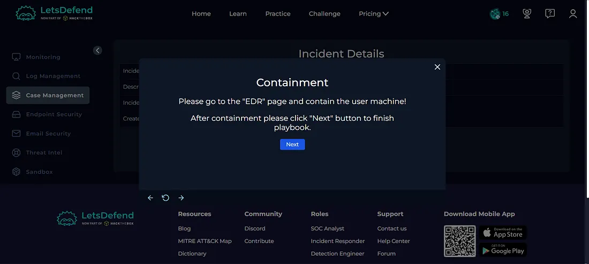

**Figure 15 — Host Containment**

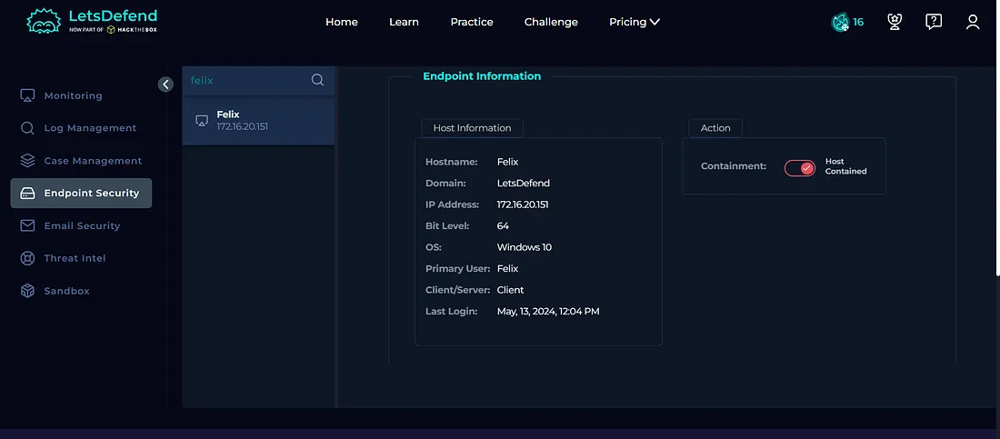

---

## Artifacts

The following indicators were identified and documented during the investigation:

| Type | Indicator |
|---|---|
| SMTP IP | `103.80.134.63` |
| Source Email | `free@coffeeshooop.com` |
| Destination Email | `Felix@letsdefend.io` |
| Email Subject | `Free Coffee Voucher` |
| Malicious File | `Coffee.exe` |
| Malware | `AsyncRAT` |
| Attachment URL | `hxxps://files-ld.s3.us-east-2.amazonaws.com/...` |

**Figure 16 — Artifacts**

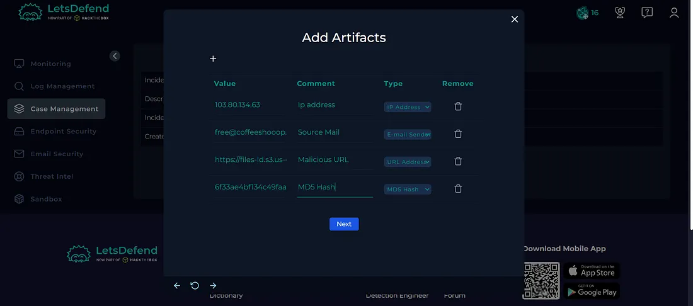

---

## Investigation Verdict

**True Positive — Phishing Email with Malicious Attachment**

The alert was confirmed as a genuine phishing incident.

The investigation identified multiple indicators of compromise:

- Suspicious SMTP server reputation
- Malicious phishing attachment
- Malicious URL
- Execution of `Coffee.exe`
- Identification of AsyncRAT
- Evidence that the user interacted with the malicious content

The email was allowed and delivered to the user, and endpoint telemetry confirmed malicious activity.

---

## Response

The malicious email should be removed from the recipient's mailbox.

The affected endpoint was **contained** to prevent further malicious activity and potential communication with attacker-controlled infrastructure.

The relevant indicators were documented as artifacts, and the alert was closed as a **True Positive**.

**Figure 17 — Closed Alert**

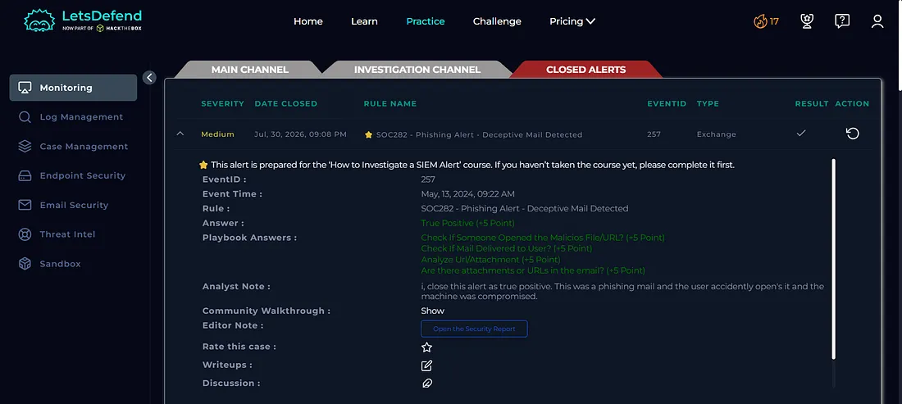

---

## What I Learned

From this investigation, I learned how to:

- Investigate deceptive phishing emails
- Analyze SMTP server reputation
- Use VirusTotal for threat intelligence
- Use Cisco Talos Intelligence
- Perform WHOIS/IP reputation analysis
- Analyze malicious email attachments
- Investigate EDR telemetry
- Identify malicious process execution
- Understand AsyncRAT-related activity
- Determine whether a phishing email was delivered
- Determine whether the user interacted with malicious content
- Perform host containment
- Document Indicators of Compromise
- Determine True Positive vs False Positive
- Follow a SOC investigation playbook

---

## Tools Used

- Let'sDefend
- VirusTotal
- Cisco Talos Intelligence
- WHOIS
- Email Security
- Endpoint Security
- EDR
- Threat Intelligence
- Case Management Playbook

---

## Key Takeaway

A phishing email can become a serious security incident when the malicious attachment is delivered and executed on an endpoint.

In this investigation, multiple sources of evidence confirmed the threat:

**SMTP Reputation → Email Analysis → Attachment Analysis → VirusTotal → EDR Telemetry → Malware Identification → Host Containment → Verdict**

The execution of `Coffee.exe` and its identification as **AsyncRAT** provided strong evidence that the phishing attempt resulted in malicious endpoint activity.

This investigation helped me understand how a SOC analyst can correlate email security, threat intelligence, and endpoint telemetry to identify and contain a phishing-driven malware incident.
