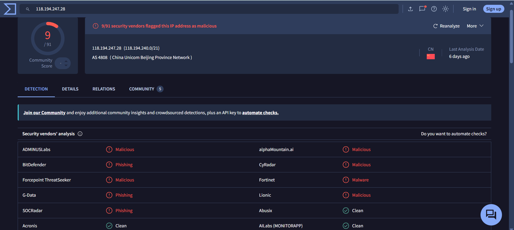
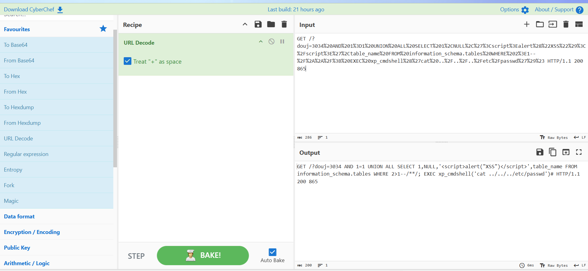
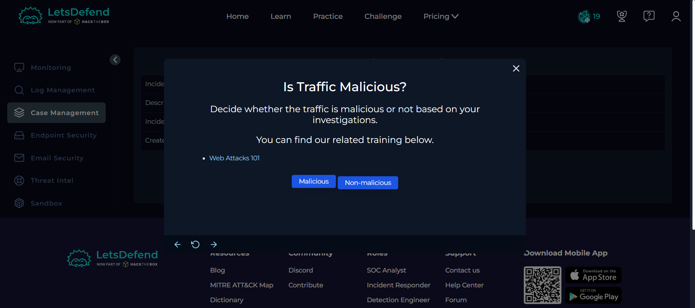
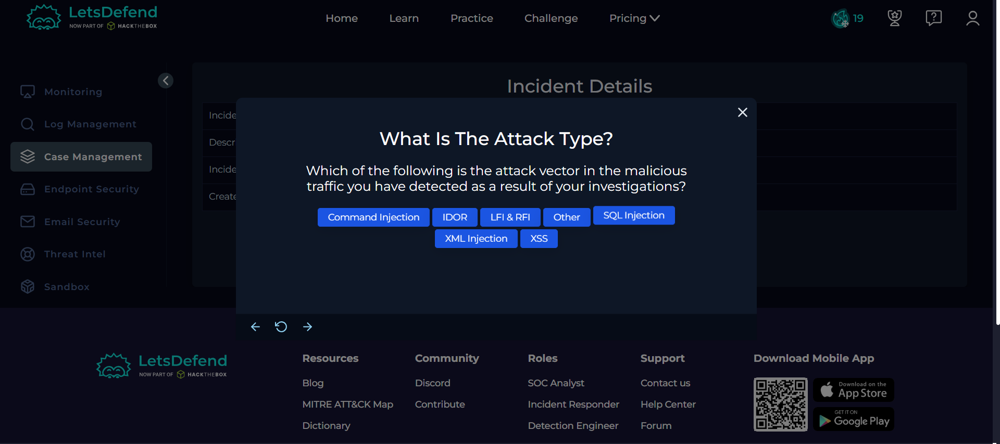
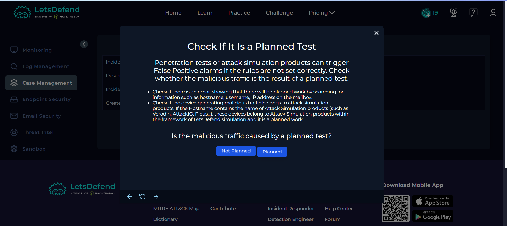
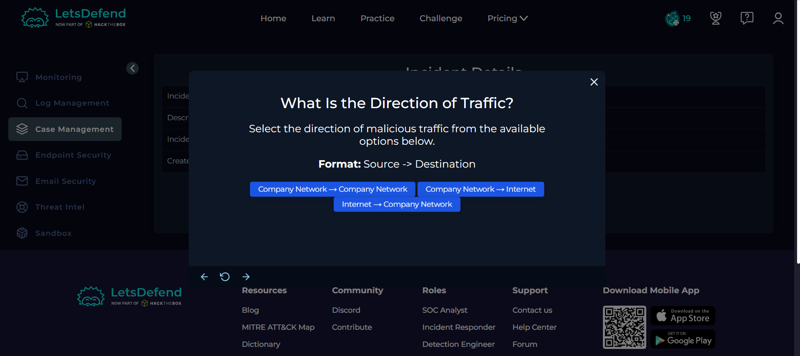
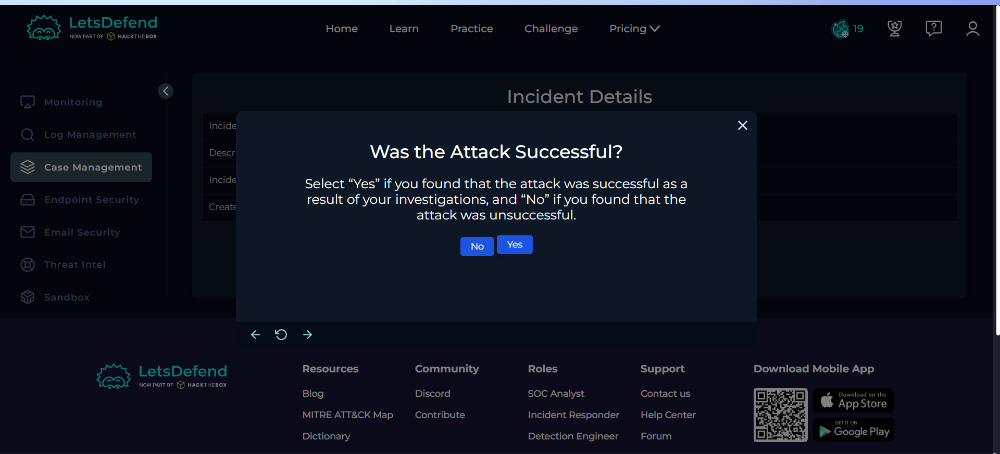
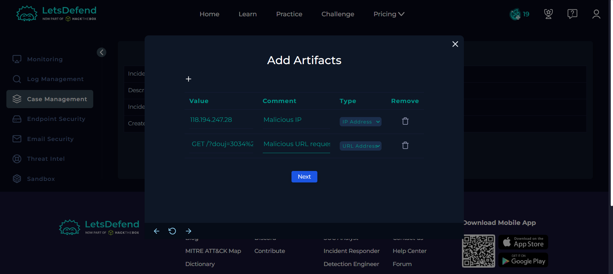
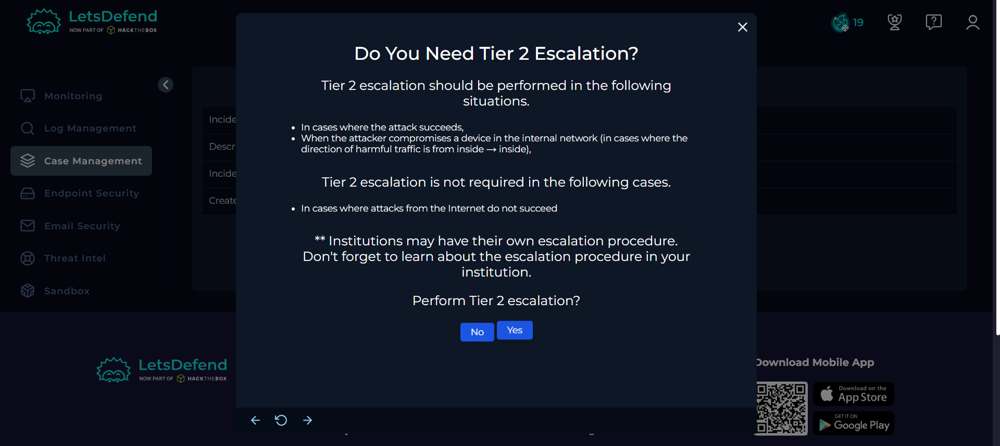
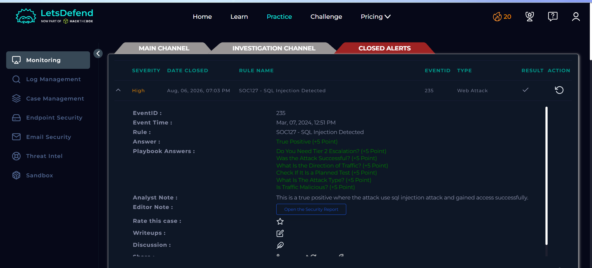

# Day 19 — SOC127: SQL Injection Detected

## Overview

Today I investigated a SQL Injection alert in the Let'sDefend SOC environment.

The alert involved a malicious HTTP request targeting the internal web server `WebServer1000`. The requested URL contained a SQL Injection payload that attempted database enumeration and execution of operating-system commands through `xp_cmdshell`.

After decoding and analyzing the request, I identified indicators of SQL Injection combined with an attempted command execution. The HTTP response returned a `200 OK` status, indicating that the request was processed by the server.

Based on the available lab evidence, the attack was classified as a **True Positive** and required **Tier 2 escalation** for further investigation.

## Alert Details

- **Alert:** SOC127 — SQL Injection Detected
- **Event ID:** 235
- **Event Time:** Mar 07, 2024, 12:51 PM
- **Level:** Security Analyst
- **Source IP:** `118.194.247.28`
- **Destination IP:** `172.16.20.12`
- **Destination Hostname:** `WebServer1000`
- **HTTP Method:** `GET`
- **Device Action:** `Allowed`
- **HTTP Response:** `200 OK`
- **Verdict:** True Positive
- **Tier 2 Escalation:** Required

---

## Investigation Process

### 1. Source IP Reputation Analysis

I started the investigation by checking the reputation of the source IP:

`118.194.247.28`

I submitted the IP address to **VirusTotal** to identify any known malicious reputation.

**Figure 1 — VirusTotal**

The IP was classified as malicious and was associated with activity originating from China.

This provided an additional indicator supporting the suspicious nature of the traffic.

---

### 2. Malicious Request Analysis

The requested URL contained an encoded SQL Injection payload.

I decoded the URL using **CyberChef** to understand the attacker's actual request.

**Figure 2 — CyberChef**

The decoded request contained multiple suspicious techniques, including:

- SQL Injection
- Database table enumeration
- `information_schema.tables` queries
- `UNION SELECT`
- `xp_cmdshell`
- Operating-system command execution
- Attempted access to `/etc/passwd`

The use of `xp_cmdshell` is particularly significant because it can allow SQL Server to execute operating-system commands.

The request also attempted to access:

`/etc/passwd`

which is a sensitive Linux system file containing account-related information.

The payload therefore went beyond a basic SQL Injection attempt and attempted to achieve operating-system-level command execution.

---

### 3. HTTP Response Analysis

The HTTP response was:

`HTTP/1.1 200 865`

The `200 OK` response indicates that the web server successfully processed the HTTP request.

**Important:** A `200 OK` response alone does not prove that every part of the malicious payload successfully executed. However, based on the lab evidence and playbook criteria, the activity was treated as a **successful attack**.

This made the alert significantly more serious than a blocked or failed SQL Injection attempt.

---

## Case Management — Playbook Answers

### 4. Is the Traffic Malicious?

**Yes**

The request contained a clearly malicious SQL Injection payload combined with an attempted command execution technique.

**Figure 3 — Playbook**

---

### 5. What Is the Attack Type?

**SQL Injection**

The payload used SQL Injection techniques including `UNION SELECT` and database enumeration.

It also attempted to escalate the attack into operating-system command execution through `xp_cmdshell`.

**Figure 4 — Playbook**

---

### 6. Was the Attack Planned?

**No — Not Planned**

There were no indicators in the lab evidence suggesting that this was an authorized security test.

**Figure 5 — Playbook**

---

### 7. What Is the Direction of Traffic?

**Internet → Company Network**

The source IP:

`118.194.247.28`

was external, while the destination:

`172.16.20.12`

was an internal company server.

Therefore, the traffic direction was:

**Internet → Company Network**

**Figure 6 — Playbook**

---

### 8. Was the Attack Successful?

**Yes — Based on the Lab Evidence**

The HTTP response returned:

`200 OK`

The request was processed by the server, and the payload contained SQL Injection and command-execution logic.

Based on the Let'sDefend lab evidence and playbook criteria, the attack was considered successful.

**Figure 7 — Playbook**

---

## Artifacts

The following indicators were identified during the investigation:

| Type | Indicator |
|---|---|
| Source IP | `118.194.247.28` |
| Destination IP | `172.16.20.12` |
| Destination Hostname | `WebServer1000` |
| HTTP Method | `GET` |
| Attack Type | SQL Injection |
| Technique | `UNION SELECT` |
| Command Execution | `xp_cmdshell` |
| Target File | `/etc/passwd` |
| HTTP Response | `200 OK` |

**Figure 8 — Artifacts**

---

## Tier 2 Escalation

**Yes — Tier 2 Escalation Required**

The investigation identified a potentially successful SQL Injection attack with attempted operating-system command execution.

Potential impact includes:

- Database compromise
- Sensitive information exposure
- Operating-system command execution
- Further server compromise
- Persistence or web shell activity
- Possible lateral movement

Because the activity went beyond a simple SQL Injection attempt and potentially involved command execution, the case required further investigation by a Tier 2 analyst.

**Figure 9 — Escalation**

---

## Investigation Verdict

**True Positive — SQL Injection with Attempted Command Execution**

The alert was confirmed as a genuine malicious attack.

The investigation identified:

- Malicious source IP reputation
- SQL Injection payload
- Database table enumeration
- `UNION SELECT`
- `xp_cmdshell` command execution attempt
- Attempted access to `/etc/passwd`
- Successful HTTP response processing

Based on the available lab evidence, the attack was considered successful and required escalation to Tier 2.

---

## Response

The relevant indicators were documented as artifacts.

Because the attack involved SQL Injection with attempted operating-system command execution and was considered successful according to the lab evidence, the alert was escalated to **Tier 2** for further investigation.

The alert was ultimately closed as a **True Positive**.

**Figure 10 — Closed Alert**

---

## What I Learned

From this investigation, I learned how to:

- Investigate SQL Injection alerts
- Decode URL-encoded attack payloads
- Use CyberChef for payload analysis
- Identify `UNION SELECT` SQL Injection techniques
- Understand `information_schema` database enumeration
- Understand the security implications of `xp_cmdshell`
- Identify attempted operating-system command execution
- Analyze HTTP response codes
- Determine Internet-to-Company Network traffic direction
- Document Indicators of Compromise
- Determine whether Tier 2 escalation is required
- Determine True Positive vs False Positive
- Follow a SOC investigation playbook

---

## Tools Used

- Let'sDefend
- VirusTotal
- CyberChef
- Log Analysis
- Threat Intelligence
- Case Management Playbook

---

## Key Takeaway

SQL Injection can become significantly more dangerous when an attacker attempts to move from database manipulation to operating-system command execution.

In this investigation, the payload combined:

**SQL Injection → Database Enumeration → `UNION SELECT` → `xp_cmdshell` → OS Command Execution Attempt**

The `200 OK` response, combined with the malicious payload and other lab evidence, resulted in the alert being treated as a **successful True Positive** requiring Tier 2 escalation.

The investigation flow was:

**Alert → Source IP Reputation → Payload Decoding → SQL Injection Analysis → HTTP Response Analysis → Playbook → Artifacts → Tier 2 Escalation → Verdict**

This investigation helped me understand how a SOC analyst can identify an SQL Injection attack and recognize when the activity has escalated beyond database-level exploitation into potential server compromise.
