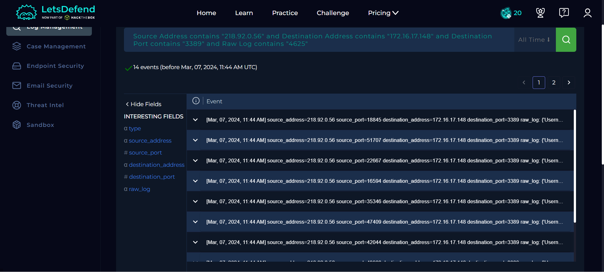
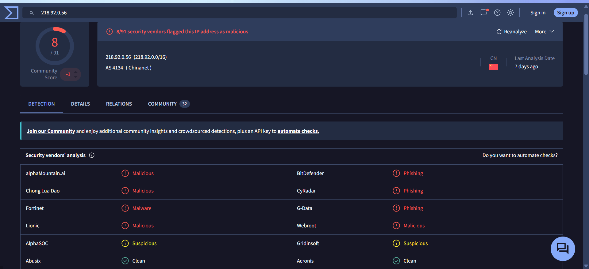
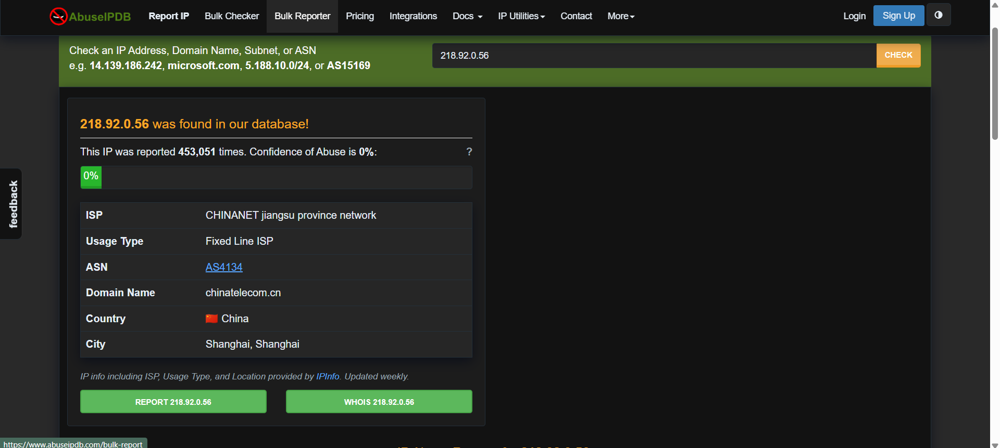
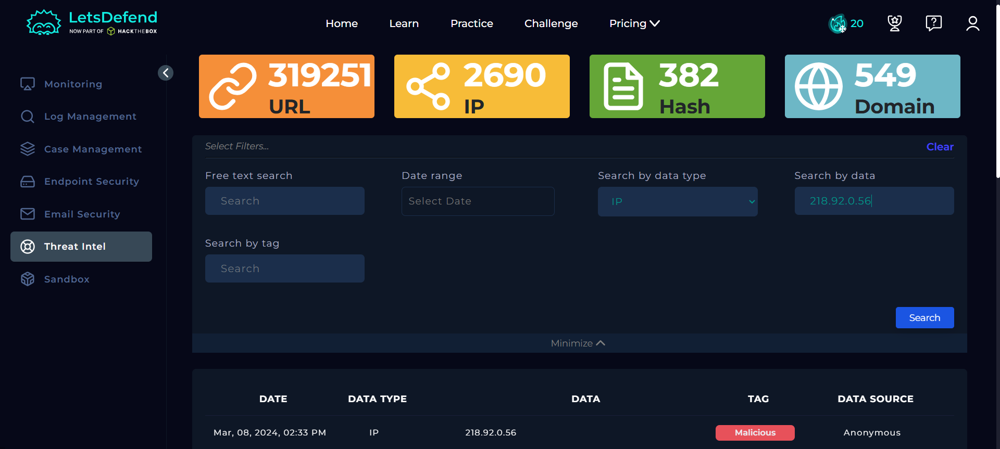
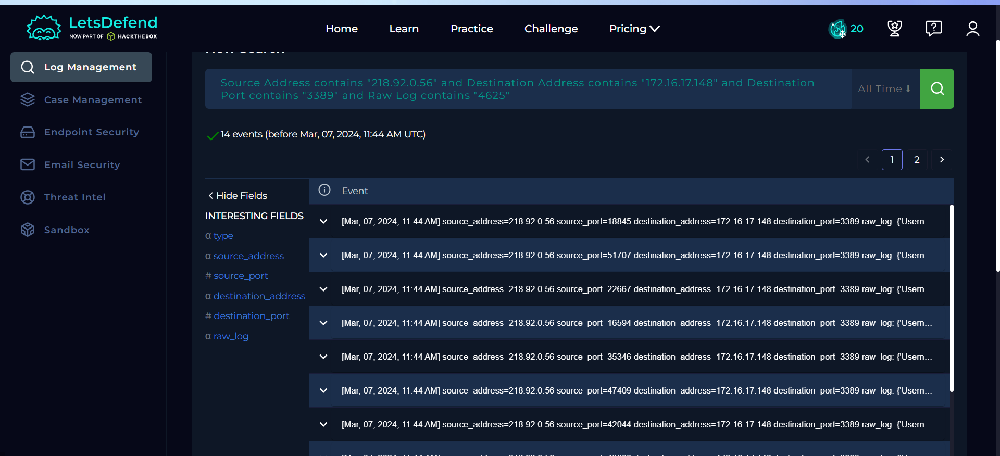
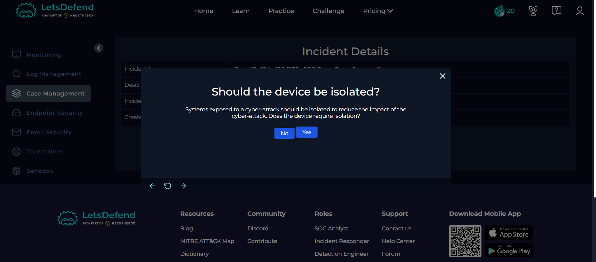

## Overview

Today I investigated an RDP brute force attack in the Let'sDefend SOC environment.

The alert showed multiple failed RDP login attempts from an external IP address targeting the host **Matthew**. Log analysis revealed **14 failed login attempts** using different usernames followed by **1 successful login**, confirming that the brute force attack was successful.

I investigated the alert using Let'sDefend SIEM, Log Management, Endpoint Security, VirusTotal, AbuseIPDB, Threat Intelligence, and the investigation playbook.

## Alert Details

- **Alert:** SOC176 — RDP Brute Force Detected
- **Event ID:** 234
- **Event Time:** Mar 07, 2024, 11:44 AM
- **Severity:** Medium
- **Type:** Brute Force
- **Source IP:** `218.92.0.56`
- **Destination Host:** `Matthew`
- **Destination IP:** `172.16.17.148`
- **Protocol:** RDP
- **Target Port:** `3389`
- **Trigger Reason:** Login failure from a single source with different nonexistent accounts

## Investigation Process

### 1. Log Management Analysis

I then moved to the **Log Management** section and filtered the logs using:

- **Source Address:** `218.92.0.56`
- **Destination Address:** `172.16.17.148`

**Figure 1 — Log Management**

The log analysis revealed multiple failed authentication attempts.

I found **14 failed login attempts** using usernames such as:

- `admin`
- `guest`
- `sysadmin`
- `Matthew`

After these failed attempts, I also found **1 successful login** to the `Matthew` account at approximately **08:44 AM**.

This confirmed that the brute force attack was successful.

---

## 2. Source IP Reputation Analysis

I checked the source IP address:

`218.92.0.56`

using multiple threat intelligence sources to determine whether the source was known for malicious activity.

### VirusTotal

VirusTotal identified the source IP as malicious.

**Figure 2 — VirusTotal IP Reputation**

### AbuseIPDB

I also checked the IP address using AbuseIPDB, where the IP had multiple reports associated with malicious activity.

**Figure 3 — AbuseIPDB Report**

### Let'sDefend Threat Intelligence

The IP address was also checked using Let'sDefend Threat Intelligence.

The results provided additional evidence that the source IP was associated with malicious activity.

**Figure 4 — Let'sDefend Threat Intelligence**

The reputation checks confirmed that the source IP was suspicious and supported the brute force investigation.

---

## 3. RDP Traffic Analysis

I analyzed the network traffic associated with the source and destination addresses.

The logs showed multiple connection attempts targeting **RDP port 3389**.

RDP commonly uses TCP port:

`3389`

The repeated requests from the same external IP toward the RDP service were consistent with a brute force attack.

**Figure 5 — RDP Traffic Analysis**

---

## 4. Authentication Log Analysis

I further investigated the Windows authentication events.

The relevant Event IDs were:

- **4625** — Failed logon
- **4624** — Successful logon

The logs showed:

- **14 Event ID 4625** failed login attempts
- **1 Event ID 4624** successful login

**Figure 6 — Failed Login Attempts**

The successful authentication after multiple failed attempts confirmed that the attacker was able to obtain valid credentials.

Therefore, this was not just an attempted brute force attack; the attack was **successful**.

---

## 5. Attack Scope

I reviewed the affected systems to determine the scope of the attack.

The attacker targeted:

- **Hostname:** `Matthew`
- **IP Address:** `172.16.17.148`

No additional affected hosts were identified during this investigation.

Therefore, the observed attack scope was limited to the **Matthew** endpoint.

---

## 6. Host Isolation

Since the brute force attack resulted in a successful login, I proceeded with containment.

The affected host **Matthew** was isolated using Endpoint Security to prevent further unauthorized access and possible exploitation.

**Figure 7 — Host Isolation**

---

## 7. Containment

The affected endpoint was successfully isolated.

### Device Details

- **Hostname:** `Matthew`
- **IP Address:** `172.16.17.148`
- **Operating System:** Windows 10

Host isolation helps prevent the attacker from continuing communication with the compromised system while further investigation and remediation can be performed.

**Figure 8 — Contained Host**

---

## Artifacts

The following indicators were identified during the investigation:

| Type | Indicator |
|---|---|
| Alert | `SOC176 — RDP Brute Force Detected` |
| Event ID | `234` |
| Source IP | `218.92.0.56` |
| Destination Host | `Matthew` |
| Destination IP | `172.16.17.148` |
| Protocol | `RDP` |
| Port | `3389` |
| Failed Logins | `14` |
| Successful Logins | `1` |
| Failed Login Event ID | `4625` |
| Successful Login Event ID | `4624` |
| Operating System | `Windows 10` |

---

## Investigation Verdict

**True Positive — Successful RDP Brute Force Attack**

The alert was confirmed as a genuine brute force attack.

The investigation identified multiple failed RDP authentication attempts from the external IP address `218.92.0.56`. The attacker used different usernames and eventually achieved a successful login to the `Matthew` account.

The source IP was also identified as malicious through multiple threat intelligence sources.

---

## Response

The affected host **Matthew** was isolated to prevent further unauthorized access.

The successful login indicates that the incident requires further investigation to determine what actions were performed after authentication.

The identified source IP, destination host, authentication events, and RDP activity were documented as investigation artifacts.

---

## What I Learned

From this investigation, I learned how to:

- Investigate RDP brute force attacks
- Identify repeated failed authentication attempts
- Understand Windows Event ID `4625`
- Understand Windows Event ID `4624`
- Identify successful brute force attacks
- Analyze RDP traffic on port `3389`
- Check IP reputation using threat intelligence sources
- Determine the scope of an attack
- Perform endpoint isolation
- Document security investigation artifacts
- Correlate authentication logs with network activity

---

## Tools Used

- Let'sDefend
- SIEM
- Log Management
- Endpoint Security
- VirusTotal
- AbuseIPDB
- Let'sDefend Threat Intelligence

---

## Key Takeaway

A large number of failed RDP login attempts from a single external source can indicate a brute force attack. However, the most important finding is whether the attacker eventually succeeds.

In this investigation:

**External IP → Multiple Failed RDP Logins → Successful Login → Confirmed Brute Force → Host Isolation**

The successful authentication made this incident more serious because the attacker may have gained unauthorized access to the affected Windows system.
