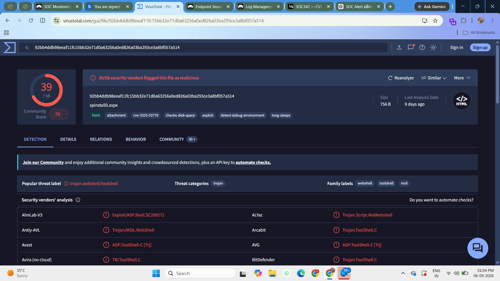
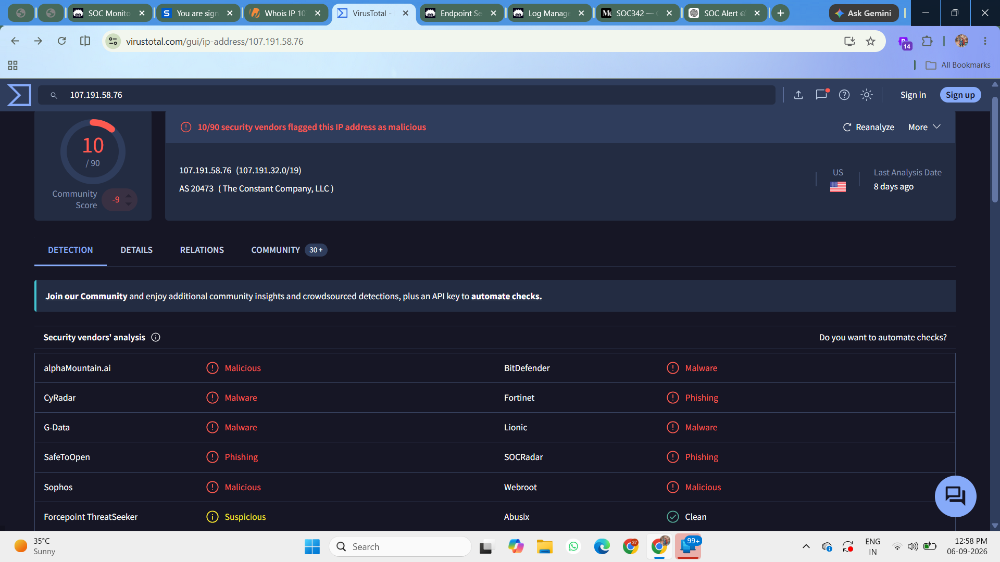
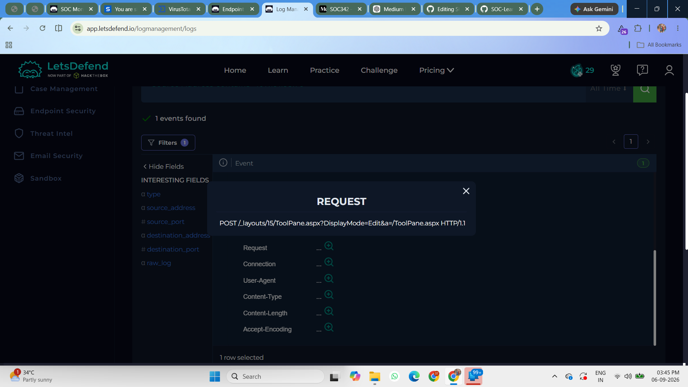
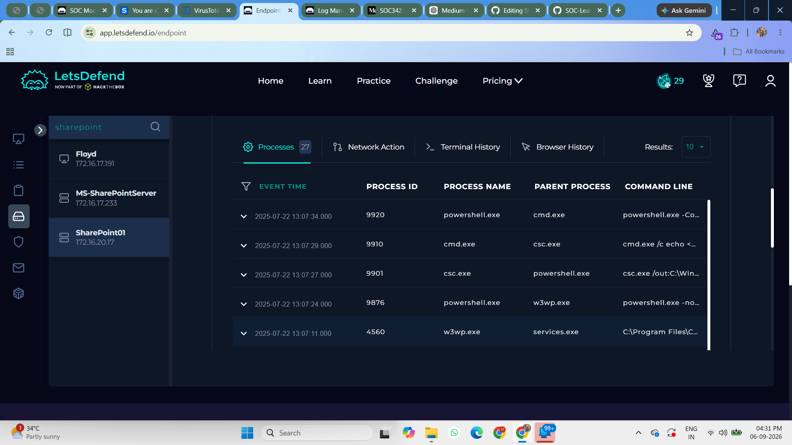
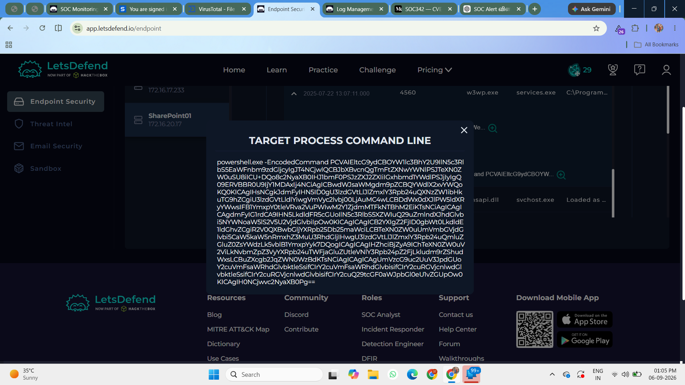
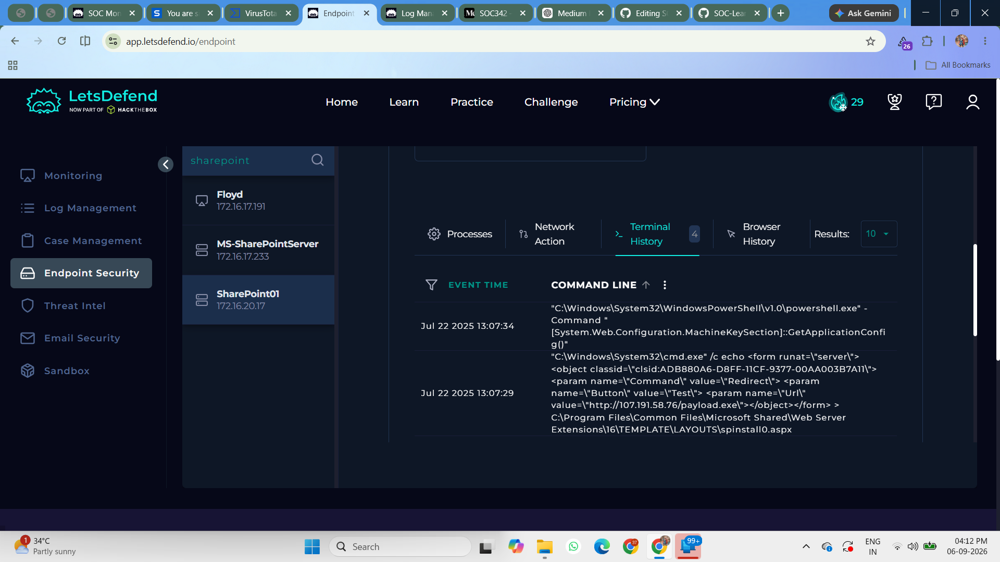
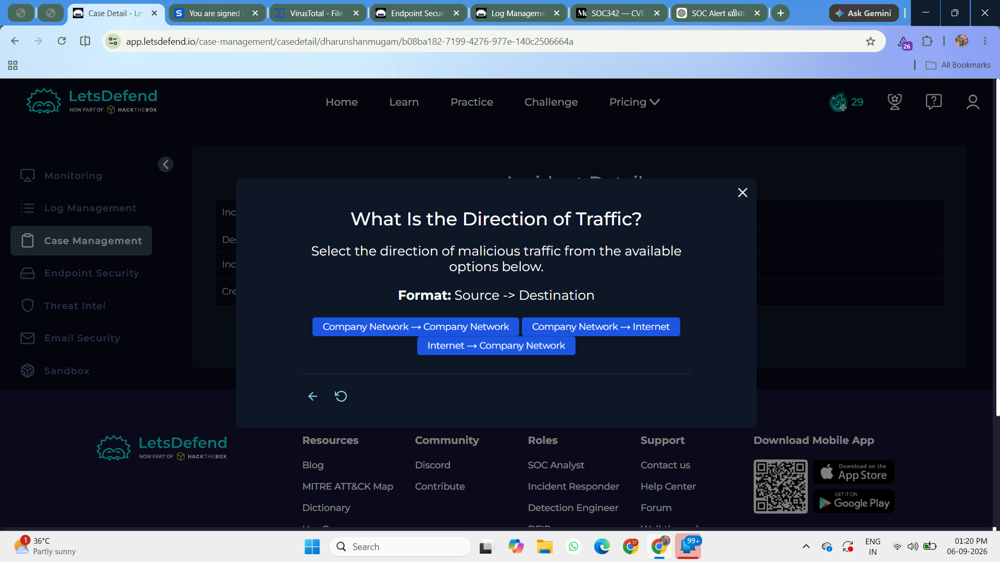
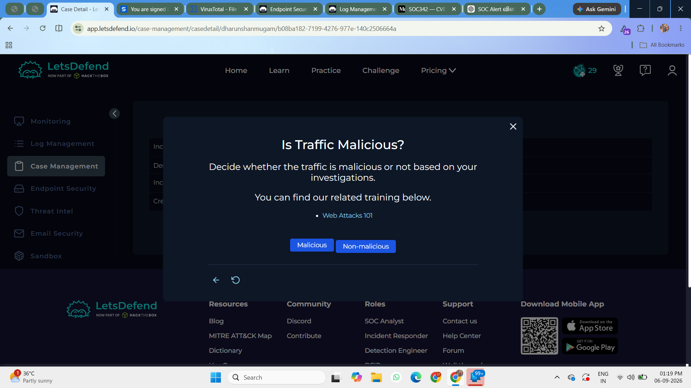
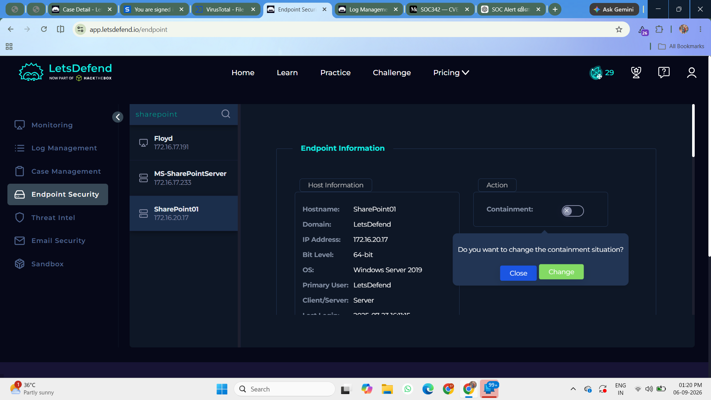
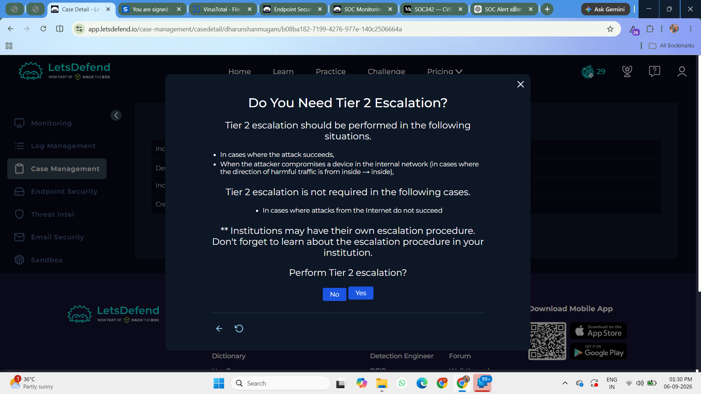

# Day 21 — SOC342: CVE-2025-53770 SharePoint ToolShell Auth Bypass and RCE

## Overview

Today I investigated the **SOC342 — CVE-2025-53770 SharePoint ToolShell Auth Bypass and RCE** alert in the Let'sDefend SOC environment.

CVE-2025-53770 is a critical vulnerability affecting on-premises Microsoft SharePoint Server. The vulnerability can allow an attacker to perform remote code execution on a vulnerable SharePoint server.

During the investigation, I analyzed the suspicious activity using **Log Management, Endpoint Security, VirusTotal, and the Case Management Playbook**.

The investigation revealed suspicious activity on the **SharePoint01** host, including a malicious file hash, suspicious SharePoint web traffic, and encoded PowerShell execution.

Based on the available evidence, the alert was confirmed as a **True Positive**.

---

## Alert Details

- **Alert:** SOC342 — CVE-2025-53770 SharePoint ToolShell Auth Bypass and RCE
- **Affected Host:** `SharePoint01`
- **Vulnerability:** `CVE-2025-53770`
- **Attack Type:** Other
- **Traffic Direction:** Internet → Company Network
- **Attack Status:** Successful
- **Host Status:** Contained
- **Escalation:** Required
- **Verdict:** True Positive

---

## Investigation Process

### 1. Initial Alert Investigation

I started the investigation by reviewing the **SOC342** alert in the Let'sDefend platform.

The alert identified **SharePoint01** as the affected host and indicated suspicious activity related to **CVE-2025-53770**.

I reviewed the available information in **Log Management** and **Endpoint Security** to understand the source of the activity and determine whether the alert represented a genuine security incident.

### 1. Suspicious Hash Investigation

During the endpoint investigation, I identified a suspicious file hash associated with the **SharePoint01** host.

I copied the hash and searched for it using **VirusTotal** to determine whether it was associated with known malicious activity.

**Figure 1 — Suspicious File Hash**

The VirusTotal results indicated that the hash was associated with malicious activity.

This provided additional evidence that the activity observed on the SharePoint server was suspicious.

**Figure 2 — VirusTotal Result**

---

### 2. Log Management Analysis

Next, I reviewed the logs associated with the **SharePoint01** server.

The investigation revealed suspicious traffic involving the SharePoint **ToolPane.aspx** endpoint.

The suspicious request was:

`POST /_layouts/15/ToolPane.aspx?DisplayMode=Edit&a=/ToolPane.aspx`

**Figure 4 — Suspicious SharePoint Request**

The request was suspicious because the **ToolPane.aspx** endpoint was involved in the observed exploitation activity related to CVE-2025-53770.

The traffic originated from the **Internet** and was directed toward the **Company Network**, making the activity especially important to investigate.

---

### 3. Endpoint Security Analysis

After reviewing the network activity, I moved to **Endpoint Security** to determine whether the suspicious request was followed by activity on the SharePoint server.

The endpoint telemetry showed suspicious activity associated with the **SharePoint01** host.

I correlated the endpoint activity with the suspicious SharePoint request identified during the Log Management investigation.

**Figure 5 — Endpoint Security Activity**

The presence of endpoint activity following the suspicious web request provided additional evidence that the incident involved more than just a normal web request.

---

### 4. PowerShell Execution Analysis

I then reviewed the process and command-line activity on the affected host.

The investigation revealed an **encoded PowerShell command** being executed on the SharePoint server.

**Figure 6 — Encoded PowerShell Execution**

Encoded PowerShell commands can be used by attackers to hide the actual commands being executed.

In this case, the PowerShell execution was associated with the suspicious SharePoint exploitation activity.

This increased the confidence that the activity was malicious.

---

### 5. PowerShell Command Investigation

I further analyzed the PowerShell activity to understand what was happening on the endpoint.

The command was encoded, so the actual command content was not immediately visible from the process command line.

The available endpoint evidence showed that PowerShell was being used as part of the suspicious activity following the SharePoint web request.

**Figure 7 — PowerShell Command Details**

The combination of the suspicious SharePoint request and encoded PowerShell execution indicated potential post-exploitation activity on the server.

---

### 6. Attack Direction and Classification

I then reviewed the attack classification in the alert.

The traffic direction was:

**Internet → Company Network**

The activity was associated with **CVE-2025-53770** and was classified as an exploitation attempt against the SharePoint server.

The activity was not identified as planned or legitimate administrative activity.

**Figure 8 — Attack Classification**

Because the activity targeted an on-premises SharePoint server from an external source and was followed by suspicious endpoint execution, the alert required further investigation and response.

---

## Case Management — Playbook Analysis

### 7. Is the Activity Malicious?

**Yes**

The activity was considered malicious based on multiple pieces of evidence.

The suspicious SharePoint request, malicious file hash, VirusTotal detection, and encoded PowerShell execution all supported the conclusion that the activity was malicious.

**Figure 9 — Playbook Analysis**

---

### 8. Was the Attack Successful?

**Yes**

The Let'sDefend alert classified the attack status as **Successful**.

The investigation also identified suspicious endpoint activity following the SharePoint request, including encoded PowerShell execution.

This provided additional evidence that the activity progressed beyond a simple scanning or reconnaissance attempt.

---

### 9. Should the Host Be Contained?

**Yes**

The affected **SharePoint01** host should be contained to prevent further attacker activity and reduce the possibility of additional compromise.

The alert indicated that the host was already contained as part of the response.

**Figure 10 — Host Containment**

---

### 10. Is Tier 2 Escalation Required?

**Yes**

The incident required escalation to **Tier 2** for further investigation.

Because the activity involved a critical SharePoint vulnerability, suspicious web traffic, malicious artifacts, and PowerShell execution, additional investigation was necessary to determine the full scope and impact of the incident.

**Figure 11 — Case Escalation**

---

## Investigation Findings

The investigation identified the following indicators and findings:

- The affected host was **SharePoint01**.
- The activity was associated with **CVE-2025-53770**.
- A suspicious file hash was identified on the host.
- VirusTotal identified the hash as malicious.
- Suspicious `POST` traffic targeted the SharePoint **ToolPane.aspx** endpoint.
- Encoded PowerShell execution was observed on the affected host.
- The traffic originated from the **Internet**.
- The destination was within the **Company Network**.
- The alert classified the attack as **Successful**.
- The affected host was **Contained**.
- The incident required **Tier 2 escalation**.

---

## Artifacts

The following indicators were identified during the investigation:

| Type | Indicator |
|---|---|
| Hostname | `SharePoint01` |
| Vulnerability | `CVE-2025-53770` |
| SharePoint Endpoint | `/_layouts/15/ToolPane.aspx` |
| HTTP Method | `POST` |
| Traffic Direction | Internet → Company Network |
| File Hash | Malicious hash identified during investigation |
| PowerShell | Encoded PowerShell execution |
| Attack Status | Successful |
| Host Status | Contained |

---

## Investigation Verdict

### True Positive — SharePoint Exploitation Activity

The alert was confirmed as a **True Positive**.

Multiple sources of evidence supported the verdict:

- The alert was associated with **CVE-2025-53770**.
- Suspicious traffic targeted the SharePoint **ToolPane.aspx** endpoint.
- A suspicious file hash was identified on the affected host.
- VirusTotal identified the hash as malicious.
- Encoded PowerShell execution was observed on the endpoint.
- The activity originated from the Internet and targeted the Company Network.
- The alert classified the attack as successful.
- The affected host was contained.
- The incident required Tier 2 escalation.

The correlation between network activity, endpoint telemetry, and threat intelligence provided strong evidence of malicious activity.

---

## Response

The following response actions were taken:

1. The affected **SharePoint01** host was contained.
2. The suspicious file hash was investigated using VirusTotal.
3. The suspicious SharePoint web request was analyzed.
4. Endpoint activity was reviewed for evidence of execution.
5. Encoded PowerShell activity was identified and documented.
6. Relevant indicators were documented as artifacts.
7. The incident was escalated to **Tier 2** for further investigation.

---

## What I Learned

From this investigation, I learned how to investigate exploitation activity against a vulnerable **Microsoft SharePoint Server**.

I learned that a suspicious web request should not be investigated in isolation. It is important to correlate network logs with endpoint activity and threat intelligence.

I also learned how to:

- Investigate SharePoint exploitation alerts
- Analyze suspicious HTTP POST requests
- Identify suspicious SharePoint endpoints
- Investigate malicious file hashes
- Use VirusTotal for threat intelligence
- Analyze endpoint process activity
- Identify encoded PowerShell execution
- Correlate network and endpoint telemetry
- Understand the importance of CVE-related alerts
- Perform host containment
- Escalate incidents to Tier 2
- Determine True Positive vs False Positive
- Document Indicators of Compromise

---

## Tools Used

- Let'sDefend
- Log Management
- Endpoint Security
- VirusTotal
- Case Management Playbook
- Threat Intelligence

---

## Key Takeaway

CVE-2025-53770 is a serious SharePoint vulnerability that can be abused to achieve remote code execution on vulnerable on-premises SharePoint servers.

In this investigation, the combination of **suspicious SharePoint traffic, a malicious file hash, VirusTotal detection, and encoded PowerShell execution** provided strong evidence of malicious activity.

The investigation flow was:

**Alert → SharePoint Log Analysis → Suspicious ToolPane Request → Hash Analysis → VirusTotal → Endpoint Investigation → PowerShell Analysis → Playbook → Host Containment → Tier 2 Escalation → True Positive**

This investigation helped me understand how a SOC analyst can correlate **web traffic, endpoint telemetry, and threat intelligence** to investigate and respond to a real-world exploitation alert.
