# Day 22 — SOC338: Lumma Stealer — DLL Side-Loading via Click Fix Phishing

## Overview

Today I investigated the **SOC338 — Lumma Stealer — DLL Side-Loading via Click Fix Phishing** alert in the Let'sDefend SOC environment.

The alert involved a suspicious phishing email sent to a user named **Dylan**. The email was designed to look like a legitimate Windows update notification and contained an **"UPDATE NOW"** button.

During the investigation, I analyzed the email details, attachment, malicious URL, and endpoint activity using **Log Management, Endpoint Security, VirusTotal, Hybrid Analysis, and the Case Management Playbook**.

The investigation showed that the email contained a malicious link. The recipient clicked the link, which resulted in suspicious command-line and PowerShell activity on the endpoint.

The activity was associated with **Lumma Stealer** and DLL side-loading behavior.

Based on the available evidence, the alert was confirmed as a **True Positive**.

---

## Alert Details

- **Alert:** SOC338 — Lumma Stealer — DLL Side-Loading via Click Fix Phishing
- **Severity:** Critical
- **Event Time:** March 13, 2025, 09:44 AM
- **SMTP Address:** `132.232.40.201`
- **Sender:** `update@windows-update.site`
- **Recipient:** `172.16.17.216`
- **User:** Dylan
- **Device Action:** Allowed
- **Threat:** Lumma Stealer
- **Attack Type:** Click Fix Phishing / DLL Side-Loading
- **Verdict:** True Positive

---

## Investigation Process

### 1. Initial Alert Investigation

I started the investigation by reviewing the **SOC338** alert in the Let'sDefend platform.

The alert was classified as **Critical**, so it required immediate investigation.

The email appeared to be related to a Windows update and contained an **"UPDATE NOW"** button.

However, the sender address was suspicious:

`update@windows-update.site`

The sender domain did not appear to be an official Microsoft domain, which was an initial indicator of a possible phishing attempt.

**Figure 1 — SOC338 Critical Alert**

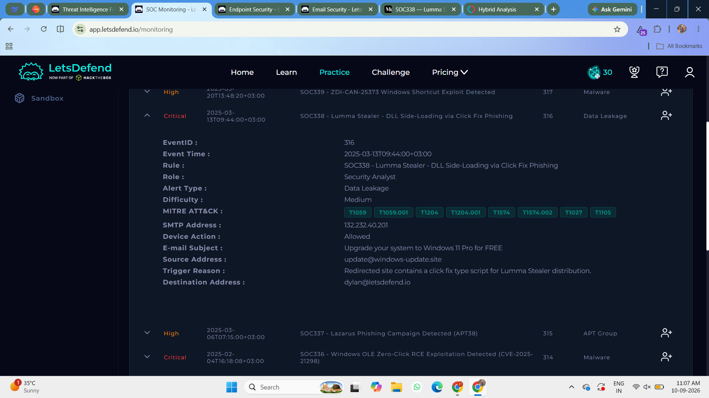

---

### 2. Email Details Analysis

I reviewed the email information to understand the source and destination of the message.

The email details were:

- **SMTP Address:** `132.232.40.201`
- **Sender:** `update@windows-update.site`
- **Recipient:** `172.16.17.216`
- **Time:** March 13, 2025, 09:44 AM

**Figure 2 — Email Details**

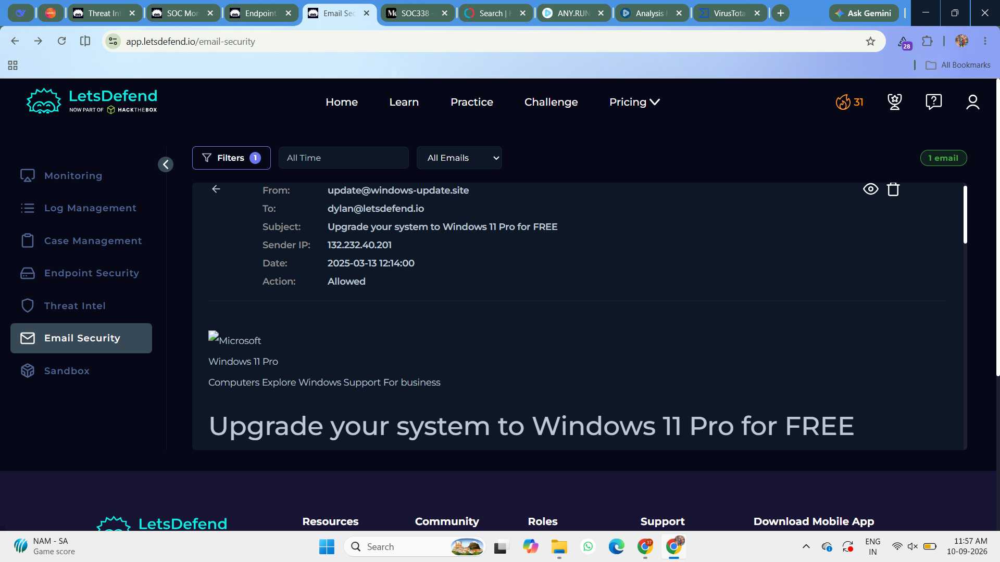

The sender address was suspicious because it attempted to appear related to Windows updates while using a non-official domain.

This increased the likelihood that the email was part of a phishing campaign.

---

### 3. Email Content and Attachment Analysis

I then reviewed the contents of the email.

The message was designed to appear legitimate and encouraged the recipient to click the **"UPDATE NOW"** button.

The email also contained an attachment/link that required further investigation.

**Figure 3 — Phishing Email**

At first glance, the email could appear legitimate to a normal user. However, the suspicious sender domain and update-themed call-to-action were important phishing indicators.

---

### 4. Malicious Link Investigation

I inspected the hyperlink associated with the **"UPDATE NOW"** button.

The link redirected the user to a suspicious Windows-update-themed domain:

`hxxps://xxx.windows-update.site/`

I investigated the URL using threat intelligence sources to determine whether it was malicious.

**Figure 4 — Suspicious Update Link**

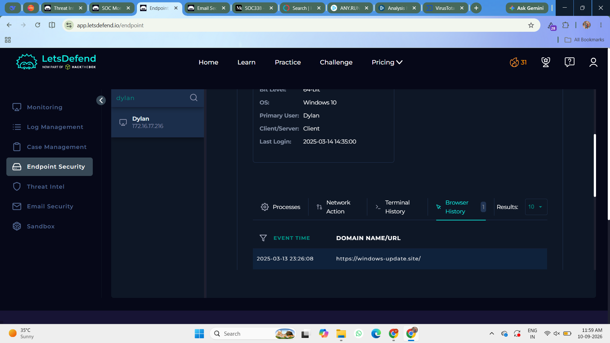

The URL was identified as malicious and was associated with the phishing activity.

---

### 5. VirusTotal Analysis

I submitted the suspicious URL/file information to **VirusTotal** for reputation analysis.

**Figure 5 — VirusTotal Result**

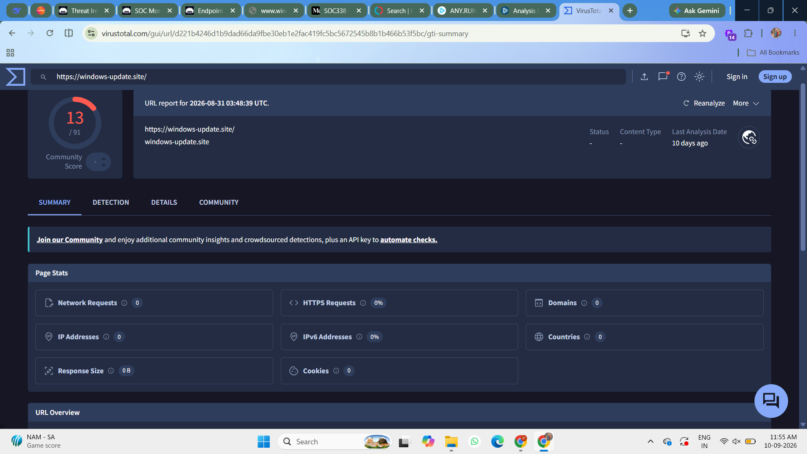

VirusTotal identified the submitted artifact as **Malicious**.

This provided additional evidence that the email was not a legitimate Windows update notification.

---

### 6. AnyRun

I also investigated the artifact using **AnyRun**.

**Figure 6 — AnyRun Result**

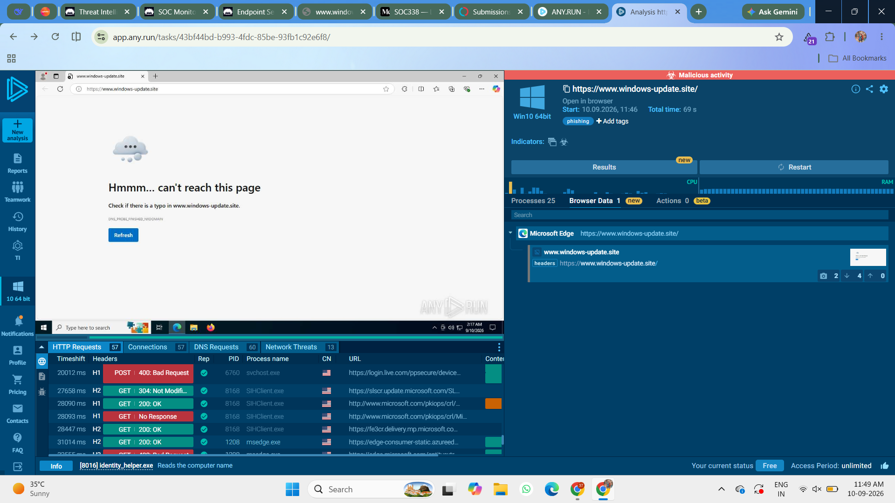

Hybrid Analysis also classified the activity as **Malicious**.

The analysis showed several behaviors associated with the malware, including techniques related to:

- Initial Access
- Defense Evasion
- Discovery
- Command and Control
- PowerShell execution

The observed behavior was consistent with a malicious phishing payload.

---

### 7. MITRE ATT&CK Technique Analysis

The Hybrid Analysis report identified several MITRE ATT&CK techniques associated with the sample.

The reported techniques included:

| ATT&CK ID | Technique / Category |
|---|---|
| T1583.001 | Resource Development |
| T1566 | Phishing / Initial Access |
| T1480 | Execution Guardrails |
| T1553.002 | Subvert Trust Controls |
| T1057 | Process Discovery |
| T1071 | Application Layer Protocol |
| T1071.004 | DNS |
| T1568.002 | Dynamic Resolution |
| T1071.001 | Web Protocols |

These techniques showed that the malware was capable of performing multiple malicious activities beyond the initial phishing delivery.

---

## Case Management — Playbook Analysis

### 8. Is the Email Suspicious?

**Yes**

The email was considered suspicious because:

- The sender used a suspicious domain.
- The email attempted to imitate a Windows update notification.
- It contained an **"UPDATE NOW"** button.
- The associated URL was identified as malicious.
- Threat intelligence tools classified the related artifact as malicious.

**Figure 7 — Playbook: Suspicious Email**

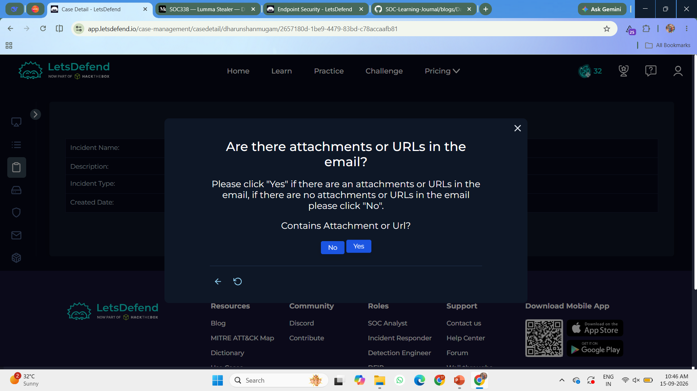

---

### 9. Is the Attachment or Artifact Malicious?

**Malicious**

The artifact associated with the phishing email was identified as malicious by both **VirusTotal** and **Hybrid Analysis**.

**Figure 8 — Playbook: Malicious Artifact**

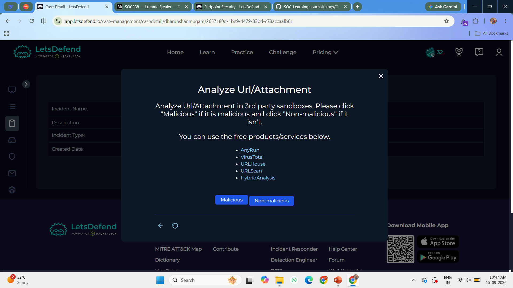

The threat intelligence results supported the classification of the email as a malicious phishing attempt.

---

### 10. Was the Email Delivered?

**Yes — Delivered**

The email was delivered because the device action was recorded as **Allowed**.

This means the security control did not block the email during delivery.

**Figure 9 — Playbook: Email Delivered**

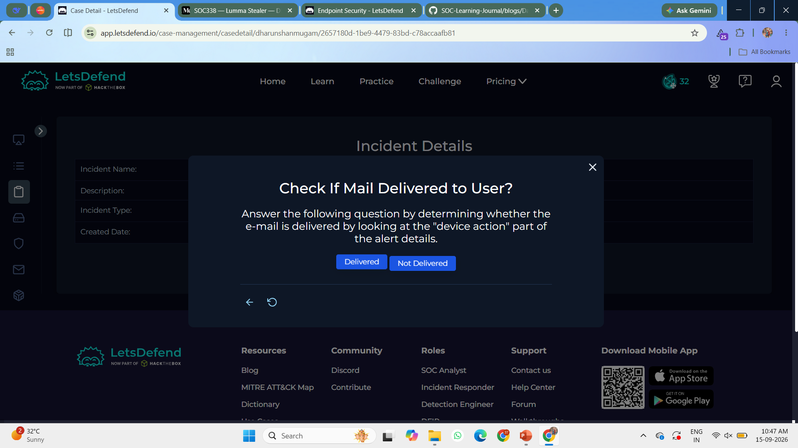

However, delivery alone does not prove that the user interacted with the email. User interaction was confirmed separately through endpoint/browser evidence.

---

### 11. Was the Malicious Email Opened?

**Yes**

Endpoint/browser activity showed that the recipient **Dylan** interacted with the malicious email and clicked the hyperlink associated with the **"UPDATE NOW"** button.

The browser history showed access to:

`hxxps://xxx.windows-update.site/`

**Figure 10 — Browser History**

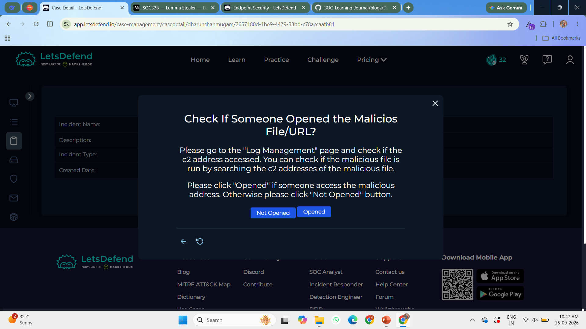

This confirmed that the phishing email was not only delivered but also interacted with by the victim.

---

### 12. Command-Line Execution After Clicking the Link

After the malicious hyperlink was clicked, suspicious command-line activity was observed on the endpoint.

The activity automatically started **PowerShell** and executed an obfuscated command.

**Figure 11 — Suspicious Command Execution**

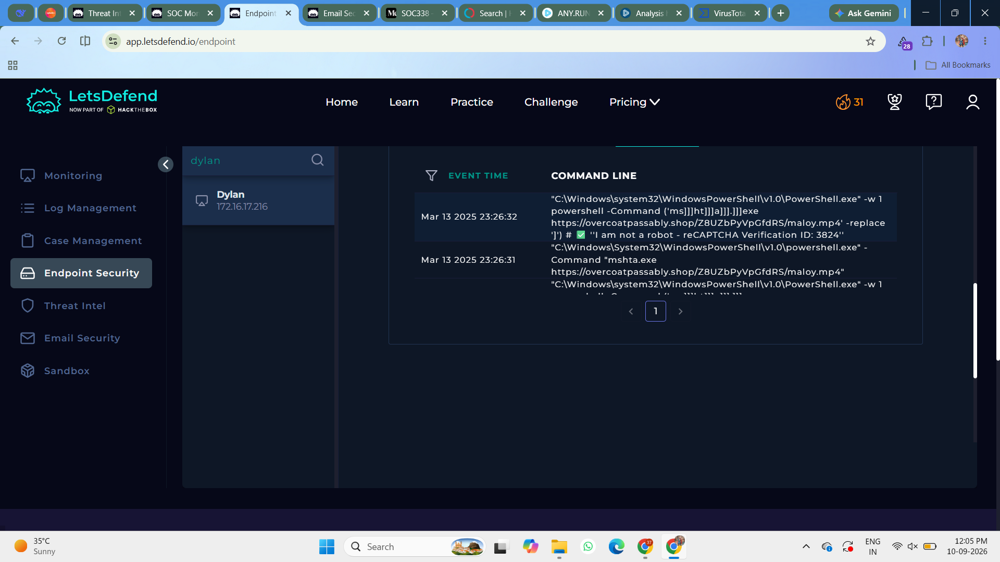

The command contained obfuscated strings designed to make the activity harder to detect.

The use of obfuscation is a common technique used by attackers to hide malicious commands from security tools and users.

---

### 13. PowerShell Activity Analysis

The malicious link resulted in PowerShell execution on the endpoint.

The command attempted to execute suspicious content while using an appearance similar to a legitimate verification or reCAPTCHA message.

This behavior is consistent with a **Click Fix / fake verification** style phishing technique, where the victim is tricked into performing an action that ultimately executes malicious code.

**Figure 12 — PowerShell Activity**

The PowerShell activity provided strong endpoint evidence that the phishing link led to malicious execution.

---

### 14. Host Containment

Because the malicious link was opened and suspicious command execution occurred on the endpoint, the affected device required containment.

The playbook response was:

**Contain the Device**

**Figure 13 — Device Containment**

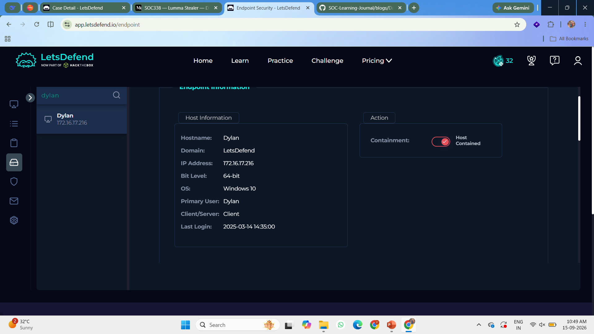

The device was successfully contained to prevent further malicious communication and reduce the potential impact of the Lumma Stealer activity.

---

### 15. Add Investigation Artifacts

I then documented the relevant Indicators of Compromise as artifacts in the case.

The artifacts included the suspicious email sender, domain, URL, and other relevant indicators identified during the investigation.

**Figure 14 — Add Artifacts**

After adding the relevant artifacts, I confirmed the entries in the case.

**Figure 15 — Confirm Artifacts**

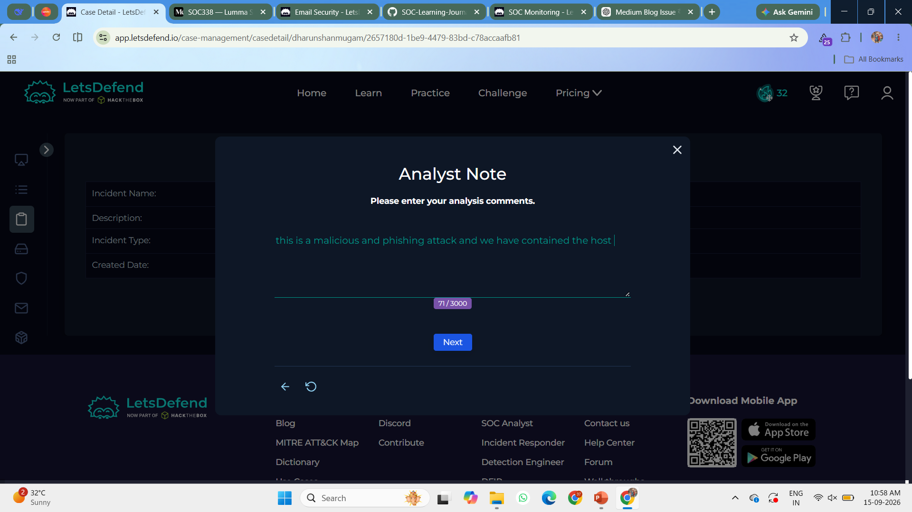

---

## Investigation Findings

The investigation identified the following findings:

- The alert was classified as **Critical**.
- The email was sent on **March 13, 2025 at 09:44 AM**.
- The SMTP address was `132.232.40.201`.
- The sender was `update@windows-update.site`.
- The email was designed to imitate a Windows update notification.
- The email contained an **"UPDATE NOW"** button.
- The associated URL was malicious.
- VirusTotal identified the artifact as malicious.
- Hybrid Analysis also identified malicious behavior.
- The email was delivered because the device action was **Allowed**.
- The victim **Dylan** clicked the malicious hyperlink.
- Browser history confirmed access to the suspicious Windows-update-themed URL.
- The click resulted in suspicious command-line activity.
- PowerShell execution was observed.
- The command contained obfuscated content.
- The activity was associated with **Lumma Stealer**.
- The affected device was contained.
- Relevant artifacts were added to the case.

---

## Artifacts

| Type | Indicator |
|---|---|
| Alert | `SOC338` |
| Threat | `Lumma Stealer` |
| SMTP Address | `132.232.40.201` |
| Sender | `update@windows-update.site` |
| Recipient | `172.16.17.216` |
| Suspicious Domain | `windows-update.site` |
| URL | `hxxps://xxx.windows-update.site/` |
| User | `Dylan` |
| Technique | Click Fix Phishing |
| Execution | PowerShell |
| Behavior | DLL Side-Loading |
| Verdict | Malicious |

---

## Investigation Verdict

### True Positive — Lumma Stealer Phishing Activity

The alert was confirmed as a **True Positive**.

Multiple sources of evidence supported the verdict:

- The sender address was suspicious.
- The email attempted to imitate a Windows update notification.
- The associated URL was identified as malicious.
- VirusTotal classified the artifact as malicious.
- Hybrid Analysis identified malicious behavior.
- The email was successfully delivered to the recipient.
- Browser history confirmed that the victim clicked the malicious link.
- Suspicious command-line activity occurred after the click.
- PowerShell was executed.
- Obfuscated commands were observed.
- The activity was associated with Lumma Stealer.
- The affected device was contained.

The correlation between **email activity, threat intelligence, browser history, and endpoint execution** confirmed that this was a genuine phishing and malware incident.

---

## Response

The following response actions were taken:

1. The malicious email was identified and investigated.
2. The suspicious URL was analyzed using VirusTotal.
3. The artifact was analyzed using Hybrid Analysis.
4. Browser history was reviewed to determine whether the victim interacted with the malicious link.
5. Suspicious command-line and PowerShell activity was identified.
6. The affected device was contained.
7. Relevant Indicators of Compromise were added to the case.
8. The incident was confirmed as a **True Positive**.

---

## What I Learned

From this investigation, I learned how attackers can combine **phishing, fake update pages, command obfuscation, PowerShell, and malware delivery** to compromise a victim endpoint.

I also learned how to:

- Investigate phishing emails
- Analyze suspicious sender domains
- Investigate malicious URLs
- Use VirusTotal for threat intelligence
- Use Anyrun for malware analysis
- Review browser history
- Identify Click Fix phishing behavior
- Analyze suspicious PowerShell execution
- Understand command obfuscation
- Identify Lumma Stealer activity
- Understand DLL side-loading behavior
- Document Indicators of Compromise
- Perform endpoint containment
- Follow a SOC investigation playbook
- Determine True Positive vs False Positive

---

## Tools Used

- Let'sDefend
- Log Management
- Endpoint Security
- VirusTotal
- Anyrun
- Browser History
- MITRE ATT&CK
- Case Management Playbook

---

## Key Takeaway

Phishing attacks can use fake update notifications and social engineering to convince users to click malicious links.

In this investigation, the attacker used a Windows-update-themed phishing email containing a malicious **"UPDATE NOW"** link. The victim clicked the link, which resulted in suspicious command-line and PowerShell activity associated with **Lumma Stealer**.

The investigation flow was:

**Alert → Email Analysis → Sender Investigation → URL Analysis → VirusTotal → Hybrid Analysis → Browser History → Malicious Link Click → Command Execution → PowerShell Analysis → Host Containment → Artifact Collection → True Positive**

This investigation helped me understand how a SOC analyst can correlate **email, threat intelligence, browser, and endpoint telemetry** to identify a phishing-based malware infection and respond effectively.
